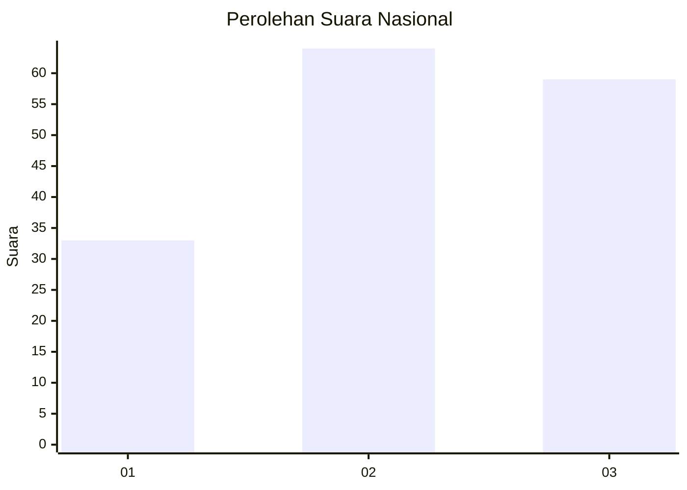
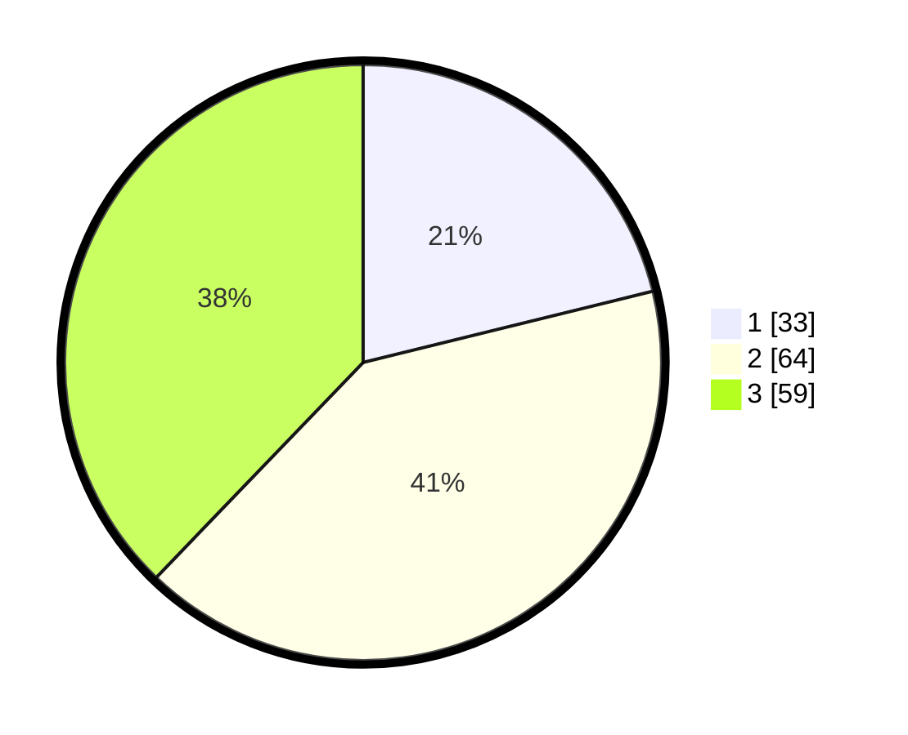

# Hasil

## Grafik

## Tabel

| No.    | Nama Paslon    | Suara | Suara (raw) | Persentase |
|:------ |:-------------- | -----:| -----------:| ----------:|
| 100025 | ANIES MUHAIMIN | 33    | [33][p-1]   | 21,15      |
| 100026 | PRABOWO GIBRAN | 64    | [64][p-2]   | 41,03      |
| 100027 | GANJAR MAHFUD  | 59    | [59][p-3]   | 37,82      |

[p-1]: https://github.com/gigit-pemilu/pemilu-2024/blob/main/pilpres/hitung-suara/sub/31-dki-jakarta/sub/73-jakarta-barat/sub/03-taman-sari/sub/1006-keagungan/sub/023-tps/sub/paslon-1.txt
[p-2]: https://github.com/gigit-pemilu/pemilu-2024/blob/main/pilpres/hitung-suara/sub/31-dki-jakarta/sub/73-jakarta-barat/sub/03-taman-sari/sub/1006-keagungan/sub/023-tps/sub/paslon-2.txt
[p-3]: https://github.com/gigit-pemilu/pemilu-2024/blob/main/pilpres/hitung-suara/sub/31-dki-jakarta/sub/73-jakarta-barat/sub/03-taman-sari/sub/1006-keagungan/sub/023-tps/sub/paslon-3.txt

## Foto C Plano

https://sirekap-obj-formc.kpu.go.id/4c9f/pemilu/ppwp/31/73/03/10/06/3173031006023-20240214-231654--3b6d6a6c-0da1-4737-b7e9-85e9232c6296.jpg

https://sirekap-obj-formc.kpu.go.id/4c9f/pemilu/ppwp/31/73/03/10/06/3173031006023-20240214-232742--ef1bee08-455d-4ba7-b8c5-49478e567d33.jpg

https://sirekap-obj-formc.kpu.go.id/4c9f/pemilu/ppwp/31/73/03/10/06/3173031006023-20240214-233056--306370e6-32e4-48c8-9d72-4e76144a97db.jpg

## Metadata

| Key        | Value               |
| ---------- | ------------------- |
| Time Stamp | 2024-02-17 16:36:25 |

