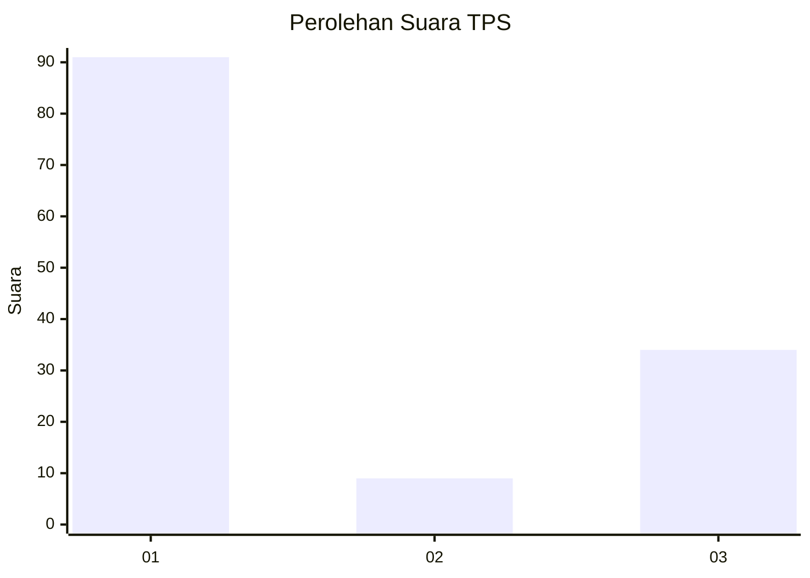
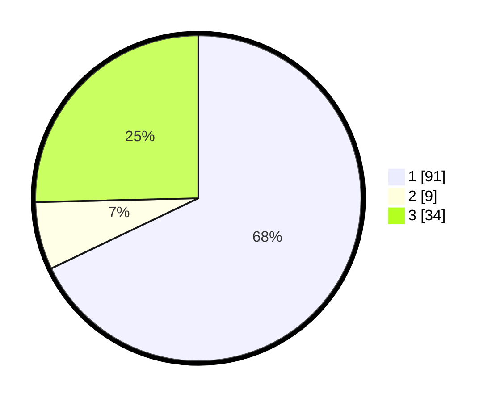

# Hasil

## Grafik

## Tabel

| No. | Nama Paslon    | Suara | Suara (raw) | Persentase |
|:--- |:-------------- | -----:| -----------:| ----------:|
| 1   | ANIES MUHAIMIN | 91    | [91][p-1]   | 67,91      |
| 2   | PRABOWO GIBRAN | 9     | [9][p-2]    | 6,72       |
| 3   | GANJAR MAHFUD  | 34    | [34][p-3]   | 25,37      |

[p-1]: https://github.com/gigit-pemilu/pemilu-2024-31-dki-jakarta/blob/main/pilpres/hitung-suara/sub/31-dki-jakarta/sub/73-jakarta-barat/sub/03-taman-sari/sub/1006-keagungan/sub/031-tps/sub/paslon-1.txt
[p-2]: https://github.com/gigit-pemilu/pemilu-2024-31-dki-jakarta/blob/main/pilpres/hitung-suara/sub/31-dki-jakarta/sub/73-jakarta-barat/sub/03-taman-sari/sub/1006-keagungan/sub/031-tps/sub/paslon-2.txt
[p-3]: https://github.com/gigit-pemilu/pemilu-2024-31-dki-jakarta/blob/main/pilpres/hitung-suara/sub/31-dki-jakarta/sub/73-jakarta-barat/sub/03-taman-sari/sub/1006-keagungan/sub/031-tps/sub/paslon-3.txt

## Foto C Plano

https://sirekap-obj-formc.kpu.go.id/385e/pemilu/ppwp/31/73/03/10/06/3173031006031-20240215-002937--6fde3501-4b5b-4dd5-a7cd-54c5493e5524.jpg

https://sirekap-obj-formc.kpu.go.id/385e/pemilu/ppwp/31/73/03/10/06/3173031006031-20240215-002953--3c14d3c9-b1ab-4bd7-b914-b3de7566dbd0.jpg

https://sirekap-obj-formc.kpu.go.id/385e/pemilu/ppwp/31/73/03/10/06/3173031006031-20240215-003008--5d6f7eaa-8405-4a0e-b160-43ee7afcf883.jpg

## Metadata

| Key        | Value               |
| ---------- | ------------------- |
| Time Stamp | 2024-02-16 16:25:10 |

