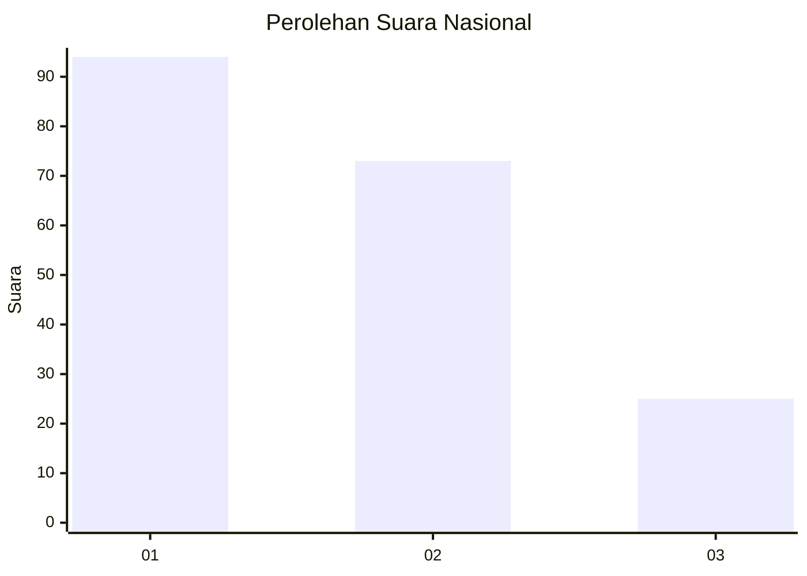
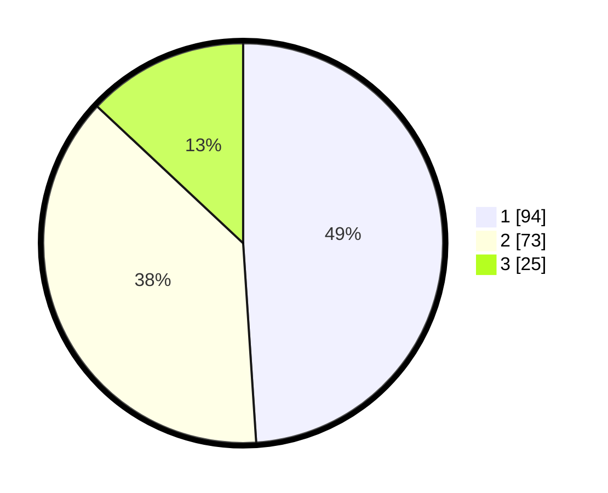

# Hasil

## Grafik

## Tabel

| No.    | Nama Paslon    | Suara | Suara (raw) | Persentase |
|:------ |:-------------- | -----:| -----------:| ----------:|
| 100025 | ANIES MUHAIMIN | 94    | [94][p-1]   | 48,96      |
| 100026 | PRABOWO GIBRAN | 73    | [73][p-2]   | 38,02      |
| 100027 | GANJAR MAHFUD  | 25    | [25][p-3]   | 13,02      |

[p-1]: https://github.com/gigit-pemilu/pemilu-2024/blob/main/pilpres/hitung-suara/sub/31-dki-jakarta/sub/73-jakarta-barat/sub/03-taman-sari/sub/1006-keagungan/sub/039-tps/sub/paslon-1.txt
[p-2]: https://github.com/gigit-pemilu/pemilu-2024/blob/main/pilpres/hitung-suara/sub/31-dki-jakarta/sub/73-jakarta-barat/sub/03-taman-sari/sub/1006-keagungan/sub/039-tps/sub/paslon-2.txt
[p-3]: https://github.com/gigit-pemilu/pemilu-2024/blob/main/pilpres/hitung-suara/sub/31-dki-jakarta/sub/73-jakarta-barat/sub/03-taman-sari/sub/1006-keagungan/sub/039-tps/sub/paslon-3.txt

## Foto C Plano

https://sirekap-obj-formc.kpu.go.id/3fc5/pemilu/ppwp/31/73/03/10/06/3173031006039-20240214-201142--cc1ecea7-b0f8-4cec-a817-f55b90f656d1.jpg

https://sirekap-obj-formc.kpu.go.id/3fc5/pemilu/ppwp/31/73/03/10/06/3173031006039-20240214-200647--d9b7c769-24a8-4425-b5cd-1f0428a45b15.jpg

https://sirekap-obj-formc.kpu.go.id/3fc5/pemilu/ppwp/31/73/03/10/06/3173031006039-20240214-200945--ba8f5c81-a928-4357-80da-81e138cf8d6c.jpg

## Metadata

| Key        | Value               |
| ---------- | ------------------- |
| Time Stamp | 2024-02-17 16:52:47 |

