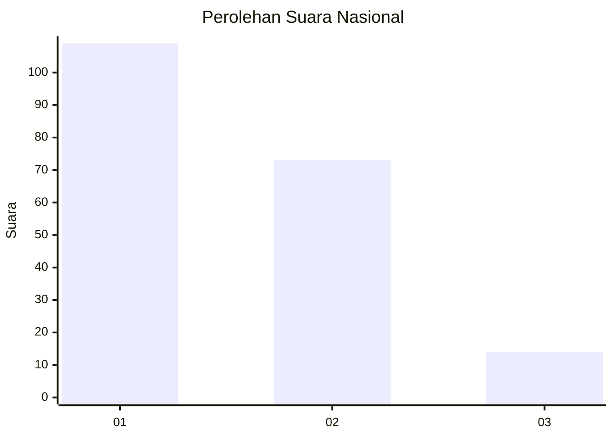
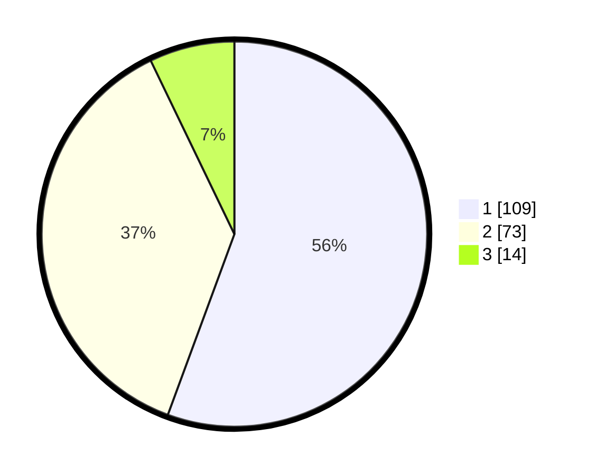

# Hasil

## Grafik

## Tabel

| No.    | Nama Paslon    | Suara | Suara (raw) | Persentase |
|:------ |:-------------- | -----:| -----------:| ----------:|
| 100025 | ANIES MUHAIMIN | 109   | [109][p-1]  | 55,61      |
| 100026 | PRABOWO GIBRAN | 73    | [73][p-2]   | 37,24      |
| 100027 | GANJAR MAHFUD  | 14    | [14][p-3]   | 7,14       |

[p-1]: https://github.com/gigit-pemilu/pemilu-2024/blob/main/pilpres/hitung-suara/sub/31-dki-jakarta/sub/73-jakarta-barat/sub/03-taman-sari/sub/1006-keagungan/sub/057-tps/sub/paslon-1.txt
[p-2]: https://github.com/gigit-pemilu/pemilu-2024/blob/main/pilpres/hitung-suara/sub/31-dki-jakarta/sub/73-jakarta-barat/sub/03-taman-sari/sub/1006-keagungan/sub/057-tps/sub/paslon-2.txt
[p-3]: https://github.com/gigit-pemilu/pemilu-2024/blob/main/pilpres/hitung-suara/sub/31-dki-jakarta/sub/73-jakarta-barat/sub/03-taman-sari/sub/1006-keagungan/sub/057-tps/sub/paslon-3.txt

## Foto C Plano

https://sirekap-obj-formc.kpu.go.id/d179/pemilu/ppwp/31/73/03/10/06/3173031006057-20240214-233945--af979ee0-8c36-430b-a533-ee5f27927a1b.jpg

https://sirekap-obj-formc.kpu.go.id/d179/pemilu/ppwp/31/73/03/10/06/3173031006057-20240214-234026--1fc77931-99a6-422d-a274-d058e73dc376.jpg

https://sirekap-obj-formc.kpu.go.id/d179/pemilu/ppwp/31/73/03/10/06/3173031006057-20240214-234055--173e1d76-8fcb-48cf-a55e-cfbbda057384.jpg

## Metadata

| Key        | Value               |
| ---------- | ------------------- |
| Time Stamp | 2024-02-17 16:52:47 |

