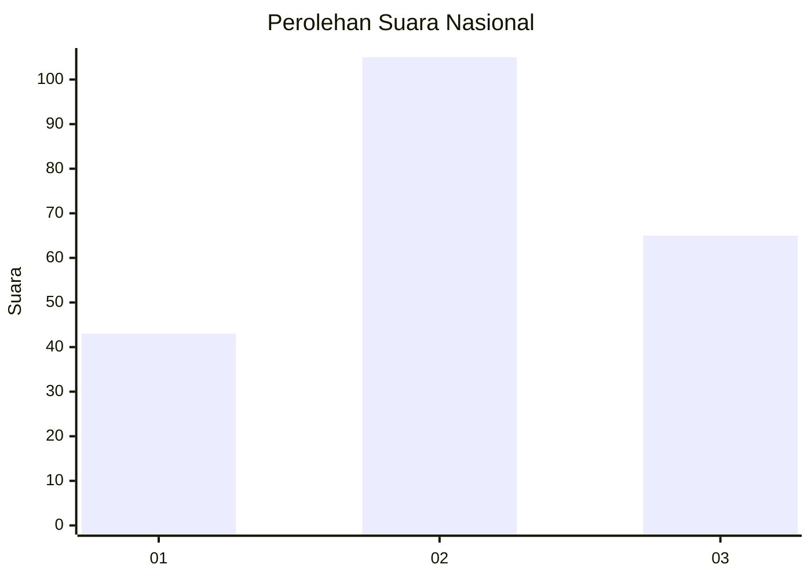
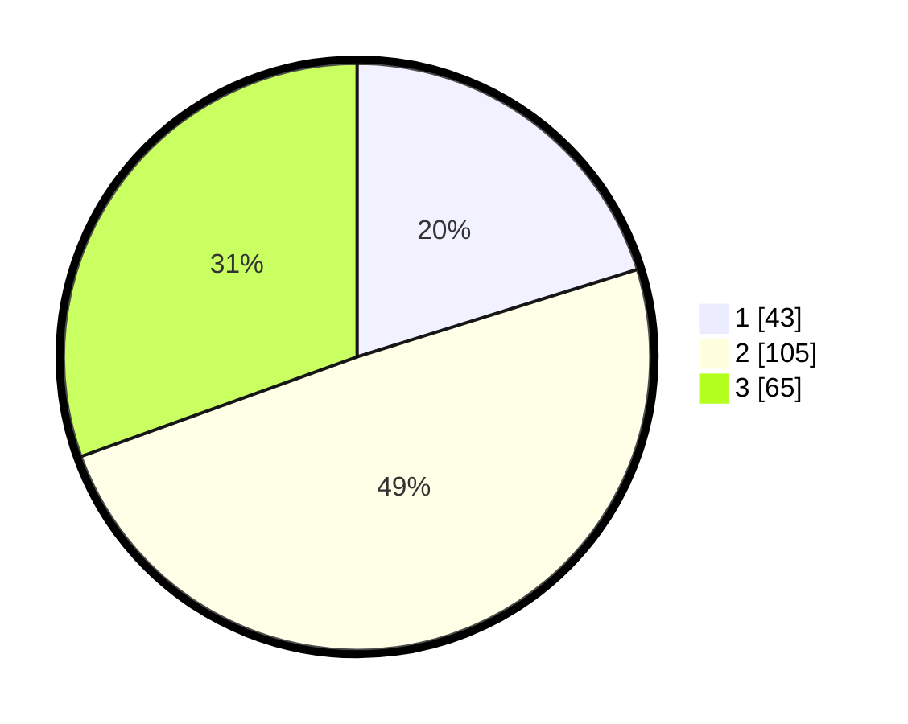

# Hasil

## Grafik

## Tabel

| No.    | Nama Paslon    | Suara | Suara (raw) | Persentase |
|:------ |:-------------- | -----:| -----------:| ----------:|
| 100025 | ANIES MUHAIMIN | 43    | [43][p-1]   | 20,19      |
| 100026 | PRABOWO GIBRAN | 105   | [105][p-2]  | 49,30      |
| 100027 | GANJAR MAHFUD  | 65    | [65][p-3]   | 30,52      |

[p-1]: https://github.com/gigit-pemilu/pemilu-2024/blob/main/pilpres/hitung-suara/sub/31-dki-jakarta/sub/73-jakarta-barat/sub/03-taman-sari/sub/1007-glodok/sub/013-tps/sub/paslon-1.txt
[p-2]: https://github.com/gigit-pemilu/pemilu-2024/blob/main/pilpres/hitung-suara/sub/31-dki-jakarta/sub/73-jakarta-barat/sub/03-taman-sari/sub/1007-glodok/sub/013-tps/sub/paslon-2.txt
[p-3]: https://github.com/gigit-pemilu/pemilu-2024/blob/main/pilpres/hitung-suara/sub/31-dki-jakarta/sub/73-jakarta-barat/sub/03-taman-sari/sub/1007-glodok/sub/013-tps/sub/paslon-3.txt

## Foto C Plano

https://sirekap-obj-formc.kpu.go.id/d4cd/pemilu/ppwp/31/73/03/10/07/3173031007013-20240214-220007--94ce1d15-20b2-4206-b9f6-018653c4c903.jpg

https://sirekap-obj-formc.kpu.go.id/d4cd/pemilu/ppwp/31/73/03/10/07/3173031007013-20240214-204056--42ef62da-4598-4eae-a733-844e03bed78e.jpg

https://sirekap-obj-formc.kpu.go.id/d4cd/pemilu/ppwp/31/73/03/10/07/3173031007013-20240214-204227--9321bfac-8e77-4ffd-a84d-68ba2f5f2a2e.jpg

## Metadata

| Key        | Value               |
| ---------- | ------------------- |
| Time Stamp | 2024-02-16 16:25:10 |

