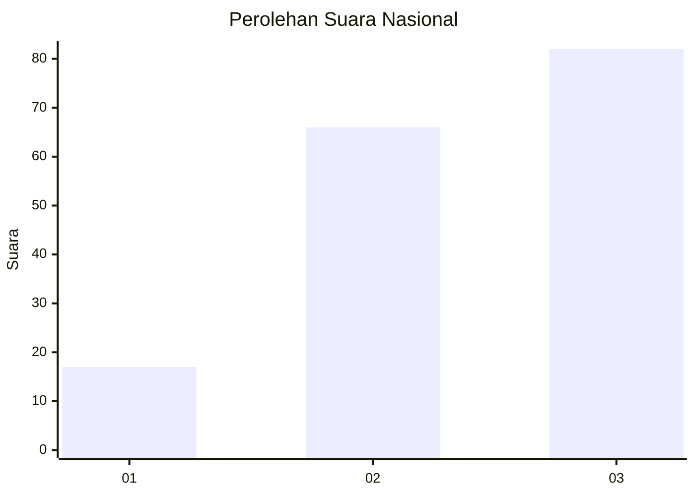
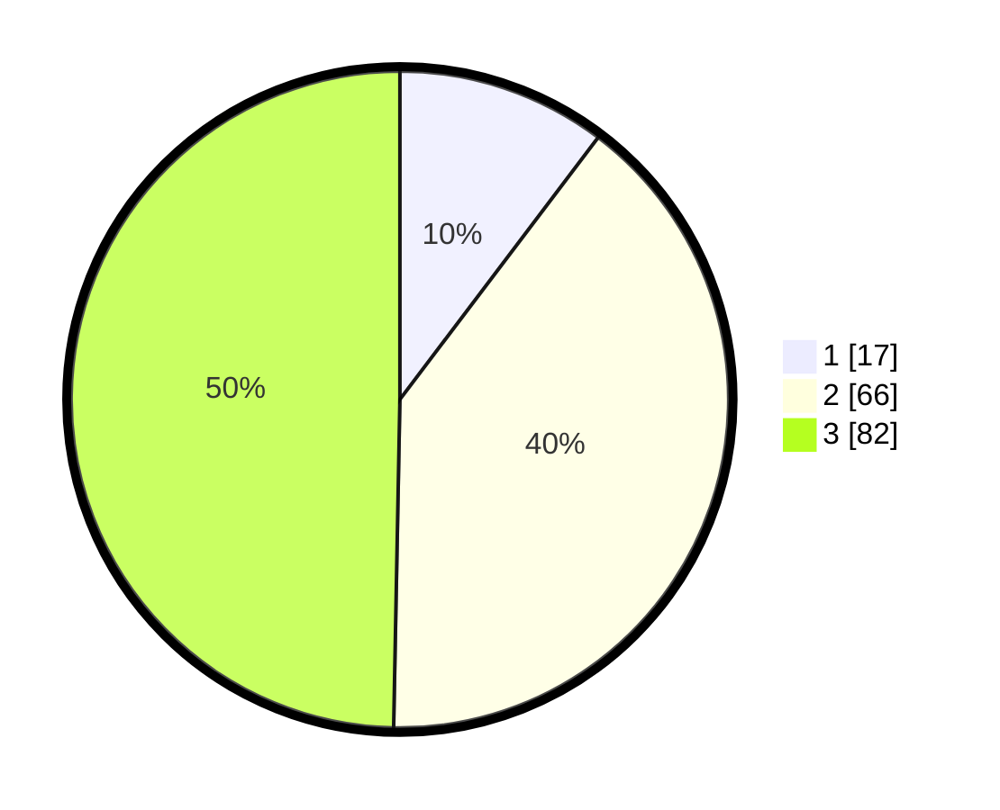

# Hasil

## Grafik

## Tabel

| No.    | Nama Paslon    | Suara | Suara (raw) | Persentase |
|:------ |:-------------- | -----:| -----------:| ----------:|
| 100025 | ANIES MUHAIMIN | 17    | [17][p-1]   | 10,30      |
| 100026 | PRABOWO GIBRAN | 66    | [66][p-2]   | 40,00      |
| 100027 | GANJAR MAHFUD  | 82    | [82][p-3]   | 49,70      |

[p-1]: https://github.com/gigit-pemilu/pemilu-2024/blob/main/pilpres/hitung-suara/sub/31-dki-jakarta/sub/73-jakarta-barat/sub/03-taman-sari/sub/1008-pinangsia/sub/005-tps/sub/paslon-1.txt
[p-2]: https://github.com/gigit-pemilu/pemilu-2024/blob/main/pilpres/hitung-suara/sub/31-dki-jakarta/sub/73-jakarta-barat/sub/03-taman-sari/sub/1008-pinangsia/sub/005-tps/sub/paslon-2.txt
[p-3]: https://github.com/gigit-pemilu/pemilu-2024/blob/main/pilpres/hitung-suara/sub/31-dki-jakarta/sub/73-jakarta-barat/sub/03-taman-sari/sub/1008-pinangsia/sub/005-tps/sub/paslon-3.txt

## Foto C Plano

https://sirekap-obj-formc.kpu.go.id/186b/pemilu/ppwp/31/73/03/10/08/3173031008005-20240214-223120--61b4bcf5-9b79-403b-b07b-ebe130b48000.jpg

https://sirekap-obj-formc.kpu.go.id/186b/pemilu/ppwp/31/73/03/10/08/3173031008005-20240214-223254--4489faa2-ac89-4e7c-946b-136918b44aad.jpg

https://sirekap-obj-formc.kpu.go.id/186b/pemilu/ppwp/31/73/03/10/08/3173031008005-20240214-192806--77959053-e42a-4a93-9783-eebf91c87f7d.jpg

## Metadata

| Key        | Value               |
| ---------- | ------------------- |
| Time Stamp | 2024-02-16 16:25:10 |

