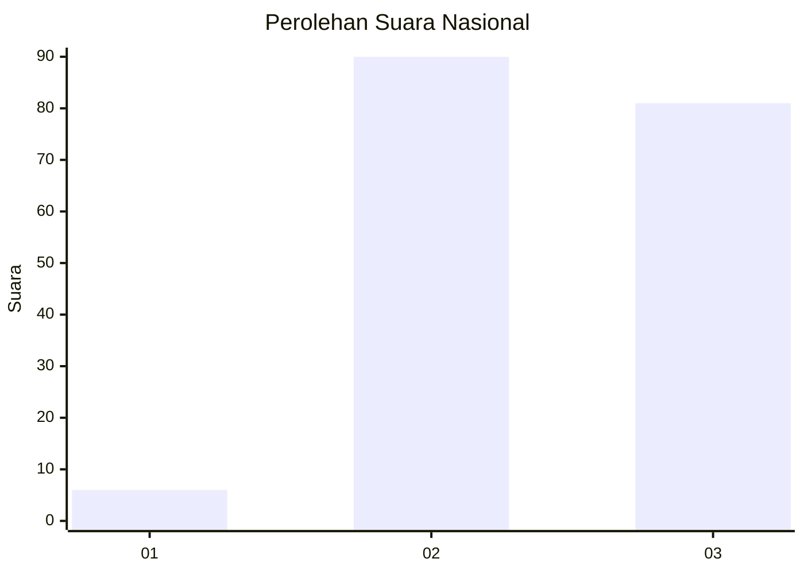
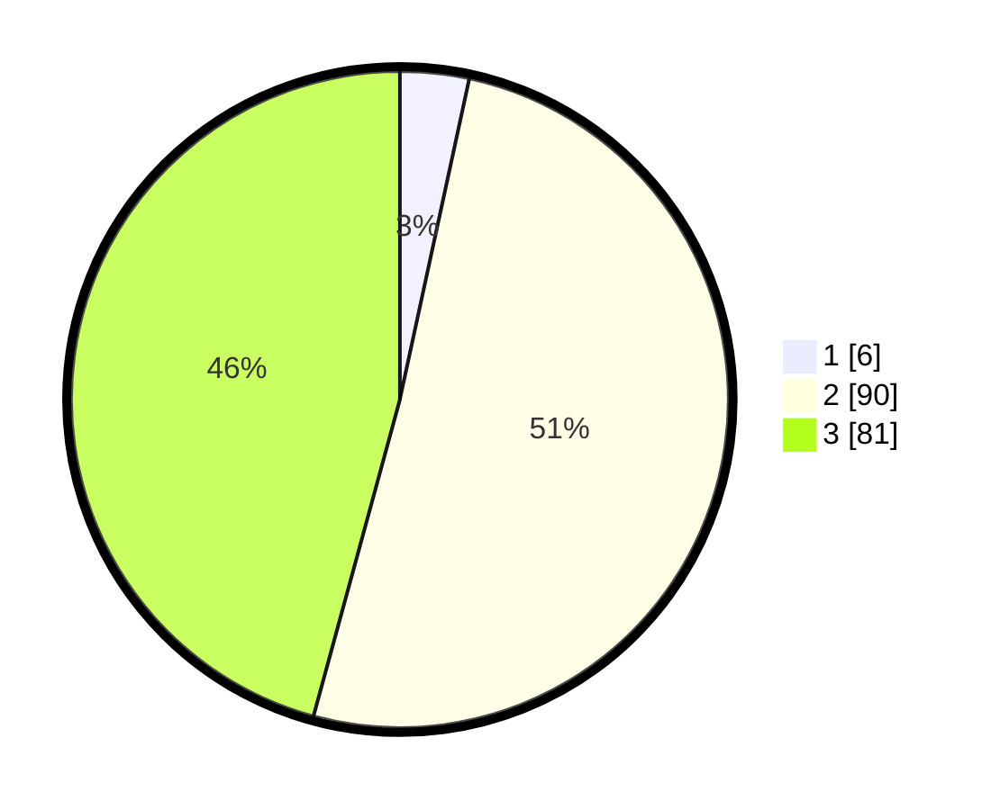

# Hasil

## Grafik

## Tabel

| No.    | Nama Paslon    | Suara | Suara (raw) | Persentase |
|:------ |:-------------- | -----:| -----------:| ----------:|
| 100025 | ANIES MUHAIMIN | 6     | [6][p-1]    | 3,39       |
| 100026 | PRABOWO GIBRAN | 90    | [90][p-2]   | 50,85      |
| 100027 | GANJAR MAHFUD  | 81    | [81][p-3]   | 45,76      |

[p-1]: https://github.com/gigit-pemilu/pemilu-2024/blob/main/pilpres/hitung-suara/sub/31-dki-jakarta/sub/73-jakarta-barat/sub/03-taman-sari/sub/1008-pinangsia/sub/008-tps/sub/paslon-1.txt
[p-2]: https://github.com/gigit-pemilu/pemilu-2024/blob/main/pilpres/hitung-suara/sub/31-dki-jakarta/sub/73-jakarta-barat/sub/03-taman-sari/sub/1008-pinangsia/sub/008-tps/sub/paslon-2.txt
[p-3]: https://github.com/gigit-pemilu/pemilu-2024/blob/main/pilpres/hitung-suara/sub/31-dki-jakarta/sub/73-jakarta-barat/sub/03-taman-sari/sub/1008-pinangsia/sub/008-tps/sub/paslon-3.txt

## Foto C Plano

https://sirekap-obj-formc.kpu.go.id/61f6/pemilu/ppwp/31/73/03/10/08/3173031008008-20240214-212610--810b1c27-c5a8-49b0-9020-bcf6ac9cce6d.jpg

https://sirekap-obj-formc.kpu.go.id/61f6/pemilu/ppwp/31/73/03/10/08/3173031008008-20240214-212645--30d8c709-6195-4a05-bbd4-8dad2cd68bbd.jpg

https://sirekap-obj-formc.kpu.go.id/61f6/pemilu/ppwp/31/73/03/10/08/3173031008008-20240214-205907--51f716d4-95d7-451c-af6c-869a98ce33eb.jpg

## Metadata

| Key        | Value               |
| ---------- | ------------------- |
| Time Stamp | 2024-02-15 00:41:44 |

