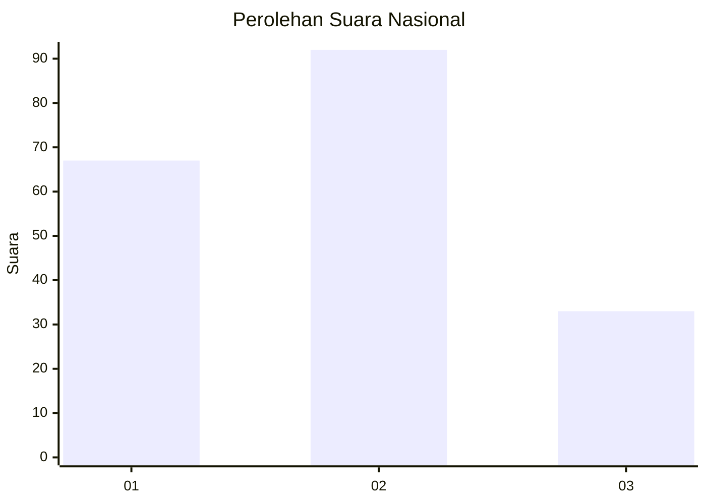
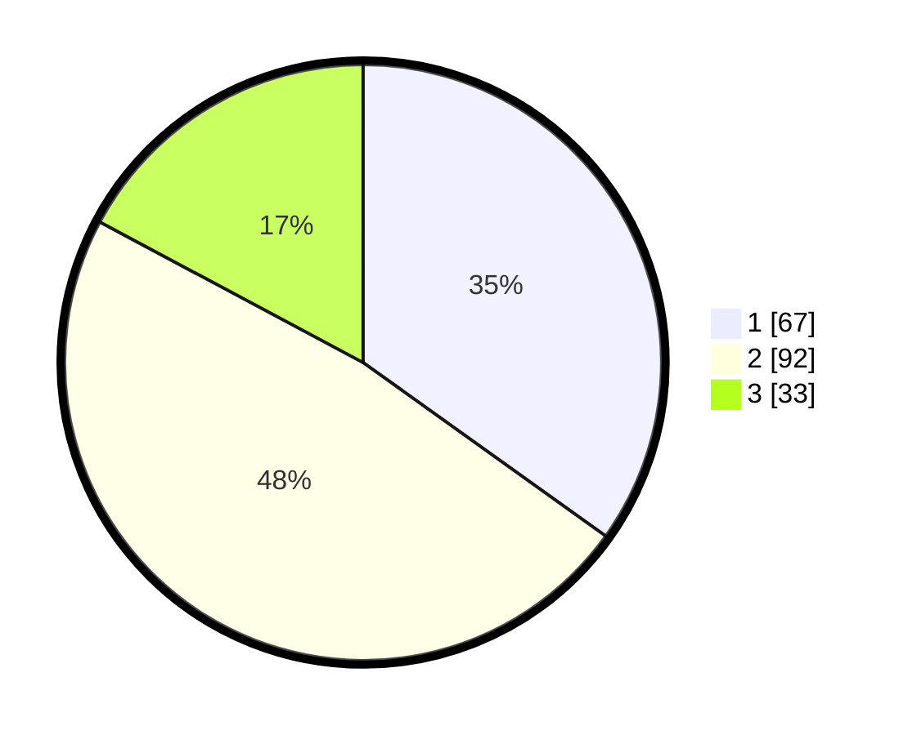

# Hasil

## Grafik

## Tabel

| No.    | Nama Paslon    | Suara | Suara (raw) | Persentase |
|:------ |:-------------- | -----:| -----------:| ----------:|
| 100025 | ANIES MUHAIMIN | 67    | [67][p-1]   | 34,90      |
| 100026 | PRABOWO GIBRAN | 92    | [92][p-2]   | 47,92      |
| 100027 | GANJAR MAHFUD  | 33    | [33][p-3]   | 17,19      |

[p-1]: https://github.com/gigit-pemilu/pemilu-2024/blob/main/pilpres/hitung-suara/sub/31-dki-jakarta/sub/73-jakarta-barat/sub/03-taman-sari/sub/1008-pinangsia/sub/034-tps/sub/paslon-1.txt
[p-2]: https://github.com/gigit-pemilu/pemilu-2024/blob/main/pilpres/hitung-suara/sub/31-dki-jakarta/sub/73-jakarta-barat/sub/03-taman-sari/sub/1008-pinangsia/sub/034-tps/sub/paslon-2.txt
[p-3]: https://github.com/gigit-pemilu/pemilu-2024/blob/main/pilpres/hitung-suara/sub/31-dki-jakarta/sub/73-jakarta-barat/sub/03-taman-sari/sub/1008-pinangsia/sub/034-tps/sub/paslon-3.txt

## Foto C Plano

https://sirekap-obj-formc.kpu.go.id/48f2/pemilu/ppwp/31/73/03/10/08/3173031008034-20240214-203044--87626464-0c5f-44bc-940e-4985273685f2.jpg

https://sirekap-obj-formc.kpu.go.id/48f2/pemilu/ppwp/31/73/03/10/08/3173031008034-20240214-203158--da8395b0-e304-41e8-8fb4-63bd00b612e9.jpg

https://sirekap-obj-formc.kpu.go.id/48f2/pemilu/ppwp/31/73/03/10/08/3173031008034-20240214-210203--f2800121-3988-40a9-9b17-e70e8d588a86.jpg

## Metadata

| Key        | Value               |
| ---------- | ------------------- |
| Time Stamp | 2024-02-21 17:00:00 |

