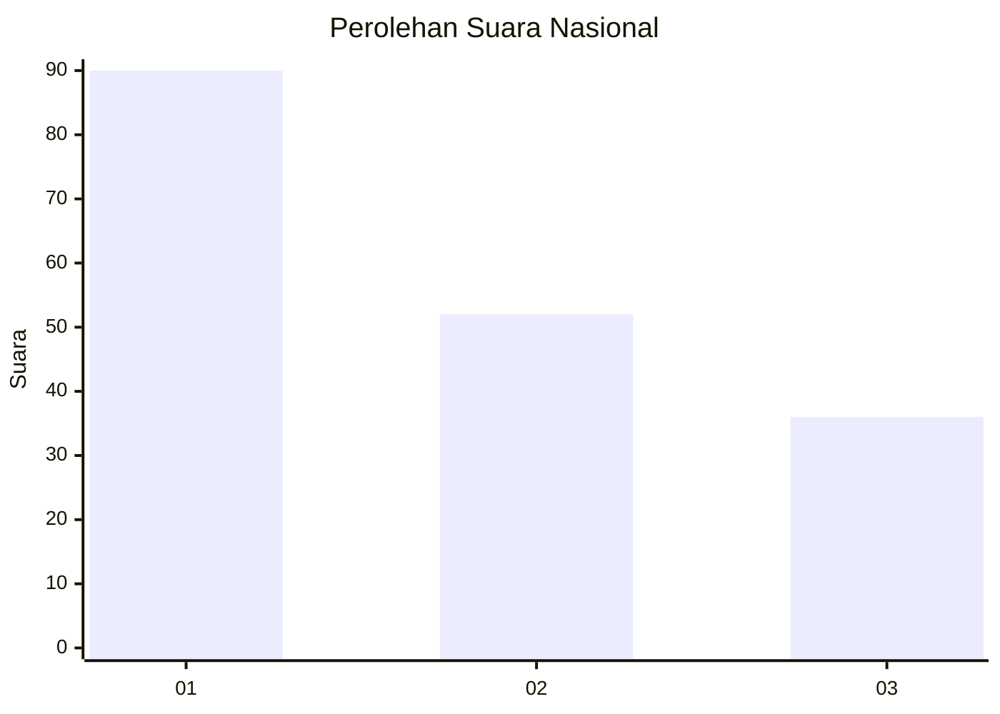
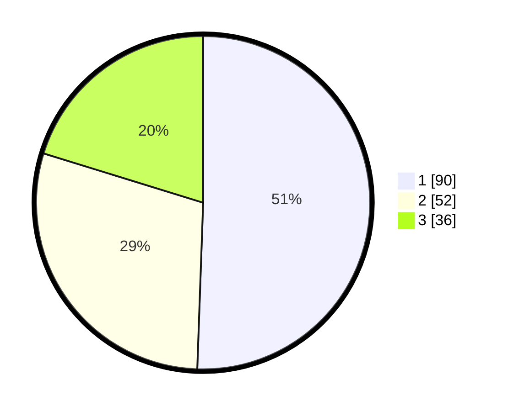

# Hasil

## Grafik

## Tabel

| No.    | Nama Paslon    | Suara | Suara (raw) | Persentase |
|:------ |:-------------- | -----:| -----------:| ----------:|
| 100025 | ANIES MUHAIMIN | 90    | [90][p-1]   | 50,56      |
| 100026 | PRABOWO GIBRAN | 52    | [52][p-2]   | 29,21      |
| 100027 | GANJAR MAHFUD  | 36    | [36][p-3]   | 20,22      |

[p-1]: https://github.com/gigit-pemilu/pemilu-2024/blob/main/pilpres/hitung-suara/sub/31-dki-jakarta/sub/73-jakarta-barat/sub/03-taman-sari/sub/1008-pinangsia/sub/037-tps/sub/paslon-1.txt
[p-2]: https://github.com/gigit-pemilu/pemilu-2024/blob/main/pilpres/hitung-suara/sub/31-dki-jakarta/sub/73-jakarta-barat/sub/03-taman-sari/sub/1008-pinangsia/sub/037-tps/sub/paslon-2.txt
[p-3]: https://github.com/gigit-pemilu/pemilu-2024/blob/main/pilpres/hitung-suara/sub/31-dki-jakarta/sub/73-jakarta-barat/sub/03-taman-sari/sub/1008-pinangsia/sub/037-tps/sub/paslon-3.txt

## Foto C Plano

https://sirekap-obj-formc.kpu.go.id/c079/pemilu/ppwp/31/73/03/10/08/3173031008037-20240214-200553--16b7f3fe-bc4b-431e-83ac-3f16dfbd0aad.jpg

https://sirekap-obj-formc.kpu.go.id/c079/pemilu/ppwp/31/73/03/10/08/3173031008037-20240214-201702--9783b4ba-6507-475e-9c70-519b852a11c7.jpg

https://sirekap-obj-formc.kpu.go.id/c079/pemilu/ppwp/31/73/03/10/08/3173031008037-20240214-201837--5be63d9c-f019-4248-af3f-17fc721ccc25.jpg

## Metadata

| Key        | Value               |
| ---------- | ------------------- |
| Time Stamp | 2024-02-17 16:52:47 |

