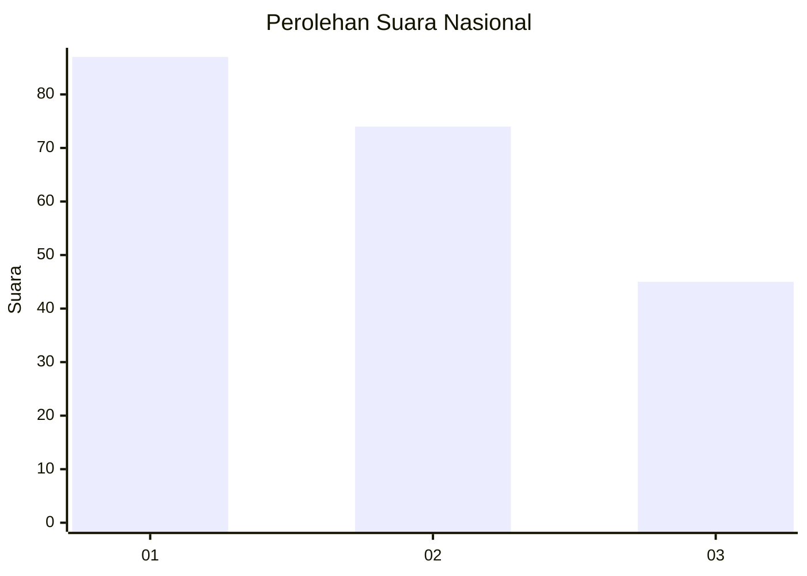
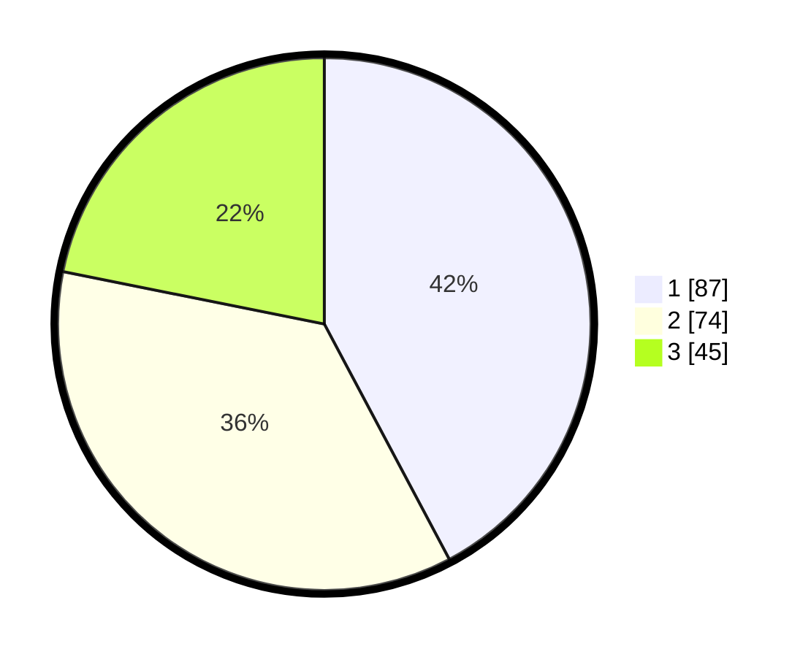

# Hasil

## Grafik

## Tabel

| No.    | Nama Paslon    | Suara | Suara (raw) | Persentase |
|:------ |:-------------- | -----:| -----------:| ----------:|
| 100025 | ANIES MUHAIMIN | 87    | [87][p-1]   | 42,23      |
| 100026 | PRABOWO GIBRAN | 74    | [74][p-2]   | 35,92      |
| 100027 | GANJAR MAHFUD  | 45    | [45][p-3]   | 21,84      |

[p-1]: https://github.com/gigit-pemilu/pemilu-2024/blob/main/pilpres/hitung-suara/sub/31-dki-jakarta/sub/73-jakarta-barat/sub/04-tambora/sub/1001-tambora/sub/015-tps/sub/paslon-1.txt
[p-2]: https://github.com/gigit-pemilu/pemilu-2024/blob/main/pilpres/hitung-suara/sub/31-dki-jakarta/sub/73-jakarta-barat/sub/04-tambora/sub/1001-tambora/sub/015-tps/sub/paslon-2.txt
[p-3]: https://github.com/gigit-pemilu/pemilu-2024/blob/main/pilpres/hitung-suara/sub/31-dki-jakarta/sub/73-jakarta-barat/sub/04-tambora/sub/1001-tambora/sub/015-tps/sub/paslon-3.txt

## Foto C Plano

https://sirekap-obj-formc.kpu.go.id/e6a4/pemilu/ppwp/31/73/04/10/01/3173041001015-20240214-195737--5fff7b46-46be-496c-88fb-c7a76160b500.jpg

https://sirekap-obj-formc.kpu.go.id/e6a4/pemilu/ppwp/31/73/04/10/01/3173041001015-20240214-195927--05953813-f13e-4190-b9ae-2359d7addf0e.jpg

https://sirekap-obj-formc.kpu.go.id/e6a4/pemilu/ppwp/31/73/04/10/01/3173041001015-20240214-215646--aeca0dc6-84e9-4abe-acb5-7a436572a9a5.jpg

## Metadata

| Key        | Value               |
| ---------- | ------------------- |
| Time Stamp | 2024-02-16 21:01:00 |

## DATA PEMILIH TETAP

Jumlah pemilih dalam DPT: **222**.
 * L: **137**.
 * P: **138**.

## DATA PENGGUNA HAK PILIH

Jumlah pengguna hak pilih dalam DPT: **203**.
 * L: **443**.
 * P: **106**.

Jumlah pengguna hak pilih dalam DPTb: **554**.
 * L: **555**.
 * P: **555**.

Jumlah pengguna hak pilih dalam DPK: **521**.
 * L: **445**.
 * P: **281**.

Jumlah pengguna hak pilih: **206**.
 * L: **499**.
 * P: **107**.

## JUMLAH SUARA SAH DAN TIDAK SAH

JUMLAH SELURUH SUARA SAH: **206**.

JUMLAH SUARA TIDAK SAH: **0**.

JUMLAH SELURUH SUARA SAH DAN SUARA TIDAK SAH: **206**.

