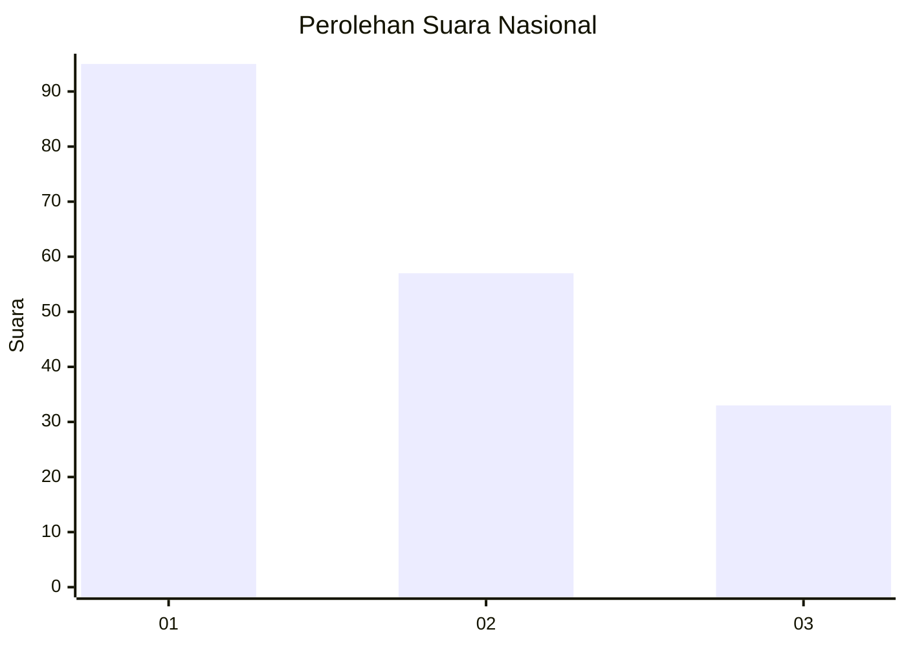
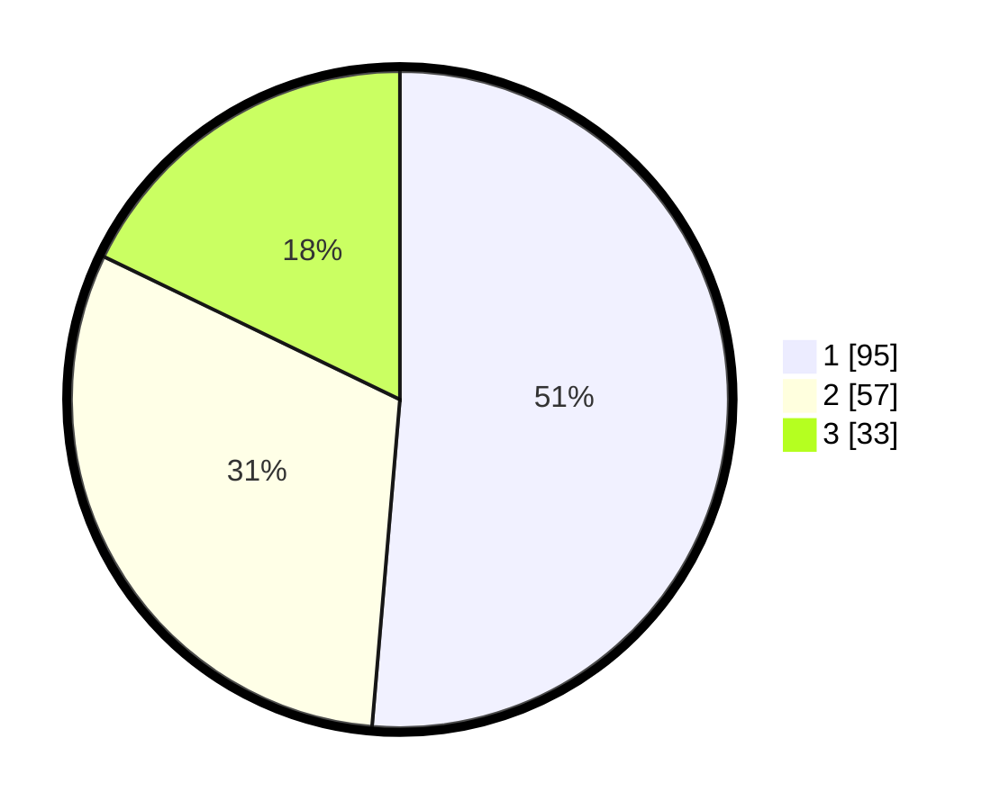

# Hasil

## Grafik

## Tabel

| No.    | Nama Paslon    | Suara | Suara (raw) | Persentase |
|:------ |:-------------- | -----:| -----------:| ----------:|
| 100025 | ANIES MUHAIMIN | 95    | [95][p-1]   | 51,35      |
| 100026 | PRABOWO GIBRAN | 57    | [57][p-2]   | 30,81      |
| 100027 | GANJAR MAHFUD  | 33    | [33][p-3]   | 17,84      |

[p-1]: https://github.com/gigit-pemilu/pemilu-2024/blob/main/pilpres/hitung-suara/sub/31-dki-jakarta/sub/73-jakarta-barat/sub/04-tambora/sub/1001-tambora/sub/034-tps/sub/paslon-1.txt
[p-2]: https://github.com/gigit-pemilu/pemilu-2024/blob/main/pilpres/hitung-suara/sub/31-dki-jakarta/sub/73-jakarta-barat/sub/04-tambora/sub/1001-tambora/sub/034-tps/sub/paslon-2.txt
[p-3]: https://github.com/gigit-pemilu/pemilu-2024/blob/main/pilpres/hitung-suara/sub/31-dki-jakarta/sub/73-jakarta-barat/sub/04-tambora/sub/1001-tambora/sub/034-tps/sub/paslon-3.txt

## Foto C Plano

https://sirekap-obj-formc.kpu.go.id/111a/pemilu/ppwp/31/73/04/10/01/3173041001034-20240215-004631--67acca7d-7f5c-4887-9c22-5ba546601f3d.jpg

https://sirekap-obj-formc.kpu.go.id/111a/pemilu/ppwp/31/73/04/10/01/3173041001034-20240215-004850--ee6dfd09-3985-44d6-86e8-7e8b9f8b5355.jpg

https://sirekap-obj-formc.kpu.go.id/111a/pemilu/ppwp/31/73/04/10/01/3173041001034-20240215-005030--3a340506-6e79-4e6f-948b-a3ebe188f65e.jpg

## Metadata

| Key        | Value               |
| ---------- | ------------------- |
| Time Stamp | 2024-02-17 14:45:18 |

