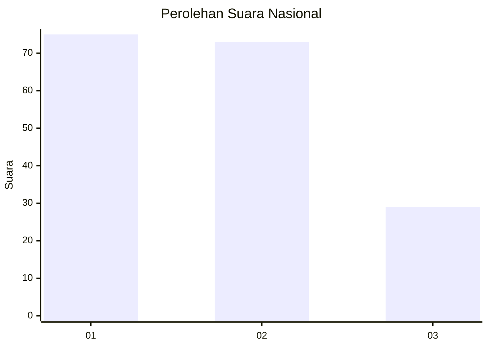
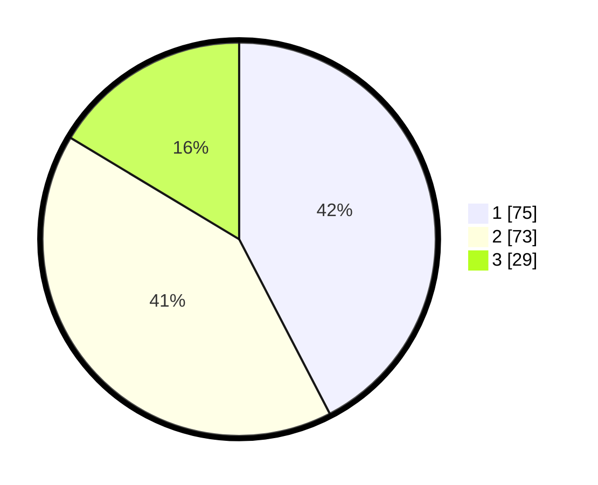

# Hasil

## Grafik

## Tabel

| No.    | Nama Paslon    | Suara | Suara (raw) | Persentase |
|:------ |:-------------- | -----:| -----------:| ----------:|
| 100025 | ANIES MUHAIMIN | 75    | [75][p-1]   | 42,37      |
| 100026 | PRABOWO GIBRAN | 73    | [73][p-2]   | 41,24      |
| 100027 | GANJAR MAHFUD  | 29    | [29][p-3]   | 16,38      |

[p-1]: https://github.com/gigit-pemilu/pemilu-2024/blob/main/pilpres/hitung-suara/sub/31-dki-jakarta/sub/73-jakarta-barat/sub/04-tambora/sub/1001-tambora/sub/038-tps/sub/paslon-1.txt
[p-2]: https://github.com/gigit-pemilu/pemilu-2024/blob/main/pilpres/hitung-suara/sub/31-dki-jakarta/sub/73-jakarta-barat/sub/04-tambora/sub/1001-tambora/sub/038-tps/sub/paslon-2.txt
[p-3]: https://github.com/gigit-pemilu/pemilu-2024/blob/main/pilpres/hitung-suara/sub/31-dki-jakarta/sub/73-jakarta-barat/sub/04-tambora/sub/1001-tambora/sub/038-tps/sub/paslon-3.txt

## Foto C Plano

https://sirekap-obj-formc.kpu.go.id/eabe/pemilu/ppwp/31/73/04/10/01/3173041001038-20240214-211308--730c689f-fe9f-4ab8-878e-adb7b9e0aeba.jpg

https://sirekap-obj-formc.kpu.go.id/eabe/pemilu/ppwp/31/73/04/10/01/3173041001038-20240214-211708--d664c9cb-823a-4d4e-a2b7-4bd392eddd58.jpg

https://sirekap-obj-formc.kpu.go.id/eabe/pemilu/ppwp/31/73/04/10/01/3173041001038-20240214-211914--94dbccc0-894b-49b3-809c-a57d9070a9ab.jpg

## Metadata

| Key        | Value               |
| ---------- | ------------------- |
| Time Stamp | 2024-02-15 05:00:24 |

