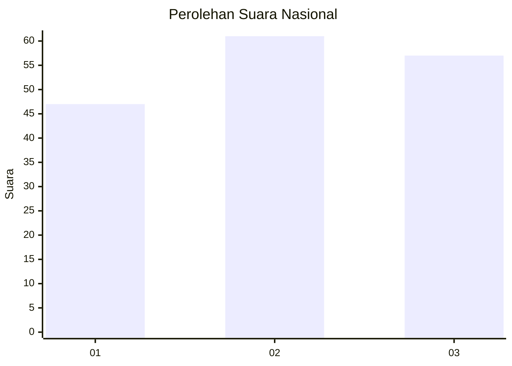
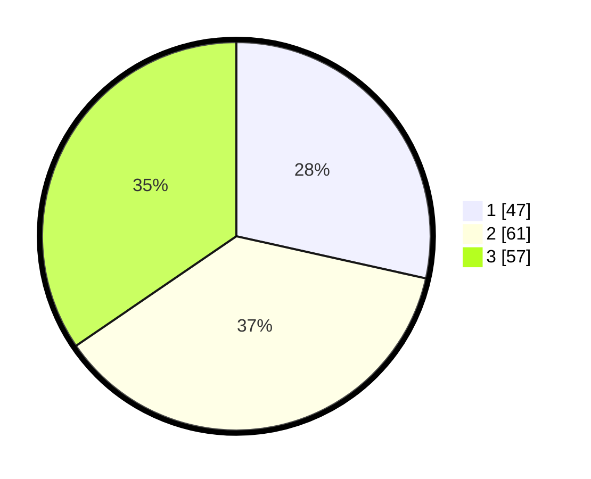

# Hasil

## Grafik

## Tabel

| No.    | Nama Paslon    | Suara | Suara (raw) | Persentase |
|:------ |:-------------- | -----:| -----------:| ----------:|
| 100025 | ANIES MUHAIMIN | 47    | [47][p-1]   | 28,48      |
| 100026 | PRABOWO GIBRAN | 61    | [61][p-2]   | 36,97      |
| 100027 | GANJAR MAHFUD  | 57    | [57][p-3]   | 34,55      |

[p-1]: https://github.com/gigit-pemilu/pemilu-2024/blob/main/pilpres/hitung-suara/sub/31-dki-jakarta/sub/73-jakarta-barat/sub/04-tambora/sub/1003-duri-utara/sub/008-tps/sub/paslon-1.txt
[p-2]: https://github.com/gigit-pemilu/pemilu-2024/blob/main/pilpres/hitung-suara/sub/31-dki-jakarta/sub/73-jakarta-barat/sub/04-tambora/sub/1003-duri-utara/sub/008-tps/sub/paslon-2.txt
[p-3]: https://github.com/gigit-pemilu/pemilu-2024/blob/main/pilpres/hitung-suara/sub/31-dki-jakarta/sub/73-jakarta-barat/sub/04-tambora/sub/1003-duri-utara/sub/008-tps/sub/paslon-3.txt

## Foto C Plano

https://sirekap-obj-formc.kpu.go.id/31da/pemilu/ppwp/31/73/04/10/03/3173041003008-20240214-214739--4472a699-4f1f-453d-bb27-b92b6304bb31.jpg

https://sirekap-obj-formc.kpu.go.id/31da/pemilu/ppwp/31/73/04/10/03/3173041003008-20240214-214949--fdf51141-9982-475f-a7a2-a8e2bcfa5ef8.jpg

https://sirekap-obj-formc.kpu.go.id/31da/pemilu/ppwp/31/73/04/10/03/3173041003008-20240214-215051--1b8a0a33-d6bd-46e3-bec6-81f45fdb8818.jpg

## Metadata

| Key        | Value               |
| ---------- | ------------------- |
| Time Stamp | 2024-02-16 00:30:27 |

