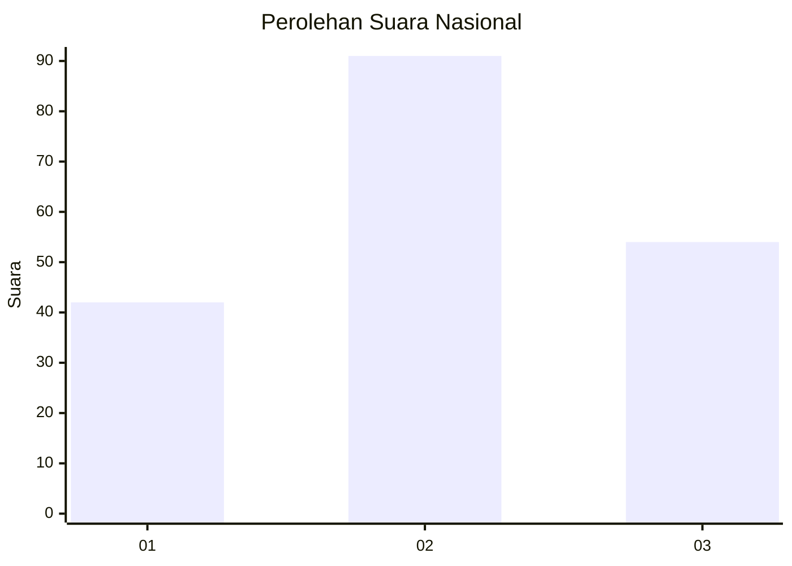
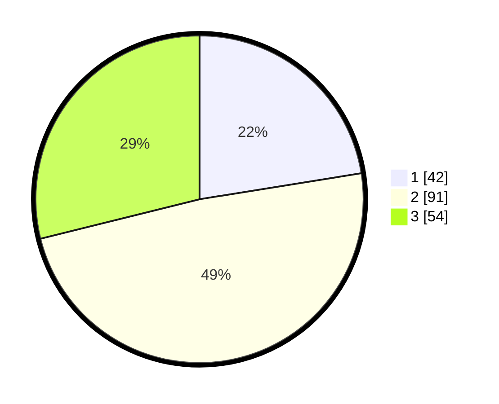

# Hasil

## Grafik

## Tabel

| No.    | Nama Paslon    | Suara | Suara (raw) | Persentase |
|:------ |:-------------- | -----:| -----------:| ----------:|
| 100025 | ANIES MUHAIMIN | 42    | [42][p-1]   | 22,46      |
| 100026 | PRABOWO GIBRAN | 91    | [91][p-2]   | 48,66      |
| 100027 | GANJAR MAHFUD  | 54    | [54][p-3]   | 28,88      |

[p-1]: https://github.com/gigit-pemilu/pemilu-2024/blob/main/pilpres/hitung-suara/sub/31-dki-jakarta/sub/73-jakarta-barat/sub/04-tambora/sub/1003-duri-utara/sub/012-tps/sub/paslon-1.txt
[p-2]: https://github.com/gigit-pemilu/pemilu-2024/blob/main/pilpres/hitung-suara/sub/31-dki-jakarta/sub/73-jakarta-barat/sub/04-tambora/sub/1003-duri-utara/sub/012-tps/sub/paslon-2.txt
[p-3]: https://github.com/gigit-pemilu/pemilu-2024/blob/main/pilpres/hitung-suara/sub/31-dki-jakarta/sub/73-jakarta-barat/sub/04-tambora/sub/1003-duri-utara/sub/012-tps/sub/paslon-3.txt

## Foto C Plano

https://sirekap-obj-formc.kpu.go.id/e1f2/pemilu/ppwp/31/73/04/10/03/3173041003012-20240214-193347--e53c9f15-8e0e-4528-817a-18f2788b44e1.jpg

https://sirekap-obj-formc.kpu.go.id/e1f2/pemilu/ppwp/31/73/04/10/03/3173041003012-20240214-193443--e8602df1-5021-4155-a817-aa7e0687599e.jpg

https://sirekap-obj-formc.kpu.go.id/e1f2/pemilu/ppwp/31/73/04/10/03/3173041003012-20240214-193537--41199064-66c6-4a28-aa25-372bc5184581.jpg

## Metadata

| Key        | Value               |
| ---------- | ------------------- |
| Time Stamp | 2024-02-16 00:30:27 |

