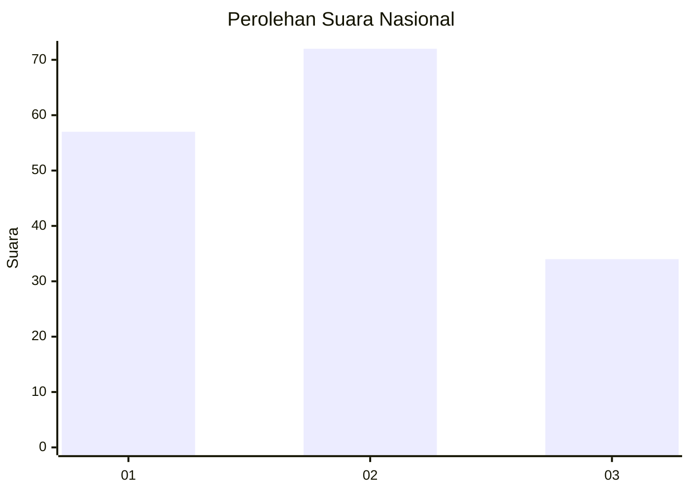
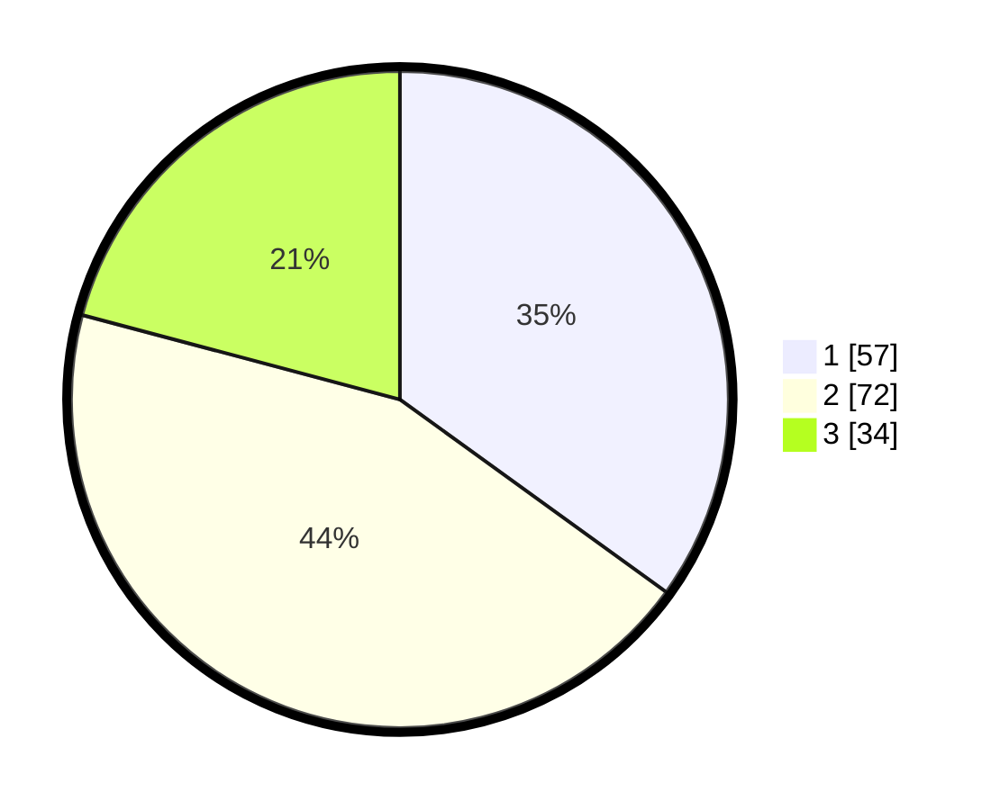

# Hasil

## Grafik

## Tabel

| No.    | Nama Paslon    | Suara | Suara (raw) | Persentase |
|:------ |:-------------- | -----:| -----------:| ----------:|
| 100025 | ANIES MUHAIMIN | 57    | [57][p-1]   | 34,97      |
| 100026 | PRABOWO GIBRAN | 72    | [72][p-2]   | 44,17      |
| 100027 | GANJAR MAHFUD  | 34    | [34][p-3]   | 20,86      |

[p-1]: https://github.com/gigit-pemilu/pemilu-2024/blob/main/pilpres/hitung-suara/sub/31-dki-jakarta/sub/73-jakarta-barat/sub/04-tambora/sub/1003-duri-utara/sub/014-tps/sub/paslon-1.txt
[p-2]: https://github.com/gigit-pemilu/pemilu-2024/blob/main/pilpres/hitung-suara/sub/31-dki-jakarta/sub/73-jakarta-barat/sub/04-tambora/sub/1003-duri-utara/sub/014-tps/sub/paslon-2.txt
[p-3]: https://github.com/gigit-pemilu/pemilu-2024/blob/main/pilpres/hitung-suara/sub/31-dki-jakarta/sub/73-jakarta-barat/sub/04-tambora/sub/1003-duri-utara/sub/014-tps/sub/paslon-3.txt

## Foto C Plano

https://sirekap-obj-formc.kpu.go.id/438c/pemilu/ppwp/31/73/04/10/03/3173041003014-20240214-221147--a420a5a3-9184-466c-962c-9b165a8368fa.jpg

https://sirekap-obj-formc.kpu.go.id/438c/pemilu/ppwp/31/73/04/10/03/3173041003014-20240214-221225--5aaeab13-0d56-41f3-bbea-e6fd24943ed7.jpg

https://sirekap-obj-formc.kpu.go.id/438c/pemilu/ppwp/31/73/04/10/03/3173041003014-20240214-221241--f4fbc5ca-c604-4a57-b488-dea6fd61d527.jpg

## Metadata

| Key        | Value               |
| ---------- | ------------------- |
| Time Stamp | 2024-02-16 00:30:27 |

