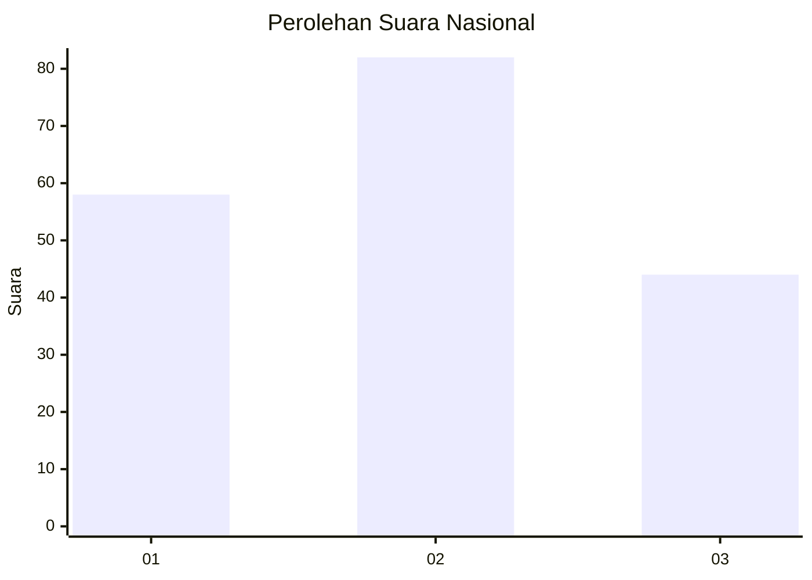
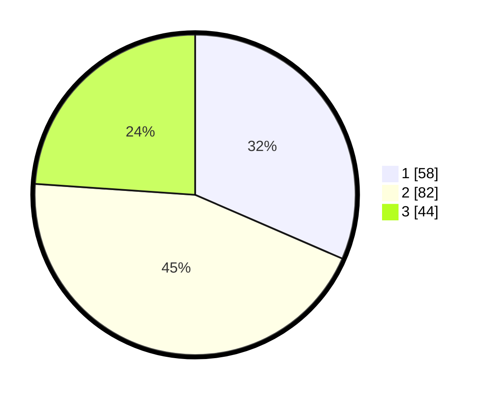

# Hasil

## Grafik

## Tabel

| No.    | Nama Paslon    | Suara | Suara (raw) | Persentase |
|:------ |:-------------- | -----:| -----------:| ----------:|
| 100025 | ANIES MUHAIMIN | 58    | [58][p-1]   | 31,52      |
| 100026 | PRABOWO GIBRAN | 82    | [82][p-2]   | 44,57      |
| 100027 | GANJAR MAHFUD  | 44    | [44][p-3]   | 23,91      |

[p-1]: https://github.com/gigit-pemilu/pemilu-2024/blob/main/pilpres/hitung-suara/sub/31-dki-jakarta/sub/73-jakarta-barat/sub/04-tambora/sub/1003-duri-utara/sub/019-tps/sub/paslon-1.txt
[p-2]: https://github.com/gigit-pemilu/pemilu-2024/blob/main/pilpres/hitung-suara/sub/31-dki-jakarta/sub/73-jakarta-barat/sub/04-tambora/sub/1003-duri-utara/sub/019-tps/sub/paslon-2.txt
[p-3]: https://github.com/gigit-pemilu/pemilu-2024/blob/main/pilpres/hitung-suara/sub/31-dki-jakarta/sub/73-jakarta-barat/sub/04-tambora/sub/1003-duri-utara/sub/019-tps/sub/paslon-3.txt

## Foto C Plano

https://sirekap-obj-formc.kpu.go.id/2fe6/pemilu/ppwp/31/73/04/10/03/3173041003019-20240214-230709--8f43b113-19db-4144-a1be-b7ef61e6c736.jpg

https://sirekap-obj-formc.kpu.go.id/2fe6/pemilu/ppwp/31/73/04/10/03/3173041003019-20240214-230619--95c8bea1-2e98-46d5-9e2b-84ed29ef3e6e.jpg

https://sirekap-obj-formc.kpu.go.id/2fe6/pemilu/ppwp/31/73/04/10/03/3173041003019-20240214-230515--2dfc1199-7429-4265-9ad6-4c071c7f021b.jpg

## Metadata

| Key        | Value               |
| ---------- | ------------------- |
| Time Stamp | 2024-02-16 00:30:27 |

