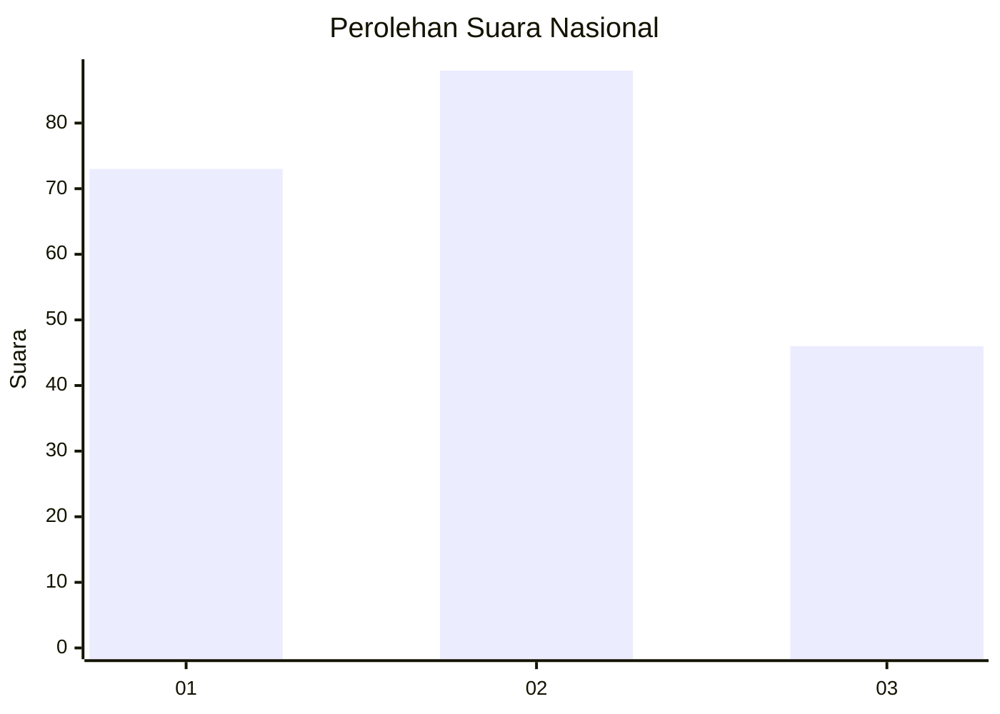
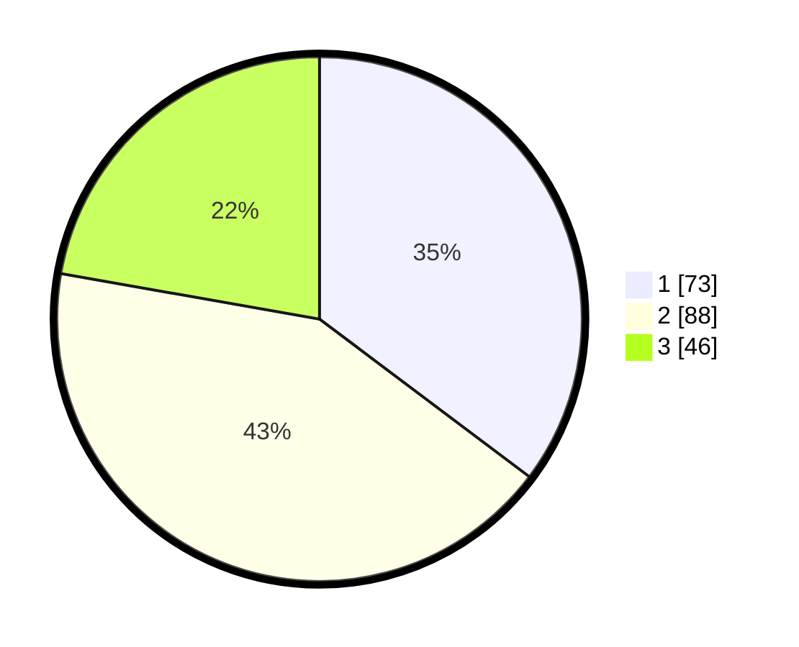

# Hasil

## Grafik

## Tabel

| No.    | Nama Paslon    | Suara | Suara (raw) | Persentase |
|:------ |:-------------- | -----:| -----------:| ----------:|
| 100025 | ANIES MUHAIMIN | 73    | [73][p-1]   | 35,27      |
| 100026 | PRABOWO GIBRAN | 88    | [88][p-2]   | 42,51      |
| 100027 | GANJAR MAHFUD  | 46    | [46][p-3]   | 22,22      |

[p-1]: https://github.com/gigit-pemilu/pemilu-2024/blob/main/pilpres/hitung-suara/sub/31-dki-jakarta/sub/73-jakarta-barat/sub/04-tambora/sub/1003-duri-utara/sub/030-tps/sub/paslon-1.txt
[p-2]: https://github.com/gigit-pemilu/pemilu-2024/blob/main/pilpres/hitung-suara/sub/31-dki-jakarta/sub/73-jakarta-barat/sub/04-tambora/sub/1003-duri-utara/sub/030-tps/sub/paslon-2.txt
[p-3]: https://github.com/gigit-pemilu/pemilu-2024/blob/main/pilpres/hitung-suara/sub/31-dki-jakarta/sub/73-jakarta-barat/sub/04-tambora/sub/1003-duri-utara/sub/030-tps/sub/paslon-3.txt

## Foto C Plano

https://sirekap-obj-formc.kpu.go.id/36d7/pemilu/ppwp/31/73/04/10/03/3173041003030-20240214-205459--b532b73e-4dbb-409a-aeaf-f55e9ebda8f2.jpg

https://sirekap-obj-formc.kpu.go.id/36d7/pemilu/ppwp/31/73/04/10/03/3173041003030-20240214-205550--62550bcd-f6c4-4f0e-a2bb-f2d570557e59.jpg

https://sirekap-obj-formc.kpu.go.id/36d7/pemilu/ppwp/31/73/04/10/03/3173041003030-20240214-205656--454b34c0-5748-439d-87dc-dea1902f2f2d.jpg

## Metadata

| Key        | Value               |
| ---------- | ------------------- |
| Time Stamp | 2024-02-16 00:30:27 |

