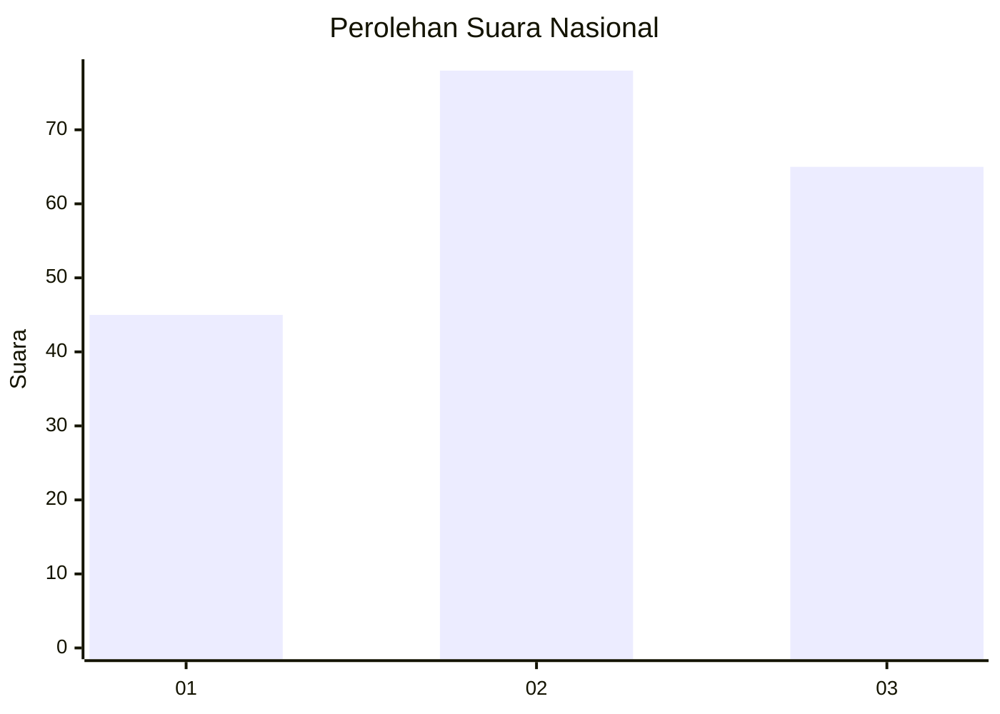
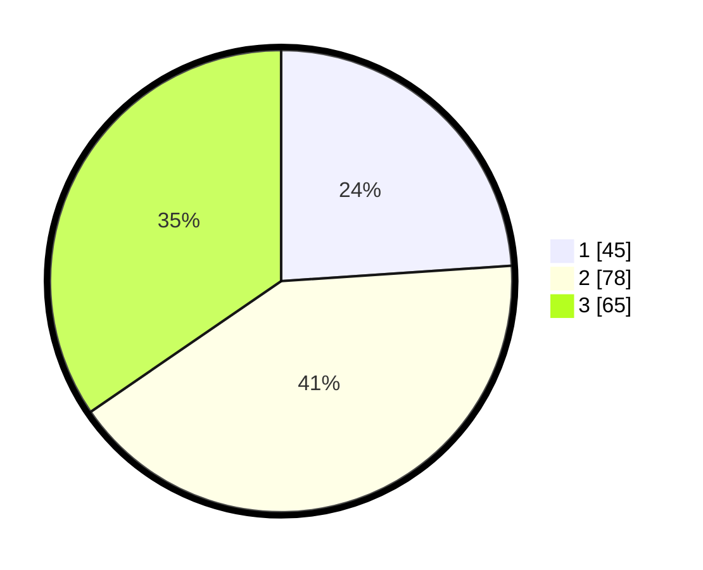

# Hasil

## Grafik

## Tabel

| No.    | Nama Paslon    | Suara | Suara (raw) | Persentase |
|:------ |:-------------- | -----:| -----------:| ----------:|
| 100025 | ANIES MUHAIMIN | 45    | [45][p-1]   | 23,94      |
| 100026 | PRABOWO GIBRAN | 78    | [78][p-2]   | 41,49      |
| 100027 | GANJAR MAHFUD  | 65    | [65][p-3]   | 34,57      |

[p-1]: https://github.com/gigit-pemilu/pemilu-2024/blob/main/pilpres/hitung-suara/sub/31-dki-jakarta/sub/73-jakarta-barat/sub/04-tambora/sub/1003-duri-utara/sub/032-tps/sub/paslon-1.txt
[p-2]: https://github.com/gigit-pemilu/pemilu-2024/blob/main/pilpres/hitung-suara/sub/31-dki-jakarta/sub/73-jakarta-barat/sub/04-tambora/sub/1003-duri-utara/sub/032-tps/sub/paslon-2.txt
[p-3]: https://github.com/gigit-pemilu/pemilu-2024/blob/main/pilpres/hitung-suara/sub/31-dki-jakarta/sub/73-jakarta-barat/sub/04-tambora/sub/1003-duri-utara/sub/032-tps/sub/paslon-3.txt

## Foto C Plano

https://sirekap-obj-formc.kpu.go.id/4b8d/pemilu/ppwp/31/73/04/10/03/3173041003032-20240214-214300--9bafbd86-e73b-4bac-9a1f-74c7f4f340ee.jpg

https://sirekap-obj-formc.kpu.go.id/4b8d/pemilu/ppwp/31/73/04/10/03/3173041003032-20240214-214309--dda633e7-011c-459b-9de4-89ddac8bdba1.jpg

https://sirekap-obj-formc.kpu.go.id/4b8d/pemilu/ppwp/31/73/04/10/03/3173041003032-20240214-214314--7688f920-6ada-4b33-96e3-5a6bc3855a1c.jpg

## Metadata

| Key        | Value               |
| ---------- | ------------------- |
| Time Stamp | 2024-02-21 16:00:00 |

