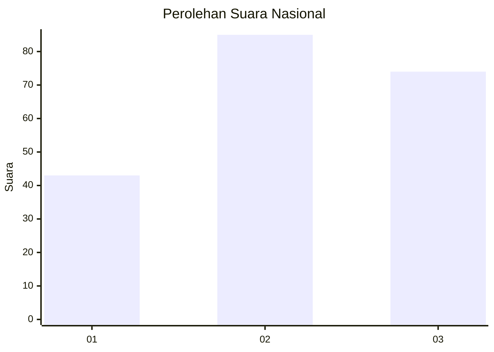
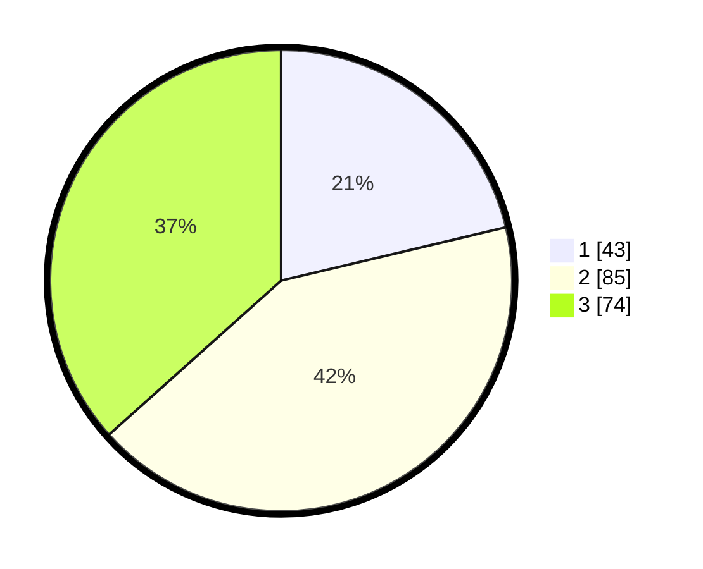

# Hasil

## Grafik

## Tabel

| No.    | Nama Paslon    | Suara | Suara (raw) | Persentase |
|:------ |:-------------- | -----:| -----------:| ----------:|
| 100025 | ANIES MUHAIMIN | 43    | [43][p-1]   | 21,29      |
| 100026 | PRABOWO GIBRAN | 85    | [85][p-2]   | 42,08      |
| 100027 | GANJAR MAHFUD  | 74    | [74][p-3]   | 36,63      |

[p-1]: https://github.com/gigit-pemilu/pemilu-2024/blob/main/pilpres/hitung-suara/sub/31-dki-jakarta/sub/73-jakarta-barat/sub/04-tambora/sub/1003-duri-utara/sub/065-tps/sub/paslon-1.txt
[p-2]: https://github.com/gigit-pemilu/pemilu-2024/blob/main/pilpres/hitung-suara/sub/31-dki-jakarta/sub/73-jakarta-barat/sub/04-tambora/sub/1003-duri-utara/sub/065-tps/sub/paslon-2.txt
[p-3]: https://github.com/gigit-pemilu/pemilu-2024/blob/main/pilpres/hitung-suara/sub/31-dki-jakarta/sub/73-jakarta-barat/sub/04-tambora/sub/1003-duri-utara/sub/065-tps/sub/paslon-3.txt

## Foto C Plano

https://sirekap-obj-formc.kpu.go.id/7ba2/pemilu/ppwp/31/73/04/10/03/3173041003065-20240215-023133--ef9c94d6-2453-42d9-907b-4bcbd81e79c4.jpg

https://sirekap-obj-formc.kpu.go.id/7ba2/pemilu/ppwp/31/73/04/10/03/3173041003065-20240215-023503--a9d1c67b-4c02-426d-8caa-70359fe36b2e.jpg

https://sirekap-obj-formc.kpu.go.id/7ba2/pemilu/ppwp/31/73/04/10/03/3173041003065-20240215-023910--e882f116-47cd-4c1e-b087-62284e2c805e.jpg

## Metadata

| Key        | Value               |
| ---------- | ------------------- |
| Time Stamp | 2024-02-16 01:00:27 |

