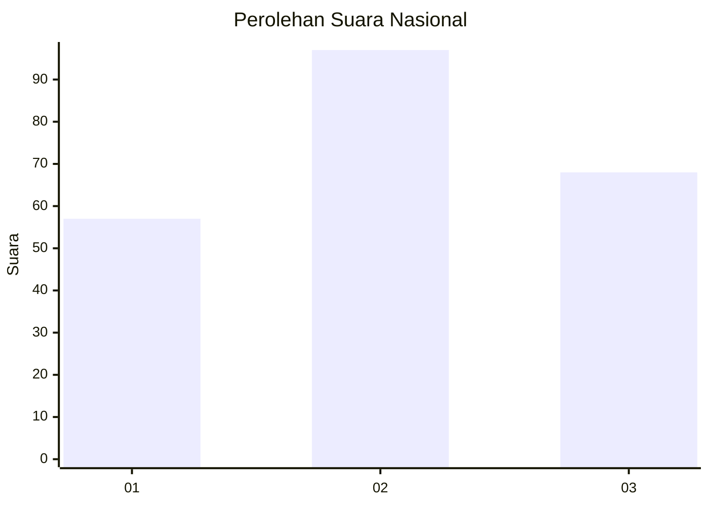
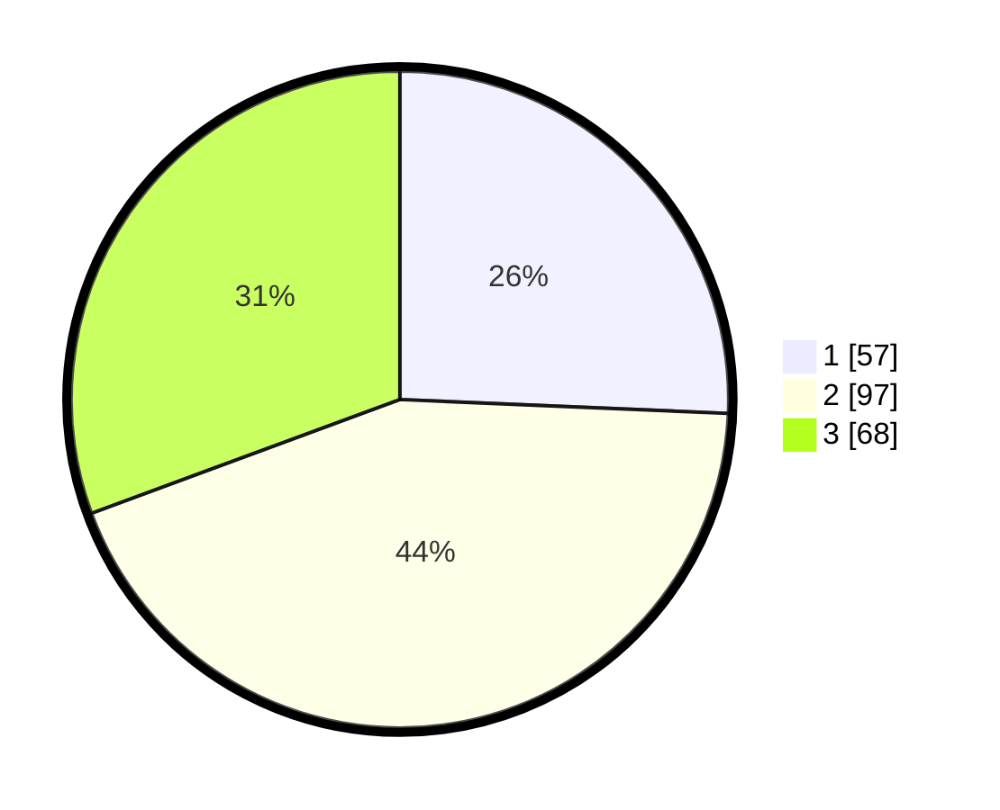

# Hasil

## Grafik

## Tabel

| No.    | Nama Paslon    | Suara | Suara (raw) | Persentase |
|:------ |:-------------- | -----:| -----------:| ----------:|
| 100025 | ANIES MUHAIMIN | 57    | [57][p-1]   | 25,68      |
| 100026 | PRABOWO GIBRAN | 97    | [97][p-2]   | 43,69      |
| 100027 | GANJAR MAHFUD  | 68    | [68][p-3]   | 30,63      |

[p-1]: https://github.com/gigit-pemilu/pemilu-2024/blob/main/pilpres/hitung-suara/sub/31-dki-jakarta/sub/73-jakarta-barat/sub/04-tambora/sub/1004-tanah-sereal/sub/002-tps/sub/paslon-1.txt
[p-2]: https://github.com/gigit-pemilu/pemilu-2024/blob/main/pilpres/hitung-suara/sub/31-dki-jakarta/sub/73-jakarta-barat/sub/04-tambora/sub/1004-tanah-sereal/sub/002-tps/sub/paslon-2.txt
[p-3]: https://github.com/gigit-pemilu/pemilu-2024/blob/main/pilpres/hitung-suara/sub/31-dki-jakarta/sub/73-jakarta-barat/sub/04-tambora/sub/1004-tanah-sereal/sub/002-tps/sub/paslon-3.txt

## Foto C Plano

https://sirekap-obj-formc.kpu.go.id/cf74/pemilu/ppwp/31/73/04/10/04/3173041004002-20240215-003647--274caac0-89c5-40c0-9410-9b5a168a93dc.jpg

https://sirekap-obj-formc.kpu.go.id/cf74/pemilu/ppwp/31/73/04/10/04/3173041004002-20240215-003907--dcd8fc90-8ee6-4c57-bf19-58779d44e68e.jpg

https://sirekap-obj-formc.kpu.go.id/cf74/pemilu/ppwp/31/73/04/10/04/3173041004002-20240215-003952--b25f8030-e6cb-4788-b2e6-95aec405d935.jpg

## Metadata

| Key        | Value               |
| ---------- | ------------------- |
| Time Stamp | 2024-02-19 14:00:00 |

