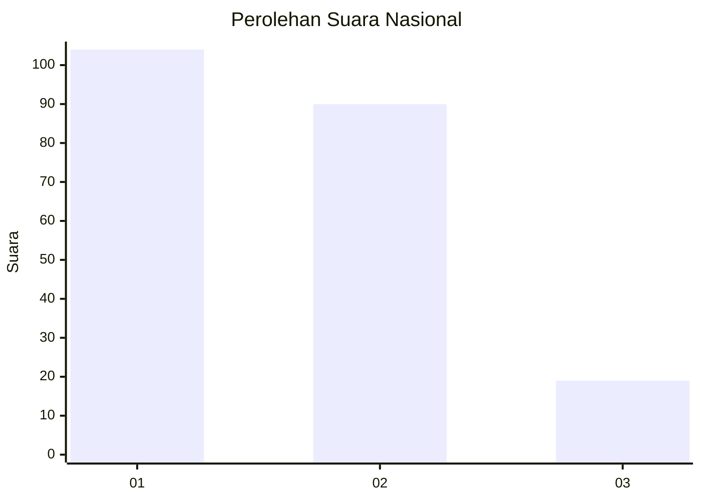
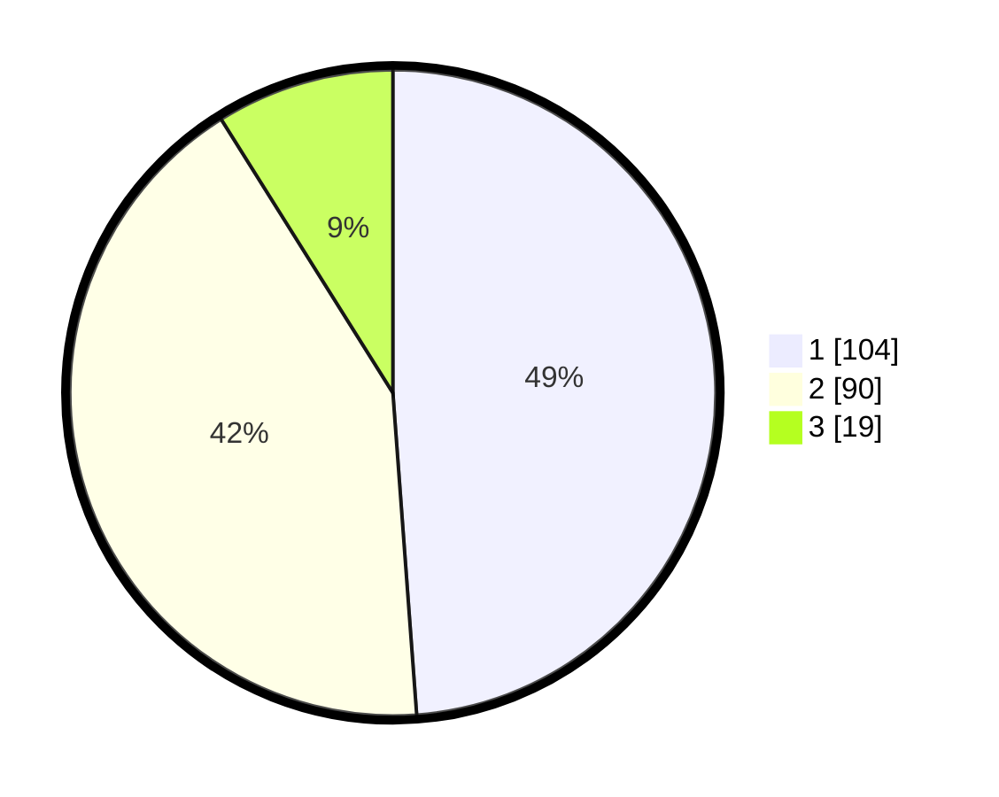

# Hasil

## Grafik

## Tabel

| No.    | Nama Paslon    | Suara | Suara (raw) | Persentase |
|:------ |:-------------- | -----:| -----------:| ----------:|
| 100025 | ANIES MUHAIMIN | 104   | [104][p-1]  | 48,83      |
| 100026 | PRABOWO GIBRAN | 90    | [90][p-2]   | 42,25      |
| 100027 | GANJAR MAHFUD  | 19    | [19][p-3]   | 8,92       |

[p-1]: https://github.com/gigit-pemilu/pemilu-2024/blob/main/pilpres/hitung-suara/sub/31-dki-jakarta/sub/73-jakarta-barat/sub/04-tambora/sub/1004-tanah-sereal/sub/004-tps/sub/paslon-1.txt
[p-2]: https://github.com/gigit-pemilu/pemilu-2024/blob/main/pilpres/hitung-suara/sub/31-dki-jakarta/sub/73-jakarta-barat/sub/04-tambora/sub/1004-tanah-sereal/sub/004-tps/sub/paslon-2.txt
[p-3]: https://github.com/gigit-pemilu/pemilu-2024/blob/main/pilpres/hitung-suara/sub/31-dki-jakarta/sub/73-jakarta-barat/sub/04-tambora/sub/1004-tanah-sereal/sub/004-tps/sub/paslon-3.txt

## Foto C Plano

https://sirekap-obj-formc.kpu.go.id/c86c/pemilu/ppwp/31/73/04/10/04/3173041004004-20240214-235607--3e267028-59b8-4fa9-a68e-9fe6aec648ed.jpg

https://sirekap-obj-formc.kpu.go.id/c86c/pemilu/ppwp/31/73/04/10/04/3173041004004-20240215-000116--7c07ca98-d4fd-4a1f-9206-ccbbe8ce0dae.jpg

https://sirekap-obj-formc.kpu.go.id/c86c/pemilu/ppwp/31/73/04/10/04/3173041004004-20240215-000318--7bda159e-46cb-421a-9d5c-2ad1b268ffe8.jpg

## Metadata

| Key        | Value               |
| ---------- | ------------------- |
| Time Stamp | 2024-02-21 16:00:00 |

