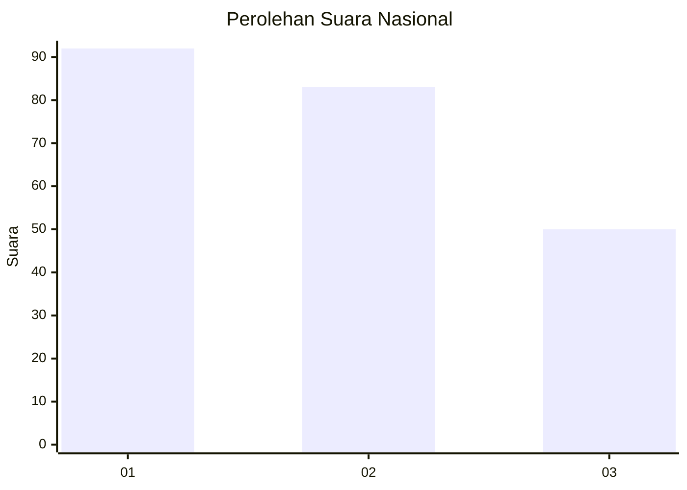
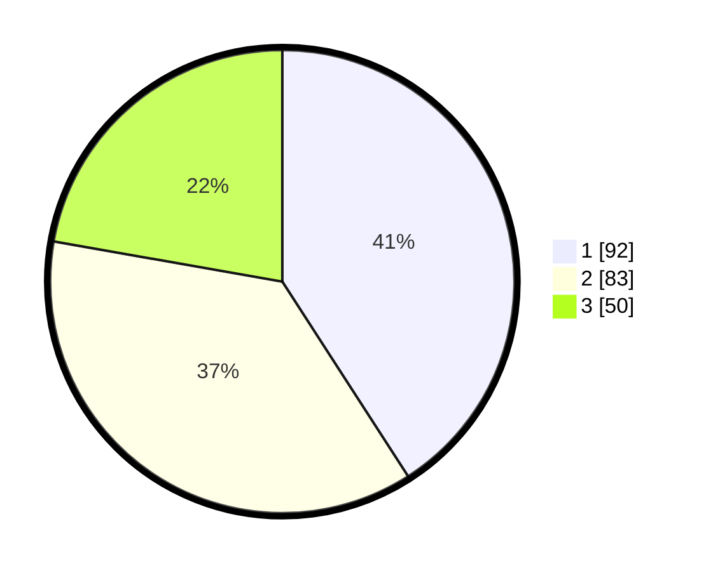

# Hasil

## Grafik

## Tabel

| No.    | Nama Paslon    | Suara | Suara (raw) | Persentase |
|:------ |:-------------- | -----:| -----------:| ----------:|
| 100025 | ANIES MUHAIMIN | 92    | [92][p-1]   | 40,89      |
| 100026 | PRABOWO GIBRAN | 83    | [83][p-2]   | 36,89      |
| 100027 | GANJAR MAHFUD  | 50    | [50][p-3]   | 22,22      |

[p-1]: https://github.com/gigit-pemilu/pemilu-2024/blob/main/pilpres/hitung-suara/sub/31-dki-jakarta/sub/73-jakarta-barat/sub/04-tambora/sub/1004-tanah-sereal/sub/011-tps/sub/paslon-1.txt
[p-2]: https://github.com/gigit-pemilu/pemilu-2024/blob/main/pilpres/hitung-suara/sub/31-dki-jakarta/sub/73-jakarta-barat/sub/04-tambora/sub/1004-tanah-sereal/sub/011-tps/sub/paslon-2.txt
[p-3]: https://github.com/gigit-pemilu/pemilu-2024/blob/main/pilpres/hitung-suara/sub/31-dki-jakarta/sub/73-jakarta-barat/sub/04-tambora/sub/1004-tanah-sereal/sub/011-tps/sub/paslon-3.txt

## Foto C Plano

https://sirekap-obj-formc.kpu.go.id/88cc/pemilu/ppwp/31/73/04/10/04/3173041004011-20240215-001140--a29988c7-dd38-4b0c-979b-511419b6b6b3.jpg

https://sirekap-obj-formc.kpu.go.id/88cc/pemilu/ppwp/31/73/04/10/04/3173041004011-20240215-001144--06780b76-4507-4f7a-b742-424923131139.jpg

https://sirekap-obj-formc.kpu.go.id/88cc/pemilu/ppwp/31/73/04/10/04/3173041004011-20240215-001217--81eb4496-3699-4341-8ba1-aae4fa317a61.jpg

## Metadata

| Key        | Value               |
| ---------- | ------------------- |
| Time Stamp | 2024-02-21 16:00:00 |

