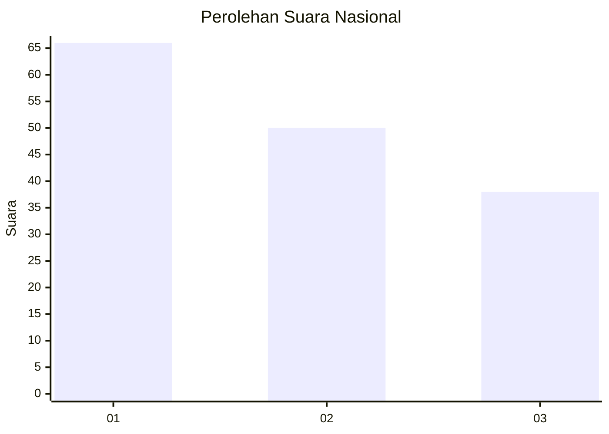
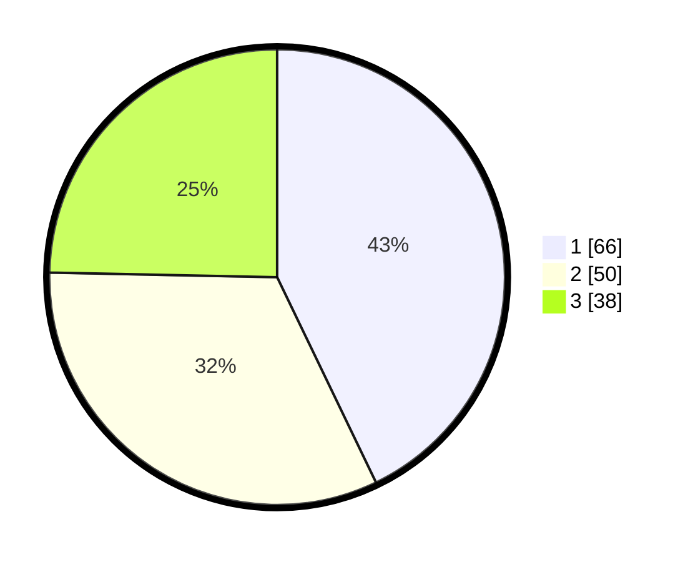

# Hasil

## Grafik

## Tabel

| No.    | Nama Paslon    | Suara | Suara (raw) | Persentase |
|:------ |:-------------- | -----:| -----------:| ----------:|
| 100025 | ANIES MUHAIMIN | 66    | [66][p-1]   | 42,86      |
| 100026 | PRABOWO GIBRAN | 50    | [50][p-2]   | 32,47      |
| 100027 | GANJAR MAHFUD  | 38    | [38][p-3]   | 24,68      |

[p-1]: https://github.com/gigit-pemilu/pemilu-2024/blob/main/pilpres/hitung-suara/sub/31-dki-jakarta/sub/73-jakarta-barat/sub/04-tambora/sub/1004-tanah-sereal/sub/023-tps/sub/paslon-1.txt
[p-2]: https://github.com/gigit-pemilu/pemilu-2024/blob/main/pilpres/hitung-suara/sub/31-dki-jakarta/sub/73-jakarta-barat/sub/04-tambora/sub/1004-tanah-sereal/sub/023-tps/sub/paslon-2.txt
[p-3]: https://github.com/gigit-pemilu/pemilu-2024/blob/main/pilpres/hitung-suara/sub/31-dki-jakarta/sub/73-jakarta-barat/sub/04-tambora/sub/1004-tanah-sereal/sub/023-tps/sub/paslon-3.txt

## Foto C Plano

https://sirekap-obj-formc.kpu.go.id/0822/pemilu/ppwp/31/73/04/10/04/3173041004023-20240214-223029--c02bc844-70f6-463c-8e1f-763efa15c4dc.jpg

https://sirekap-obj-formc.kpu.go.id/0822/pemilu/ppwp/31/73/04/10/04/3173041004023-20240214-214739--b016eae9-6319-4688-b155-446a96265005.jpg

https://sirekap-obj-formc.kpu.go.id/0822/pemilu/ppwp/31/73/04/10/04/3173041004023-20240214-221212--519a3d13-bb97-4ca0-b459-4b40d55af247.jpg

## Metadata

| Key        | Value               |
| ---------- | ------------------- |
| Time Stamp | 2024-02-19 15:00:00 |

