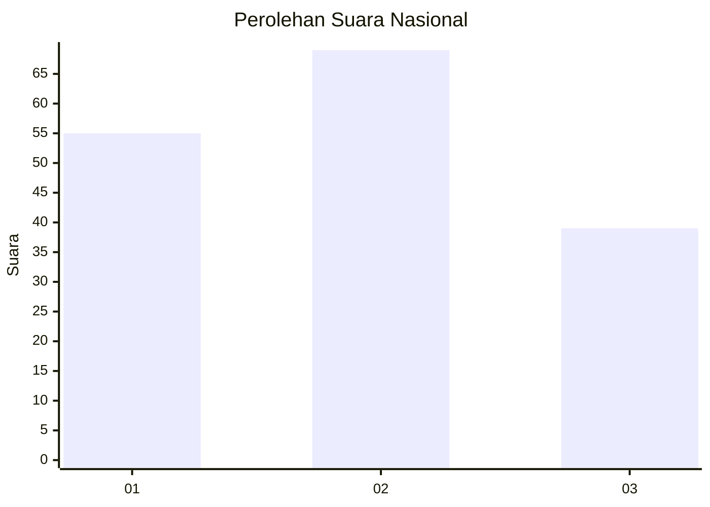
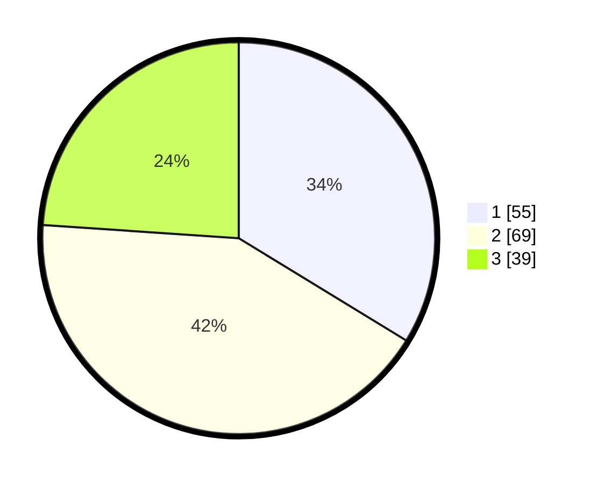

# Hasil

## Grafik

## Tabel

| No.    | Nama Paslon    | Suara | Suara (raw) | Persentase |
|:------ |:-------------- | -----:| -----------:| ----------:|
| 100025 | ANIES MUHAIMIN | 55    | [55][p-1]   | 33,74      |
| 100026 | PRABOWO GIBRAN | 69    | [69][p-2]   | 42,33      |
| 100027 | GANJAR MAHFUD  | 39    | [39][p-3]   | 23,93      |

[p-1]: https://github.com/gigit-pemilu/pemilu-2024/blob/main/pilpres/hitung-suara/sub/31-dki-jakarta/sub/73-jakarta-barat/sub/04-tambora/sub/1004-tanah-sereal/sub/029-tps/sub/paslon-1.txt
[p-2]: https://github.com/gigit-pemilu/pemilu-2024/blob/main/pilpres/hitung-suara/sub/31-dki-jakarta/sub/73-jakarta-barat/sub/04-tambora/sub/1004-tanah-sereal/sub/029-tps/sub/paslon-2.txt
[p-3]: https://github.com/gigit-pemilu/pemilu-2024/blob/main/pilpres/hitung-suara/sub/31-dki-jakarta/sub/73-jakarta-barat/sub/04-tambora/sub/1004-tanah-sereal/sub/029-tps/sub/paslon-3.txt

## Foto C Plano

https://sirekap-obj-formc.kpu.go.id/82dd/pemilu/ppwp/31/73/04/10/04/3173041004029-20240214-190617--fcc93cf4-5aad-48c6-996c-965fb05925c6.jpg

https://sirekap-obj-formc.kpu.go.id/82dd/pemilu/ppwp/31/73/04/10/04/3173041004029-20240214-190620--09a0a839-8c2f-43bc-baef-c10a448805d8.jpg

https://sirekap-obj-formc.kpu.go.id/82dd/pemilu/ppwp/31/73/04/10/04/3173041004029-20240215-195505--e5ac1757-c702-4ea9-98df-248e8a53e194.jpg

## Metadata

| Key        | Value               |
| ---------- | ------------------- |
| Time Stamp | 2024-02-15 20:00:44 |

