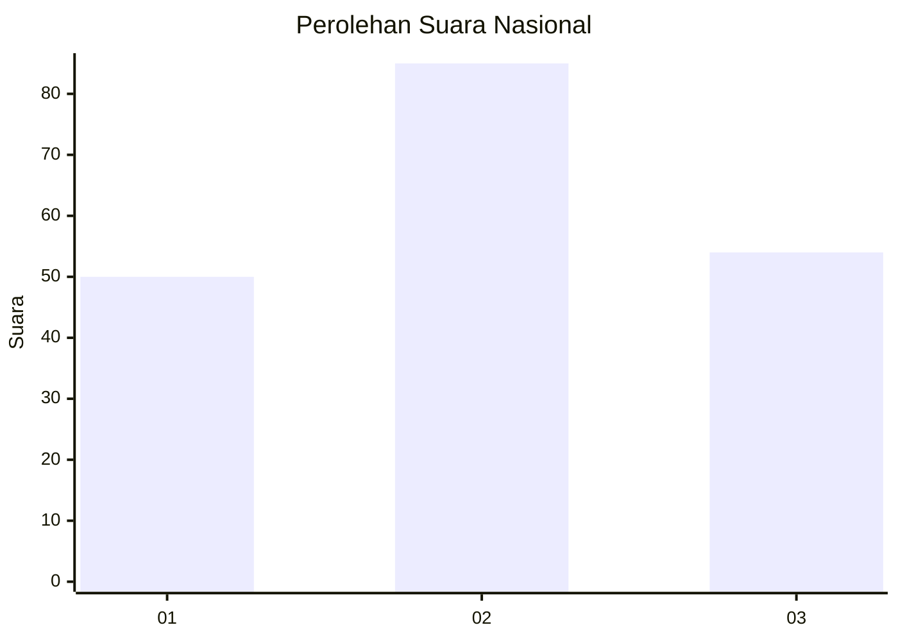
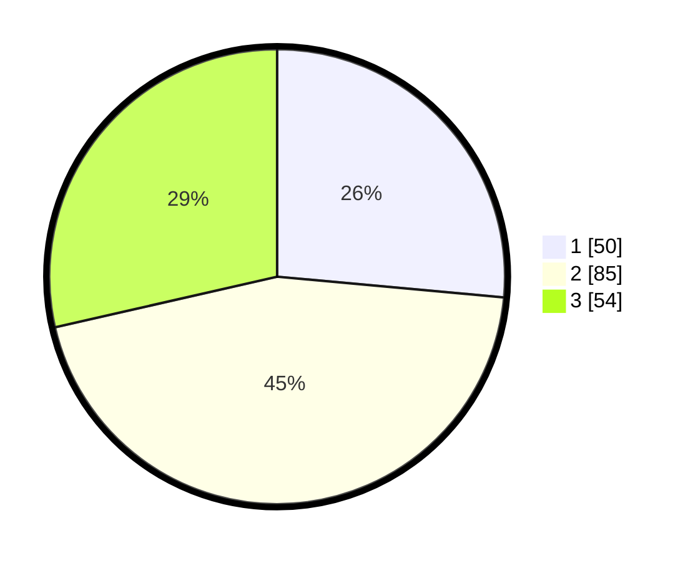

# Hasil

## Grafik

## Tabel

| No.    | Nama Paslon    | Suara | Suara (raw) | Persentase |
|:------ |:-------------- | -----:| -----------:| ----------:|
| 100025 | ANIES MUHAIMIN | 50    | [50][p-1]   | 26,46      |
| 100026 | PRABOWO GIBRAN | 85    | [85][p-2]   | 44,97      |
| 100027 | GANJAR MAHFUD  | 54    | [54][p-3]   | 28,57      |

[p-1]: https://github.com/gigit-pemilu/pemilu-2024/blob/main/pilpres/hitung-suara/sub/31-dki-jakarta/sub/73-jakarta-barat/sub/04-tambora/sub/1004-tanah-sereal/sub/031-tps/sub/paslon-1.txt
[p-2]: https://github.com/gigit-pemilu/pemilu-2024/blob/main/pilpres/hitung-suara/sub/31-dki-jakarta/sub/73-jakarta-barat/sub/04-tambora/sub/1004-tanah-sereal/sub/031-tps/sub/paslon-2.txt
[p-3]: https://github.com/gigit-pemilu/pemilu-2024/blob/main/pilpres/hitung-suara/sub/31-dki-jakarta/sub/73-jakarta-barat/sub/04-tambora/sub/1004-tanah-sereal/sub/031-tps/sub/paslon-3.txt

## Foto C Plano

https://sirekap-obj-formc.kpu.go.id/f91c/pemilu/ppwp/31/73/04/10/04/3173041004031-20240217-003512--abaa6864-5203-49de-ad6d-065934f524ab.jpg

https://sirekap-obj-formc.kpu.go.id/f91c/pemilu/ppwp/31/73/04/10/04/3173041004031-20240215-003720--ee08b6e1-13b7-4307-813a-3c87aff7d3f1.jpg

https://sirekap-obj-formc.kpu.go.id/f91c/pemilu/ppwp/31/73/04/10/04/3173041004031-20240215-003808--f7ad38d7-acd6-4430-82f6-6676feaa9c5a.jpg

## Metadata

| Key        | Value               |
| ---------- | ------------------- |
| Time Stamp | 2024-02-17 01:00:00 |

