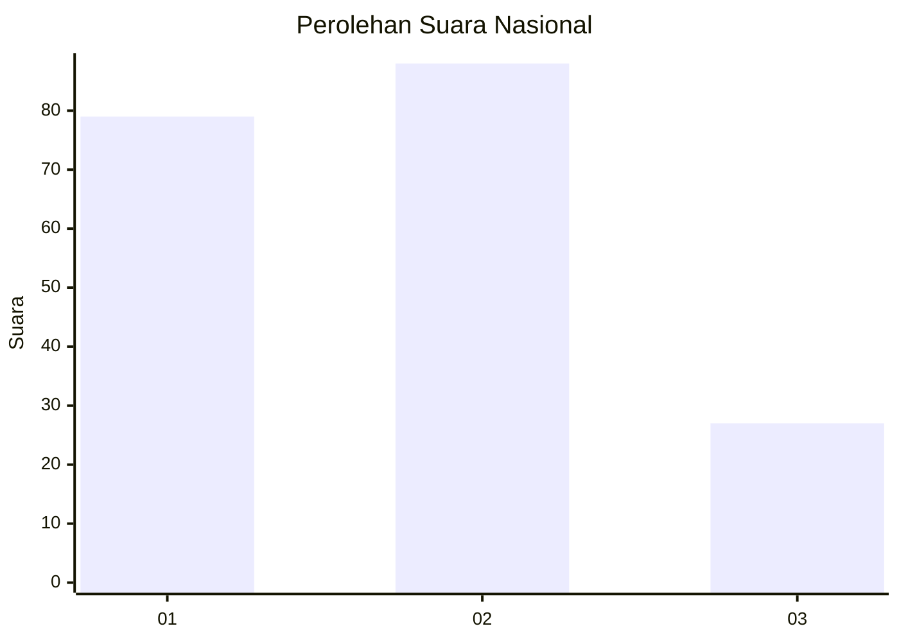
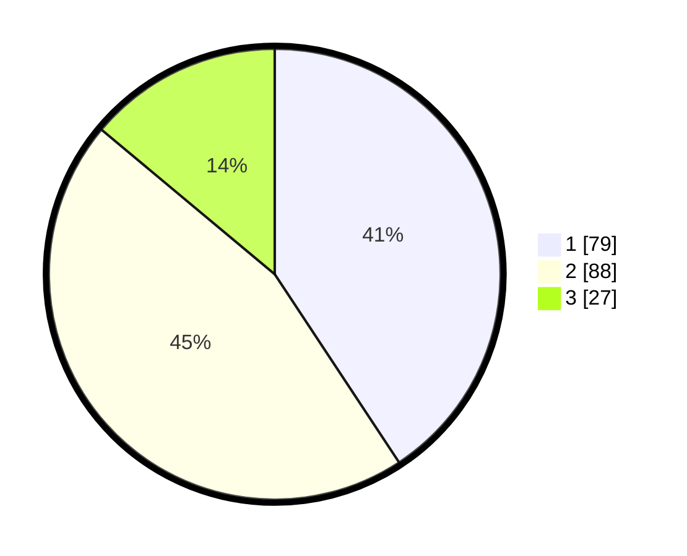

# Hasil

## Grafik

## Tabel

| No.    | Nama Paslon    | Suara | Suara (raw) | Persentase |
|:------ |:-------------- | -----:| -----------:| ----------:|
| 100025 | ANIES MUHAIMIN | 79    | [79][p-1]   | 40,72      |
| 100026 | PRABOWO GIBRAN | 88    | [88][p-2]   | 45,36      |
| 100027 | GANJAR MAHFUD  | 27    | [27][p-3]   | 13,92      |

[p-1]: https://github.com/gigit-pemilu/pemilu-2024/blob/main/pilpres/hitung-suara/sub/31-dki-jakarta/sub/73-jakarta-barat/sub/04-tambora/sub/1004-tanah-sereal/sub/048-tps/sub/paslon-1.txt
[p-2]: https://github.com/gigit-pemilu/pemilu-2024/blob/main/pilpres/hitung-suara/sub/31-dki-jakarta/sub/73-jakarta-barat/sub/04-tambora/sub/1004-tanah-sereal/sub/048-tps/sub/paslon-2.txt
[p-3]: https://github.com/gigit-pemilu/pemilu-2024/blob/main/pilpres/hitung-suara/sub/31-dki-jakarta/sub/73-jakarta-barat/sub/04-tambora/sub/1004-tanah-sereal/sub/048-tps/sub/paslon-3.txt

## Foto C Plano

https://sirekap-obj-formc.kpu.go.id/2b70/pemilu/ppwp/31/73/04/10/04/3173041004048-20240214-222218--5773d087-3224-4602-8c16-c835c890f4f1.jpg

https://sirekap-obj-formc.kpu.go.id/2b70/pemilu/ppwp/31/73/04/10/04/3173041004048-20240214-222208--df6aead4-8269-45fe-9753-3ad84111962c.jpg

https://sirekap-obj-formc.kpu.go.id/2b70/pemilu/ppwp/31/73/04/10/04/3173041004048-20240214-222229--358aaa91-8f21-4784-a49b-f5e5b3d77cfb.jpg

## Metadata

| Key        | Value               |
| ---------- | ------------------- |
| Time Stamp | 2024-02-19 14:00:00 |

