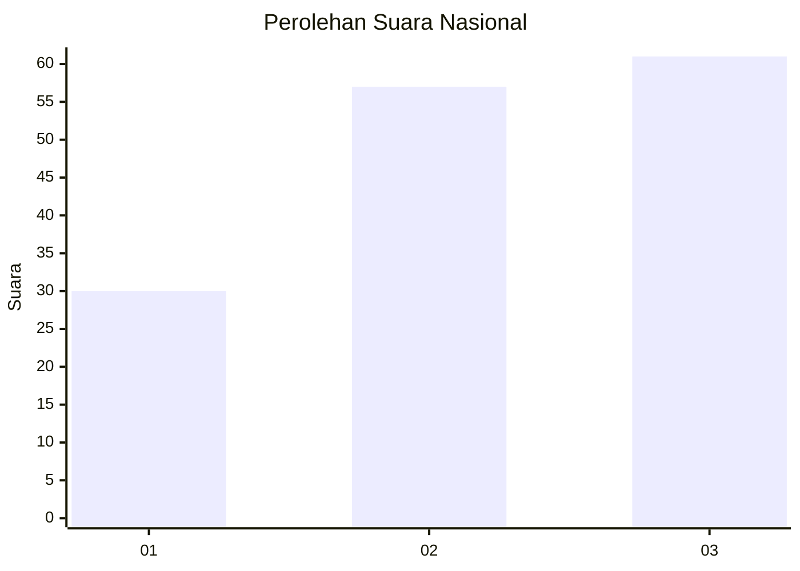
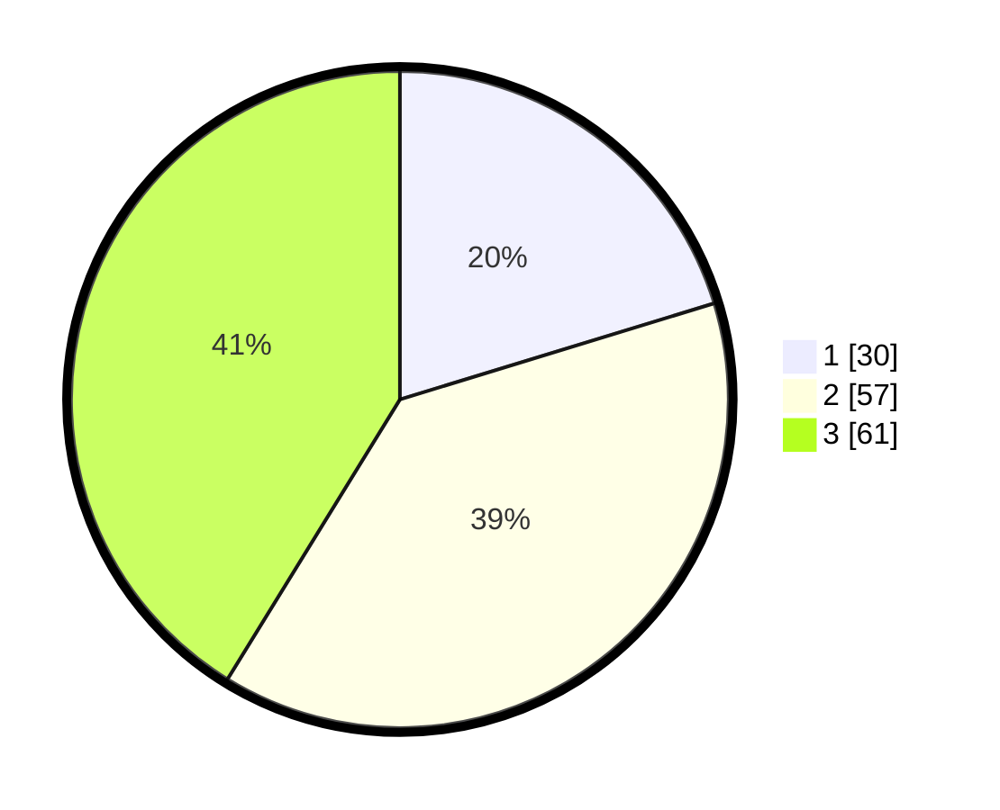

# Hasil

## Grafik

## Tabel

| No.    | Nama Paslon    | Suara | Suara (raw) | Persentase |
|:------ |:-------------- | -----:| -----------:| ----------:|
| 100025 | ANIES MUHAIMIN | 30    | [30][p-1]   | 20,27      |
| 100026 | PRABOWO GIBRAN | 57    | [57][p-2]   | 38,51      |
| 100027 | GANJAR MAHFUD  | 61    | [61][p-3]   | 41,22      |

[p-1]: https://github.com/gigit-pemilu/pemilu-2024/blob/main/pilpres/hitung-suara/sub/31-dki-jakarta/sub/73-jakarta-barat/sub/04-tambora/sub/1004-tanah-sereal/sub/050-tps/sub/paslon-1.txt
[p-2]: https://github.com/gigit-pemilu/pemilu-2024/blob/main/pilpres/hitung-suara/sub/31-dki-jakarta/sub/73-jakarta-barat/sub/04-tambora/sub/1004-tanah-sereal/sub/050-tps/sub/paslon-2.txt
[p-3]: https://github.com/gigit-pemilu/pemilu-2024/blob/main/pilpres/hitung-suara/sub/31-dki-jakarta/sub/73-jakarta-barat/sub/04-tambora/sub/1004-tanah-sereal/sub/050-tps/sub/paslon-3.txt

## Foto C Plano

https://sirekap-obj-formc.kpu.go.id/55d3/pemilu/ppwp/31/73/04/10/04/3173041004050-20240214-234859--2d2483ed-0eab-4c68-92f4-7226f62b86d3.jpg

https://sirekap-obj-formc.kpu.go.id/55d3/pemilu/ppwp/31/73/04/10/04/3173041004050-20240214-204442--632eb311-401c-4b54-8e0b-a8361ec7e8e5.jpg

https://sirekap-obj-formc.kpu.go.id/55d3/pemilu/ppwp/31/73/04/10/04/3173041004050-20240214-204247--5c378744-f71c-4afe-9896-e67674ca1d4c.jpg

## Metadata

| Key        | Value               |
| ---------- | ------------------- |
| Time Stamp | 2024-02-15 00:41:44 |

