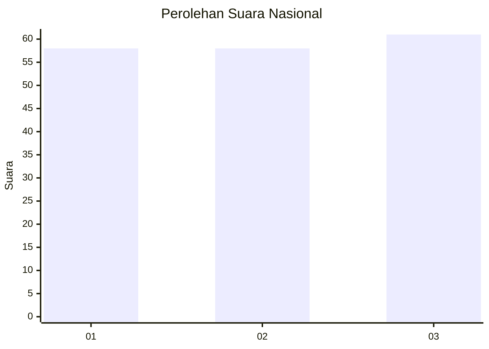
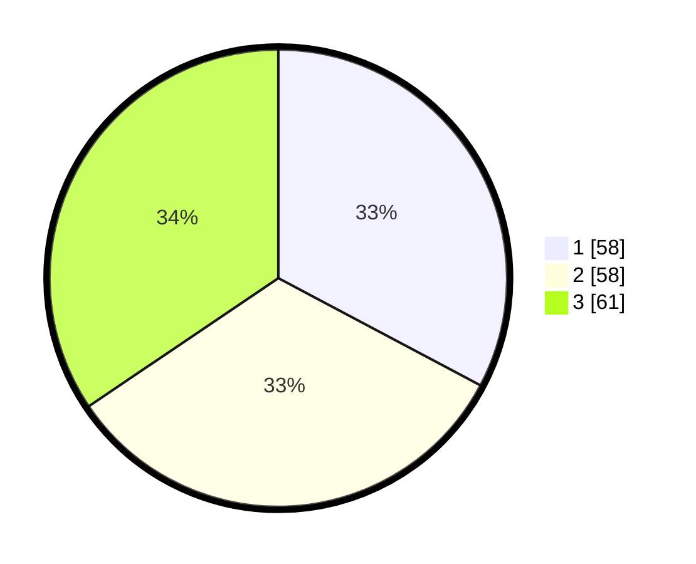

# Hasil

## Grafik

## Tabel

| No.    | Nama Paslon    | Suara | Suara (raw) | Persentase |
|:------ |:-------------- | -----:| -----------:| ----------:|
| 100025 | ANIES MUHAIMIN | 58    | [58][p-1]   | 32,77      |
| 100026 | PRABOWO GIBRAN | 58    | [58][p-2]   | 32,77      |
| 100027 | GANJAR MAHFUD  | 61    | [61][p-3]   | 34,46      |

[p-1]: https://github.com/gigit-pemilu/pemilu-2024/blob/main/pilpres/hitung-suara/sub/31-dki-jakarta/sub/73-jakarta-barat/sub/04-tambora/sub/1004-tanah-sereal/sub/055-tps/sub/paslon-1.txt
[p-2]: https://github.com/gigit-pemilu/pemilu-2024/blob/main/pilpres/hitung-suara/sub/31-dki-jakarta/sub/73-jakarta-barat/sub/04-tambora/sub/1004-tanah-sereal/sub/055-tps/sub/paslon-2.txt
[p-3]: https://github.com/gigit-pemilu/pemilu-2024/blob/main/pilpres/hitung-suara/sub/31-dki-jakarta/sub/73-jakarta-barat/sub/04-tambora/sub/1004-tanah-sereal/sub/055-tps/sub/paslon-3.txt

## Foto C Plano

https://sirekap-obj-formc.kpu.go.id/80eb/pemilu/ppwp/31/73/04/10/04/3173041004055-20240215-180612--84f27c95-80b3-4292-9283-5722f7781813.jpg

https://sirekap-obj-formc.kpu.go.id/80eb/pemilu/ppwp/31/73/04/10/04/3173041004055-20240215-180655--9f1071e0-ec93-4219-9c47-315473965a8f.jpg

https://sirekap-obj-formc.kpu.go.id/80eb/pemilu/ppwp/31/73/04/10/04/3173041004055-20240215-180758--c5dc16ce-4ea4-45b4-bf3a-5b62bdd7b5ef.jpg

## Metadata

| Key        | Value               |
| ---------- | ------------------- |
| Time Stamp | 2024-02-17 16:00:02 |

