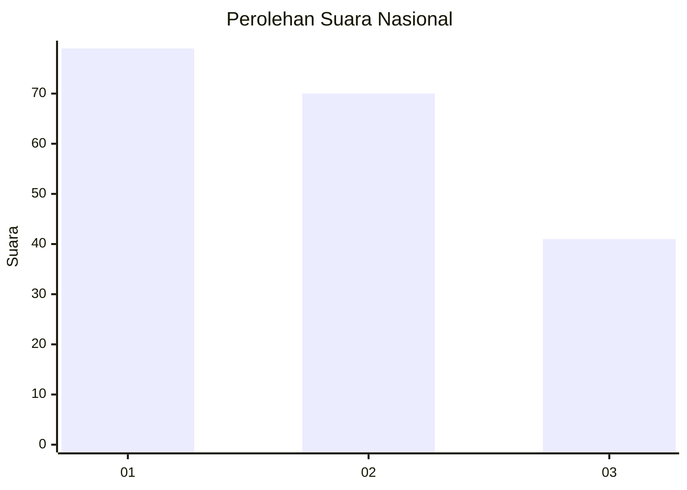
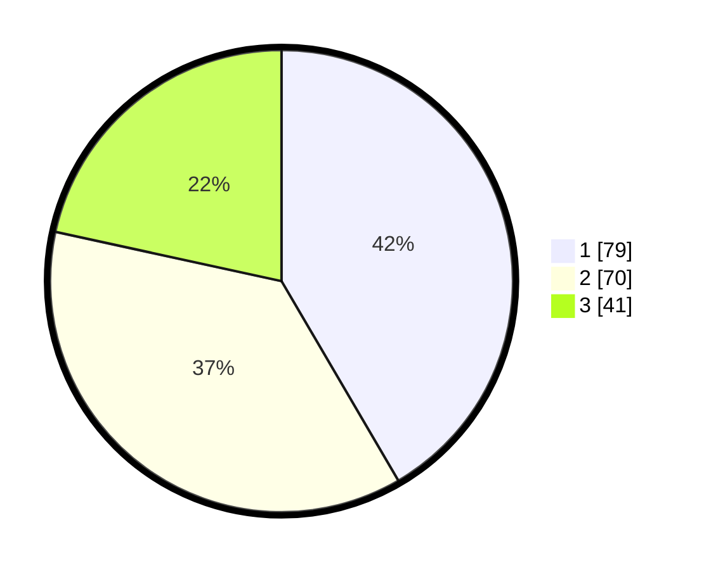

# Hasil

## Grafik

## Tabel

| No.    | Nama Paslon    | Suara | Suara (raw) | Persentase |
|:------ |:-------------- | -----:| -----------:| ----------:|
| 100025 | ANIES MUHAIMIN | 79    | [79][p-1]   | 41,58      |
| 100026 | PRABOWO GIBRAN | 70    | [70][p-2]   | 36,84      |
| 100027 | GANJAR MAHFUD  | 41    | [41][p-3]   | 21,58      |

[p-1]: https://github.com/gigit-pemilu/pemilu-2024/blob/main/pilpres/hitung-suara/sub/31-dki-jakarta/sub/73-jakarta-barat/sub/04-tambora/sub/1004-tanah-sereal/sub/069-tps/sub/paslon-1.txt
[p-2]: https://github.com/gigit-pemilu/pemilu-2024/blob/main/pilpres/hitung-suara/sub/31-dki-jakarta/sub/73-jakarta-barat/sub/04-tambora/sub/1004-tanah-sereal/sub/069-tps/sub/paslon-2.txt
[p-3]: https://github.com/gigit-pemilu/pemilu-2024/blob/main/pilpres/hitung-suara/sub/31-dki-jakarta/sub/73-jakarta-barat/sub/04-tambora/sub/1004-tanah-sereal/sub/069-tps/sub/paslon-3.txt

## Foto C Plano

https://sirekap-obj-formc.kpu.go.id/4111/pemilu/ppwp/31/73/04/10/04/3173041004069-20240215-005317--8e3963df-8965-4ce4-881d-27be31409267.jpg

https://sirekap-obj-formc.kpu.go.id/4111/pemilu/ppwp/31/73/04/10/04/3173041004069-20240215-005414--bbf16e33-0077-46fa-aa2a-21885d30f4d9.jpg

https://sirekap-obj-formc.kpu.go.id/4111/pemilu/ppwp/31/73/04/10/04/3173041004069-20240215-005446--649736ea-c49d-425c-8b18-e5bf831ed4d8.jpg

## Metadata

| Key        | Value               |
| ---------- | ------------------- |
| Time Stamp | 2024-02-19 16:00:00 |

