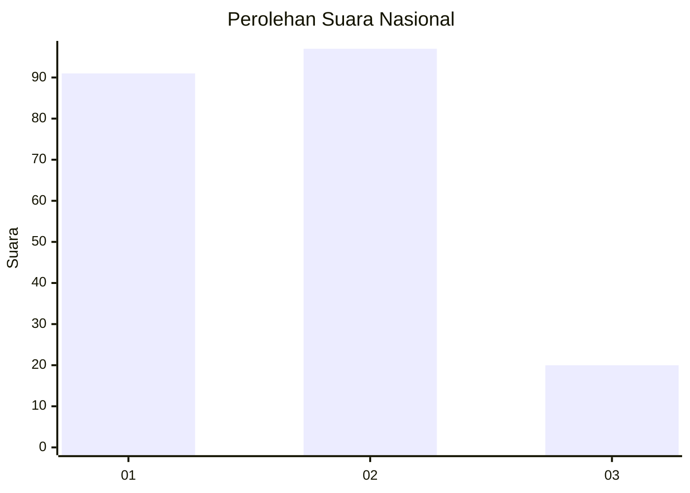
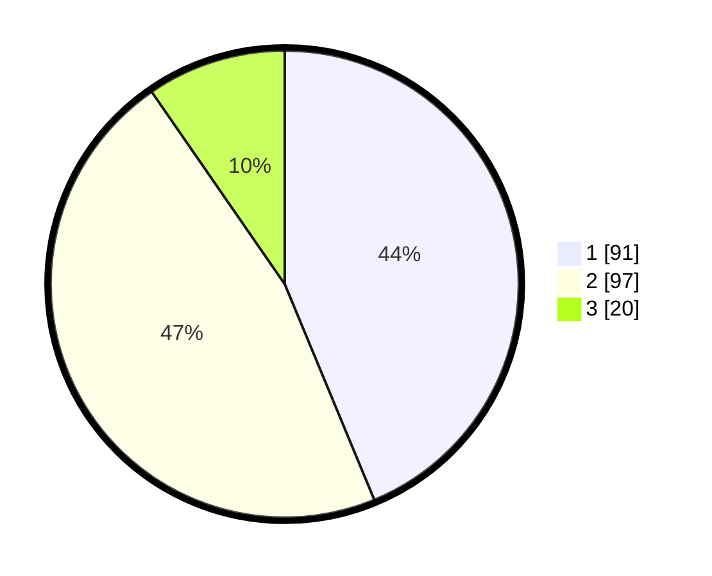

# Hasil

## Grafik

## Tabel

| No.    | Nama Paslon    | Suara | Suara (raw) | Persentase |
|:------ |:-------------- | -----:| -----------:| ----------:|
| 100025 | ANIES MUHAIMIN | 91    | [91][p-1]   | 43,75      |
| 100026 | PRABOWO GIBRAN | 97    | [97][p-2]   | 46,63      |
| 100027 | GANJAR MAHFUD  | 20    | [20][p-3]   | 9,62       |

[p-1]: https://github.com/gigit-pemilu/pemilu-2024/blob/main/pilpres/hitung-suara/sub/31-dki-jakarta/sub/73-jakarta-barat/sub/04-tambora/sub/1006-jembatan-besi/sub/015-tps/sub/paslon-1.txt
[p-2]: https://github.com/gigit-pemilu/pemilu-2024/blob/main/pilpres/hitung-suara/sub/31-dki-jakarta/sub/73-jakarta-barat/sub/04-tambora/sub/1006-jembatan-besi/sub/015-tps/sub/paslon-2.txt
[p-3]: https://github.com/gigit-pemilu/pemilu-2024/blob/main/pilpres/hitung-suara/sub/31-dki-jakarta/sub/73-jakarta-barat/sub/04-tambora/sub/1006-jembatan-besi/sub/015-tps/sub/paslon-3.txt

## Foto C Plano

https://sirekap-obj-formc.kpu.go.id/765d/pemilu/ppwp/31/73/04/10/06/3173041006015-20240215-005626--482730a1-e3d5-42ea-be6d-4842a6cab8e2.jpg

https://sirekap-obj-formc.kpu.go.id/765d/pemilu/ppwp/31/73/04/10/06/3173041006015-20240215-010615--2260eb80-0d7c-45ca-a01e-ee036fab7df0.jpg

https://sirekap-obj-formc.kpu.go.id/765d/pemilu/ppwp/31/73/04/10/06/3173041006015-20240215-010708--6f0b35fa-94d3-4493-8ba4-bb3d1744ab79.jpg

## Metadata

| Key        | Value               |
| ---------- | ------------------- |
| Time Stamp | 2024-02-19 16:00:00 |

