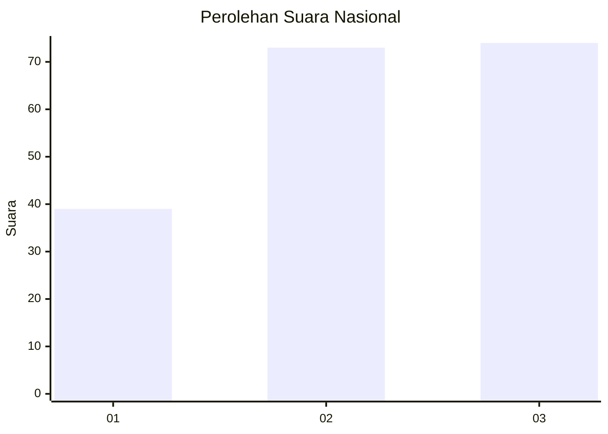
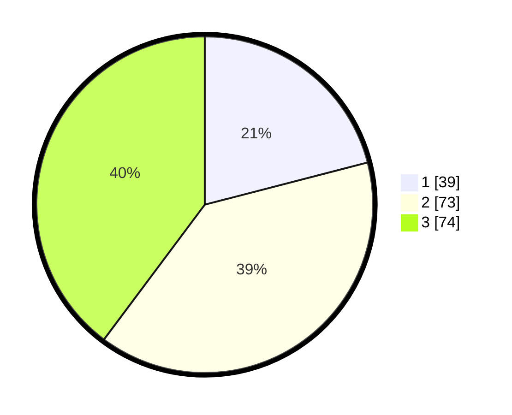

# Hasil

## Grafik

## Tabel

| No.    | Nama Paslon    | Suara | Suara (raw) | Persentase |
|:------ |:-------------- | -----:| -----------:| ----------:|
| 100025 | ANIES MUHAIMIN | 39    | [39][p-1]   | 20,97      |
| 100026 | PRABOWO GIBRAN | 73    | [73][p-2]   | 39,25      |
| 100027 | GANJAR MAHFUD  | 74    | [74][p-3]   | 39,78      |

[p-1]: https://github.com/gigit-pemilu/pemilu-2024/blob/main/pilpres/hitung-suara/sub/31-dki-jakarta/sub/73-jakarta-barat/sub/04-tambora/sub/1006-jembatan-besi/sub/025-tps/sub/paslon-1.txt
[p-2]: https://github.com/gigit-pemilu/pemilu-2024/blob/main/pilpres/hitung-suara/sub/31-dki-jakarta/sub/73-jakarta-barat/sub/04-tambora/sub/1006-jembatan-besi/sub/025-tps/sub/paslon-2.txt
[p-3]: https://github.com/gigit-pemilu/pemilu-2024/blob/main/pilpres/hitung-suara/sub/31-dki-jakarta/sub/73-jakarta-barat/sub/04-tambora/sub/1006-jembatan-besi/sub/025-tps/sub/paslon-3.txt

## Foto C Plano

https://sirekap-obj-formc.kpu.go.id/d8a0/pemilu/ppwp/31/73/04/10/06/3173041006025-20240214-225917--8df62eb5-4263-443a-93ab-72a864795b00.jpg

https://sirekap-obj-formc.kpu.go.id/d8a0/pemilu/ppwp/31/73/04/10/06/3173041006025-20240214-230020--7b18d0b2-6f2c-4992-a580-433400bd3558.jpg

https://sirekap-obj-formc.kpu.go.id/d8a0/pemilu/ppwp/31/73/04/10/06/3173041006025-20240214-230126--65f5b7b0-d732-43ee-9439-1dfeeb4d3df2.jpg

## Metadata

| Key        | Value               |
| ---------- | ------------------- |
| Time Stamp | 2024-02-19 17:00:00 |

