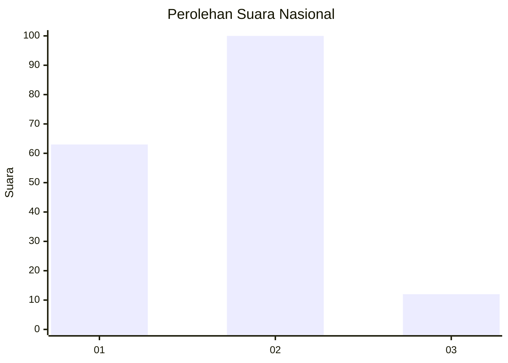
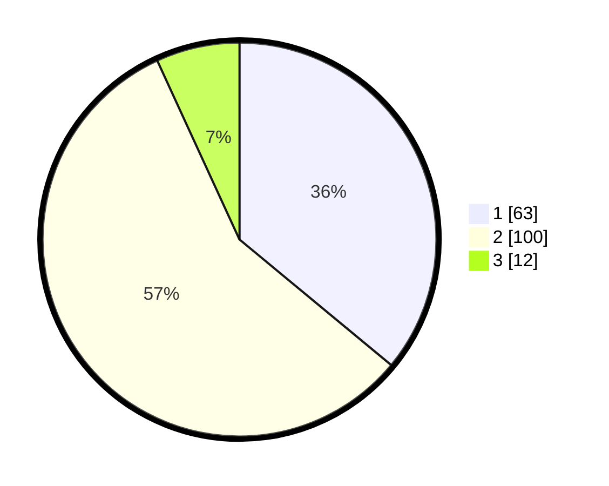

# Hasil

## Grafik

## Tabel

| No.    | Nama Paslon    | Suara | Suara (raw) | Persentase |
|:------ |:-------------- | -----:| -----------:| ----------:|
| 100025 | ANIES MUHAIMIN | 63    | [63][p-1]   | 36,00      |
| 100026 | PRABOWO GIBRAN | 100   | [100][p-2]  | 57,14      |
| 100027 | GANJAR MAHFUD  | 12    | [12][p-3]   | 6,86       |

[p-1]: https://github.com/gigit-pemilu/pemilu-2024/blob/main/pilpres/hitung-suara/sub/31-dki-jakarta/sub/73-jakarta-barat/sub/04-tambora/sub/1006-jembatan-besi/sub/029-tps/sub/paslon-1.txt
[p-2]: https://github.com/gigit-pemilu/pemilu-2024/blob/main/pilpres/hitung-suara/sub/31-dki-jakarta/sub/73-jakarta-barat/sub/04-tambora/sub/1006-jembatan-besi/sub/029-tps/sub/paslon-2.txt
[p-3]: https://github.com/gigit-pemilu/pemilu-2024/blob/main/pilpres/hitung-suara/sub/31-dki-jakarta/sub/73-jakarta-barat/sub/04-tambora/sub/1006-jembatan-besi/sub/029-tps/sub/paslon-3.txt

## Foto C Plano

https://sirekap-obj-formc.kpu.go.id/e0ba/pemilu/ppwp/31/73/04/10/06/3173041006029-20240214-204513--6e1fe772-b429-44f9-b6e5-f41b515072ee.jpg

https://sirekap-obj-formc.kpu.go.id/e0ba/pemilu/ppwp/31/73/04/10/06/3173041006029-20240214-205418--8ab911ee-20c1-45aa-b714-97144419eb41.jpg

https://sirekap-obj-formc.kpu.go.id/e0ba/pemilu/ppwp/31/73/04/10/06/3173041006029-20240214-205052--341c2ba9-4d84-4cfe-a5c0-818343512337.jpg

## Metadata

| Key        | Value               |
| ---------- | ------------------- |
| Time Stamp | 2024-02-19 17:00:00 |

