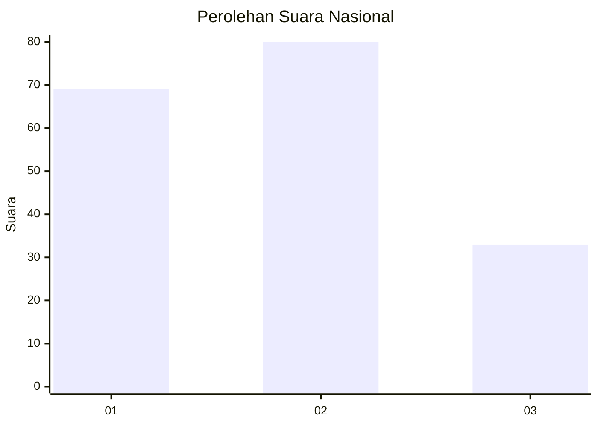
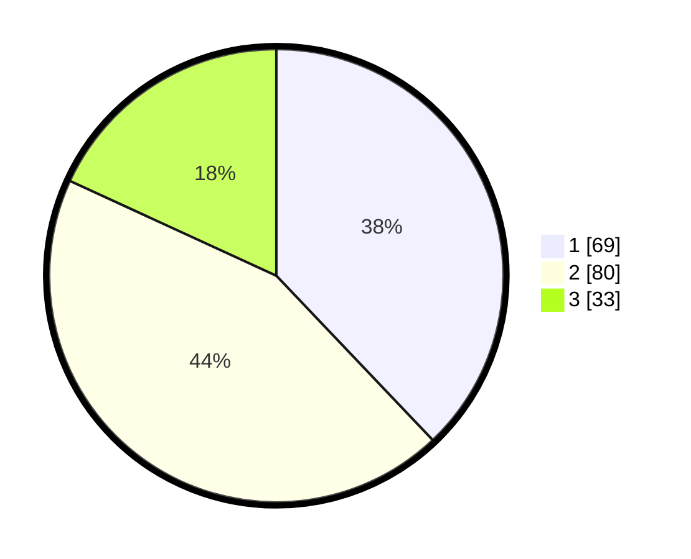

# Hasil

## Grafik

## Tabel

| No.    | Nama Paslon    | Suara | Suara (raw) | Persentase |
|:------ |:-------------- | -----:| -----------:| ----------:|
| 100025 | ANIES MUHAIMIN | 69    | [69][p-1]   | 37,91      |
| 100026 | PRABOWO GIBRAN | 80    | [80][p-2]   | 43,96      |
| 100027 | GANJAR MAHFUD  | 33    | [33][p-3]   | 18,13      |

[p-1]: https://github.com/gigit-pemilu/pemilu-2024/blob/main/pilpres/hitung-suara/sub/31-dki-jakarta/sub/73-jakarta-barat/sub/04-tambora/sub/1006-jembatan-besi/sub/034-tps/sub/paslon-1.txt
[p-2]: https://github.com/gigit-pemilu/pemilu-2024/blob/main/pilpres/hitung-suara/sub/31-dki-jakarta/sub/73-jakarta-barat/sub/04-tambora/sub/1006-jembatan-besi/sub/034-tps/sub/paslon-2.txt
[p-3]: https://github.com/gigit-pemilu/pemilu-2024/blob/main/pilpres/hitung-suara/sub/31-dki-jakarta/sub/73-jakarta-barat/sub/04-tambora/sub/1006-jembatan-besi/sub/034-tps/sub/paslon-3.txt

## Foto C Plano

https://sirekap-obj-formc.kpu.go.id/ed5e/pemilu/ppwp/31/73/04/10/06/3173041006034-20240214-230537--719d0bf8-27b8-4b5a-be29-646b0658e86e.jpg

https://sirekap-obj-formc.kpu.go.id/ed5e/pemilu/ppwp/31/73/04/10/06/3173041006034-20240214-230710--dc7f4afe-0fa8-48fb-9f2f-5589c6c50ed5.jpg

https://sirekap-obj-formc.kpu.go.id/ed5e/pemilu/ppwp/31/73/04/10/06/3173041006034-20240214-230909--6ab80ad4-f2c7-4432-ae5e-30fc0df7efe8.jpg

## Metadata

| Key        | Value               |
| ---------- | ------------------- |
| Time Stamp | 2024-02-19 17:00:00 |

