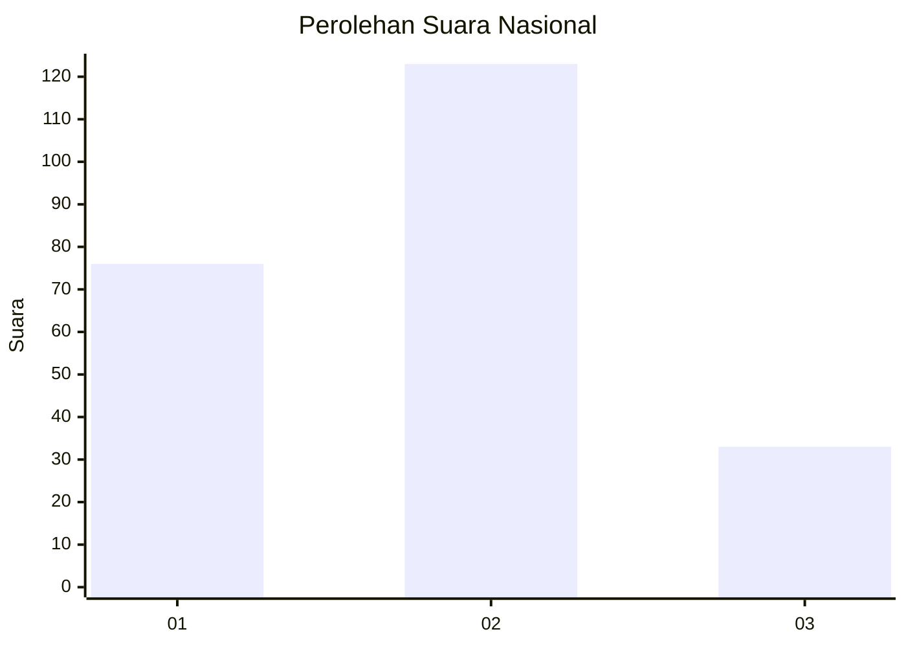
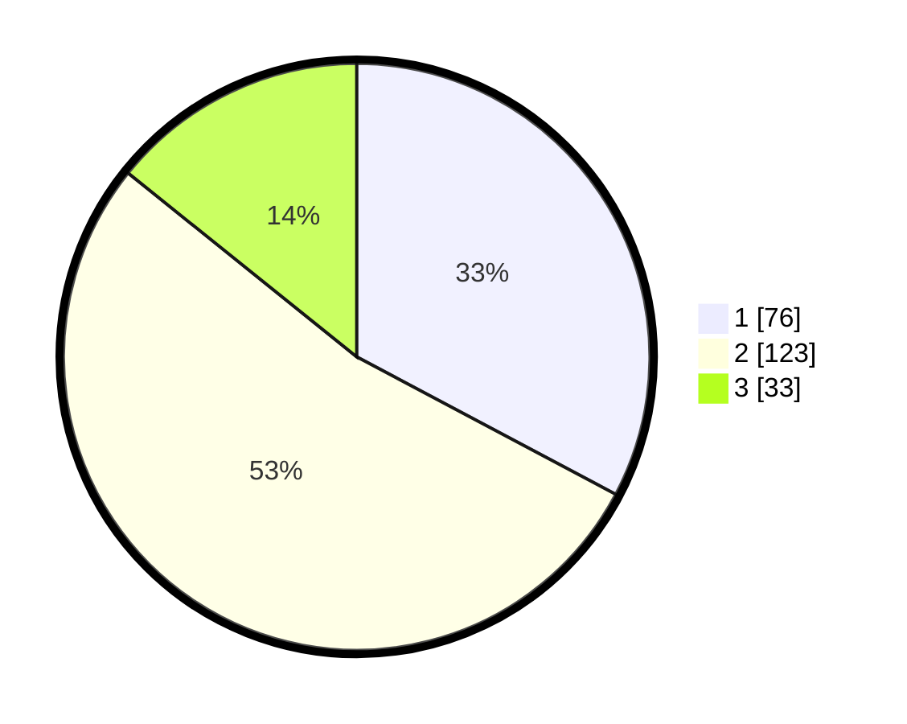

# Hasil

## Grafik

## Tabel

| No.    | Nama Paslon    | Suara | Suara (raw) | Persentase |
|:------ |:-------------- | -----:| -----------:| ----------:|
| 100025 | ANIES MUHAIMIN | 76    | [76][p-1]   | 32,76      |
| 100026 | PRABOWO GIBRAN | 123   | [123][p-2]  | 53,02      |
| 100027 | GANJAR MAHFUD  | 33    | [33][p-3]   | 14,22      |

[p-1]: https://github.com/gigit-pemilu/pemilu-2024/blob/main/pilpres/hitung-suara/sub/31-dki-jakarta/sub/73-jakarta-barat/sub/04-tambora/sub/1006-jembatan-besi/sub/041-tps/sub/paslon-1.txt
[p-2]: https://github.com/gigit-pemilu/pemilu-2024/blob/main/pilpres/hitung-suara/sub/31-dki-jakarta/sub/73-jakarta-barat/sub/04-tambora/sub/1006-jembatan-besi/sub/041-tps/sub/paslon-2.txt
[p-3]: https://github.com/gigit-pemilu/pemilu-2024/blob/main/pilpres/hitung-suara/sub/31-dki-jakarta/sub/73-jakarta-barat/sub/04-tambora/sub/1006-jembatan-besi/sub/041-tps/sub/paslon-3.txt

## Foto C Plano

https://sirekap-obj-formc.kpu.go.id/819b/pemilu/ppwp/31/73/04/10/06/3173041006041-20240214-213240--0a25c672-9487-4ae7-950b-fcfbd3b0bcb1.jpg

https://sirekap-obj-formc.kpu.go.id/819b/pemilu/ppwp/31/73/04/10/06/3173041006041-20240214-213336--296ad038-b597-458f-b891-e955c9a9b655.jpg

https://sirekap-obj-formc.kpu.go.id/819b/pemilu/ppwp/31/73/04/10/06/3173041006041-20240214-213425--a4dc557e-7a62-40bf-aad5-1ff8bfe1b376.jpg

## Metadata

| Key        | Value               |
| ---------- | ------------------- |
| Time Stamp | 2024-02-19 17:00:00 |

