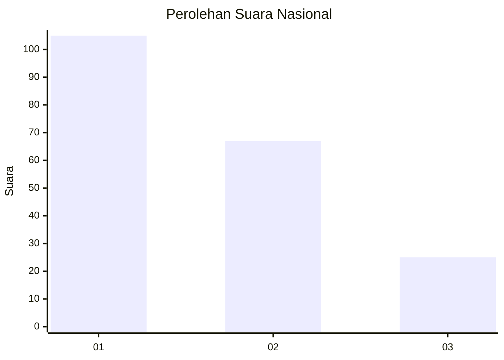
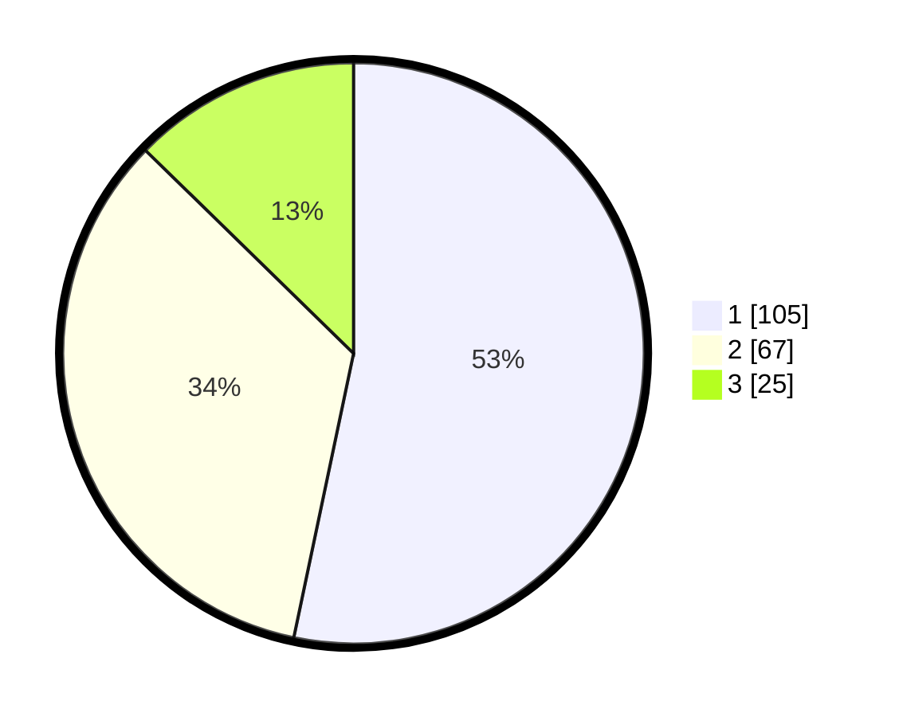

# Hasil

## Grafik

## Tabel

| No.    | Nama Paslon    | Suara | Suara (raw) | Persentase |
|:------ |:-------------- | -----:| -----------:| ----------:|
| 100025 | ANIES MUHAIMIN | 105   | [105][p-1]  | 53,30      |
| 100026 | PRABOWO GIBRAN | 67    | [67][p-2]   | 34,01      |
| 100027 | GANJAR MAHFUD  | 25    | [25][p-3]   | 12,69      |

[p-1]: https://github.com/gigit-pemilu/pemilu-2024/blob/main/pilpres/hitung-suara/sub/31-dki-jakarta/sub/73-jakarta-barat/sub/04-tambora/sub/1006-jembatan-besi/sub/042-tps/sub/paslon-1.txt
[p-2]: https://github.com/gigit-pemilu/pemilu-2024/blob/main/pilpres/hitung-suara/sub/31-dki-jakarta/sub/73-jakarta-barat/sub/04-tambora/sub/1006-jembatan-besi/sub/042-tps/sub/paslon-2.txt
[p-3]: https://github.com/gigit-pemilu/pemilu-2024/blob/main/pilpres/hitung-suara/sub/31-dki-jakarta/sub/73-jakarta-barat/sub/04-tambora/sub/1006-jembatan-besi/sub/042-tps/sub/paslon-3.txt

## Foto C Plano

https://sirekap-obj-formc.kpu.go.id/bda1/pemilu/ppwp/31/73/04/10/06/3173041006042-20240214-192216--af5acbd3-81a3-468a-9826-d1c15695e80c.jpg

https://sirekap-obj-formc.kpu.go.id/bda1/pemilu/ppwp/31/73/04/10/06/3173041006042-20240214-191155--be50f226-12f2-4a4c-b26e-0ebe41a7558f.jpg

https://sirekap-obj-formc.kpu.go.id/bda1/pemilu/ppwp/31/73/04/10/06/3173041006042-20240214-191253--76d902a1-d8b6-47d8-85b7-34b25fb82651.jpg

## Metadata

| Key        | Value               |
| ---------- | ------------------- |
| Time Stamp | 2024-02-21 16:00:00 |

