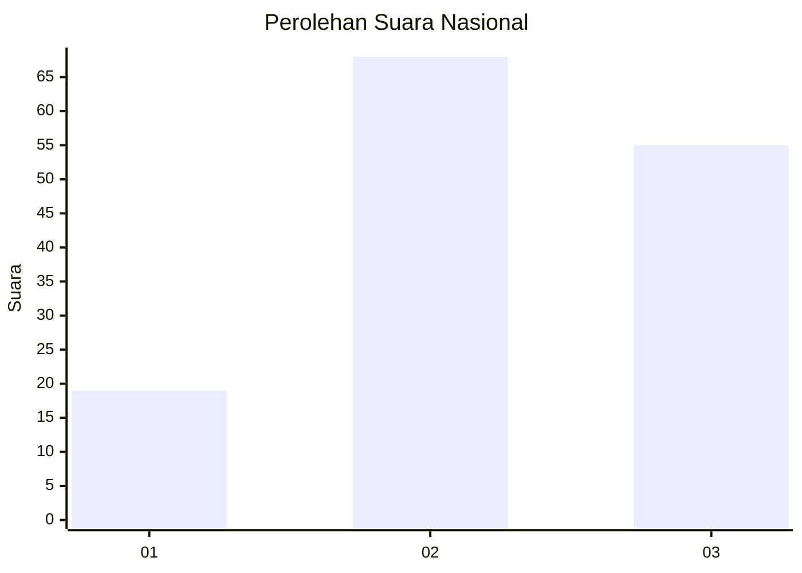
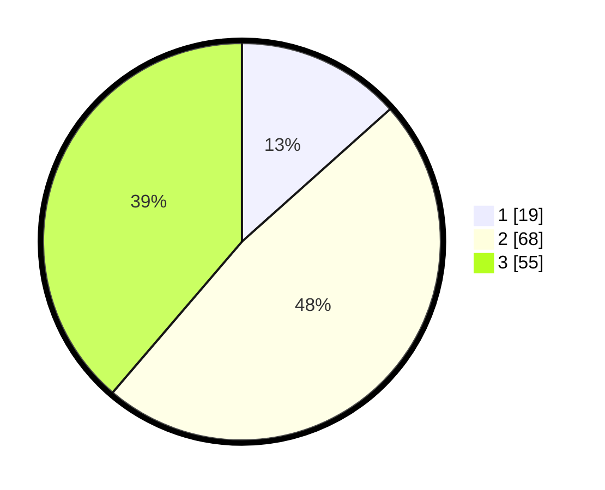

# Hasil

## Grafik

## Tabel

| No.    | Nama Paslon    | Suara | Suara (raw) | Persentase |
|:------ |:-------------- | -----:| -----------:| ----------:|
| 100025 | ANIES MUHAIMIN | 19    | [19][p-1]   | 13,38      |
| 100026 | PRABOWO GIBRAN | 68    | [68][p-2]   | 47,89      |
| 100027 | GANJAR MAHFUD  | 55    | [55][p-3]   | 38,73      |

[p-1]: https://github.com/gigit-pemilu/pemilu-2024/blob/main/pilpres/hitung-suara/sub/31-dki-jakarta/sub/73-jakarta-barat/sub/04-tambora/sub/1006-jembatan-besi/sub/050-tps/sub/paslon-1.txt
[p-2]: https://github.com/gigit-pemilu/pemilu-2024/blob/main/pilpres/hitung-suara/sub/31-dki-jakarta/sub/73-jakarta-barat/sub/04-tambora/sub/1006-jembatan-besi/sub/050-tps/sub/paslon-2.txt
[p-3]: https://github.com/gigit-pemilu/pemilu-2024/blob/main/pilpres/hitung-suara/sub/31-dki-jakarta/sub/73-jakarta-barat/sub/04-tambora/sub/1006-jembatan-besi/sub/050-tps/sub/paslon-3.txt

## Foto C Plano

https://sirekap-obj-formc.kpu.go.id/82cf/pemilu/ppwp/31/73/04/10/06/3173041006050-20240214-212824--da38bc12-c1e3-4b4c-ad21-437db190f8c6.jpg

https://sirekap-obj-formc.kpu.go.id/82cf/pemilu/ppwp/31/73/04/10/06/3173041006050-20240214-230146--88883102-e5c1-456a-9216-02f18e9d21c6.jpg

https://sirekap-obj-formc.kpu.go.id/82cf/pemilu/ppwp/31/73/04/10/06/3173041006050-20240214-212926--b3a3e977-08c3-4f76-9a8e-0a6df5a3216b.jpg

## Metadata

| Key        | Value               |
| ---------- | ------------------- |
| Time Stamp | 2024-02-19 19:00:00 |

