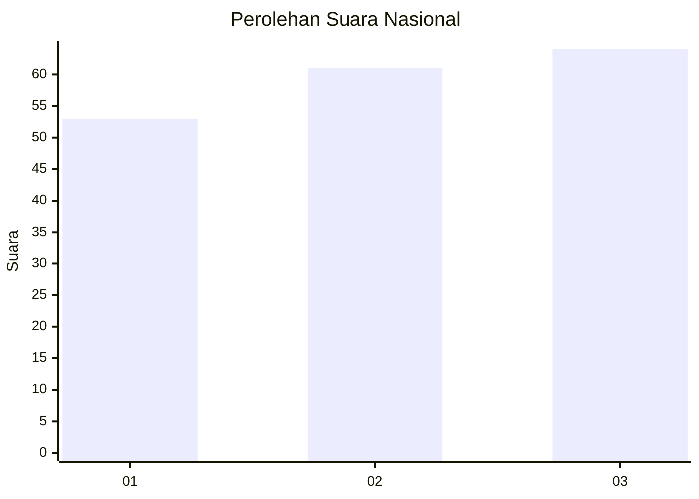
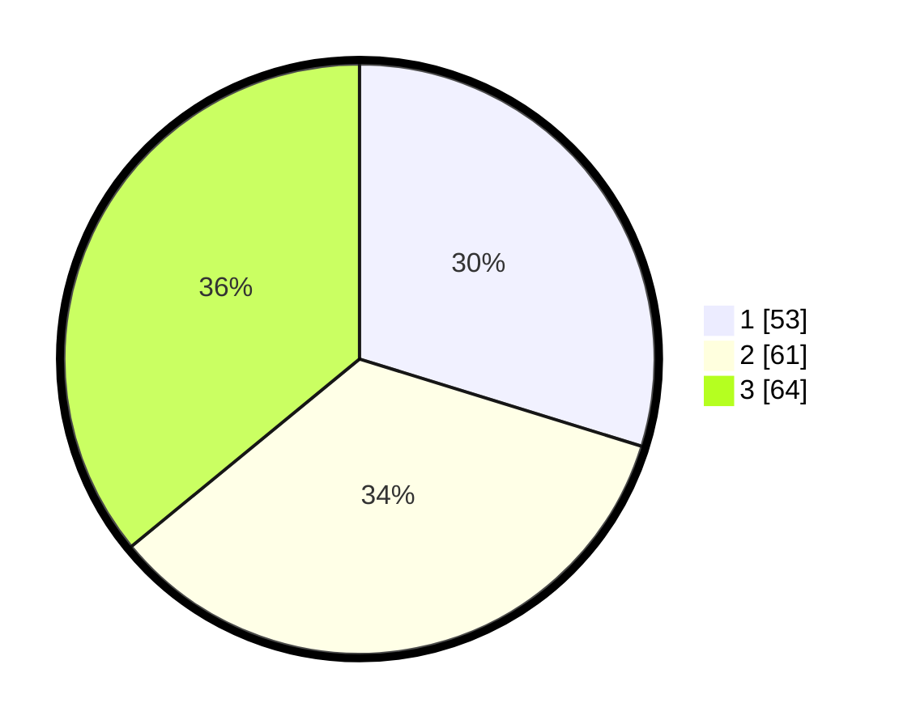

# Hasil

## Grafik

## Tabel

| No.    | Nama Paslon    | Suara | Suara (raw) | Persentase |
|:------ |:-------------- | -----:| -----------:| ----------:|
| 100025 | ANIES MUHAIMIN | 53    | [53][p-1]   | 29,78      |
| 100026 | PRABOWO GIBRAN | 61    | [61][p-2]   | 34,27      |
| 100027 | GANJAR MAHFUD  | 64    | [64][p-3]   | 35,96      |

[p-1]: https://github.com/gigit-pemilu/pemilu-2024/blob/main/pilpres/hitung-suara/sub/31-dki-jakarta/sub/73-jakarta-barat/sub/04-tambora/sub/1006-jembatan-besi/sub/054-tps/sub/paslon-1.txt
[p-2]: https://github.com/gigit-pemilu/pemilu-2024/blob/main/pilpres/hitung-suara/sub/31-dki-jakarta/sub/73-jakarta-barat/sub/04-tambora/sub/1006-jembatan-besi/sub/054-tps/sub/paslon-2.txt
[p-3]: https://github.com/gigit-pemilu/pemilu-2024/blob/main/pilpres/hitung-suara/sub/31-dki-jakarta/sub/73-jakarta-barat/sub/04-tambora/sub/1006-jembatan-besi/sub/054-tps/sub/paslon-3.txt

## Foto C Plano

https://sirekap-obj-formc.kpu.go.id/e9b9/pemilu/ppwp/31/73/04/10/06/3173041006054-20240215-021041--34dd3677-ada8-45a8-a27c-fcffb8977c0f.jpg

https://sirekap-obj-formc.kpu.go.id/e9b9/pemilu/ppwp/31/73/04/10/06/3173041006054-20240215-021128--87033f6b-2305-40f6-81e9-615a46bd6b5f.jpg

https://sirekap-obj-formc.kpu.go.id/e9b9/pemilu/ppwp/31/73/04/10/06/3173041006054-20240215-021219--42300744-36da-4b30-b04c-76835662dbd9.jpg

## Metadata

| Key        | Value               |
| ---------- | ------------------- |
| Time Stamp | 2024-02-19 19:00:00 |

