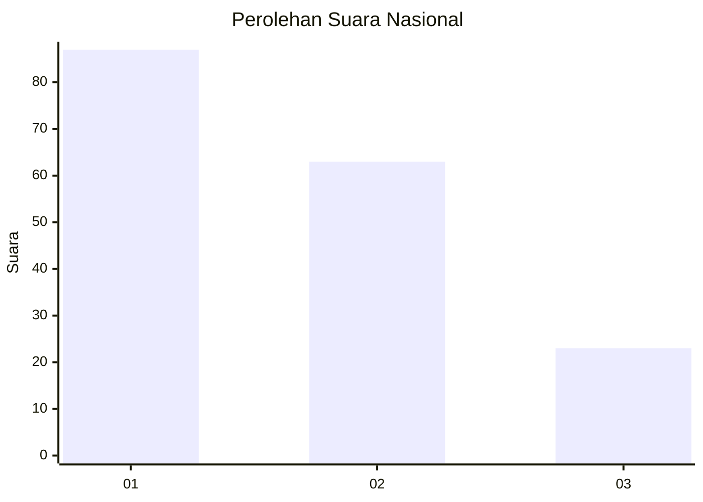
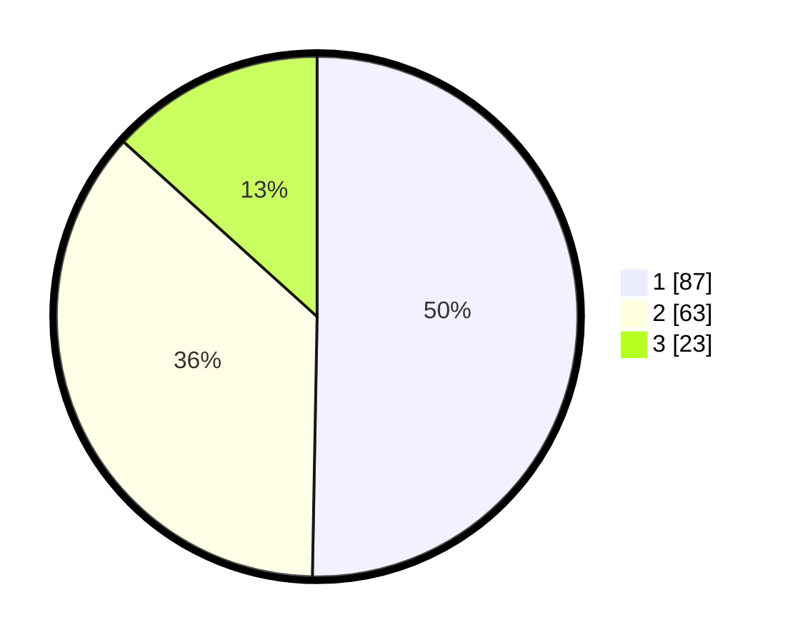

# Hasil

## Grafik

## Tabel

| No.    | Nama Paslon    | Suara | Suara (raw) | Persentase |
|:------ |:-------------- | -----:| -----------:| ----------:|
| 100025 | ANIES MUHAIMIN | 87    | [87][p-1]   | 50,29      |
| 100026 | PRABOWO GIBRAN | 63    | [63][p-2]   | 36,42      |
| 100027 | GANJAR MAHFUD  | 23    | [23][p-3]   | 13,29      |

[p-1]: https://github.com/gigit-pemilu/pemilu-2024/blob/main/pilpres/hitung-suara/sub/31-dki-jakarta/sub/73-jakarta-barat/sub/04-tambora/sub/1006-jembatan-besi/sub/058-tps/sub/paslon-1.txt
[p-2]: https://github.com/gigit-pemilu/pemilu-2024/blob/main/pilpres/hitung-suara/sub/31-dki-jakarta/sub/73-jakarta-barat/sub/04-tambora/sub/1006-jembatan-besi/sub/058-tps/sub/paslon-2.txt
[p-3]: https://github.com/gigit-pemilu/pemilu-2024/blob/main/pilpres/hitung-suara/sub/31-dki-jakarta/sub/73-jakarta-barat/sub/04-tambora/sub/1006-jembatan-besi/sub/058-tps/sub/paslon-3.txt

## Foto C Plano

https://sirekap-obj-formc.kpu.go.id/cc94/pemilu/ppwp/31/73/04/10/06/3173041006058-20240214-223605--388dea3e-96eb-48c1-a723-96d010763ae5.jpg

https://sirekap-obj-formc.kpu.go.id/cc94/pemilu/ppwp/31/73/04/10/06/3173041006058-20240214-223756--0aa6e64a-2aa7-4510-9cef-6fda36691b3e.jpg

https://sirekap-obj-formc.kpu.go.id/cc94/pemilu/ppwp/31/73/04/10/06/3173041006058-20240214-223926--bb012980-659e-4a39-9c61-c36beef18196.jpg

## Metadata

| Key        | Value               |
| ---------- | ------------------- |
| Time Stamp | 2024-02-19 17:00:00 |

