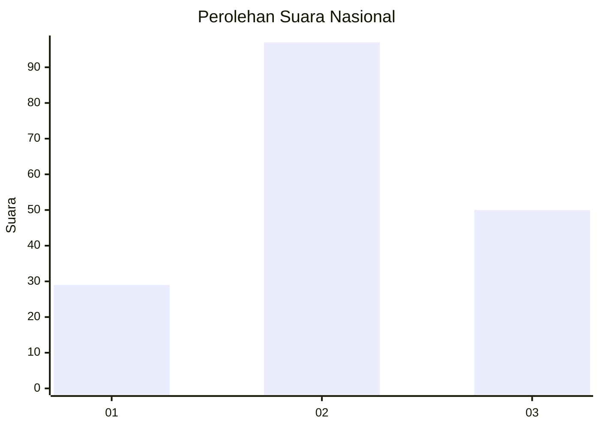
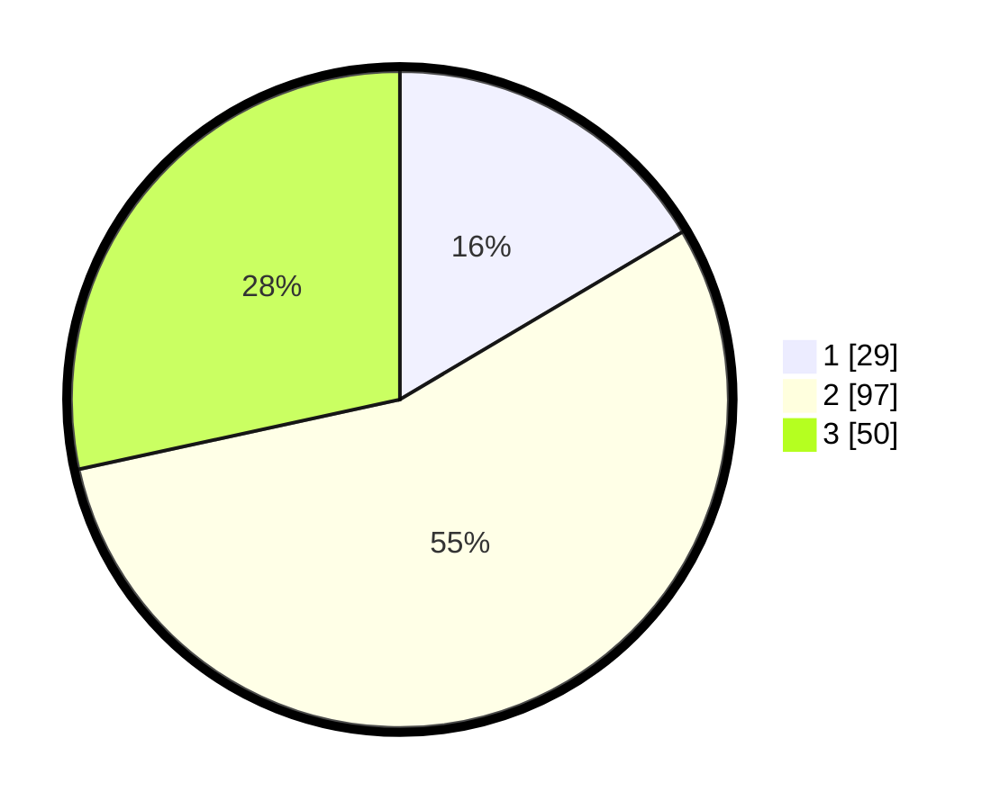

# Hasil

## Grafik

## Tabel

| No.    | Nama Paslon    | Suara | Suara (raw) | Persentase |
|:------ |:-------------- | -----:| -----------:| ----------:|
| 100025 | ANIES MUHAIMIN | 29    | [29][p-1]   | 16,48      |
| 100026 | PRABOWO GIBRAN | 97    | [97][p-2]   | 55,11      |
| 100027 | GANJAR MAHFUD  | 50    | [50][p-3]   | 28,41      |

[p-1]: https://github.com/gigit-pemilu/pemilu-2024/blob/main/pilpres/hitung-suara/sub/31-dki-jakarta/sub/73-jakarta-barat/sub/04-tambora/sub/1006-jembatan-besi/sub/077-tps/sub/paslon-1.txt
[p-2]: https://github.com/gigit-pemilu/pemilu-2024/blob/main/pilpres/hitung-suara/sub/31-dki-jakarta/sub/73-jakarta-barat/sub/04-tambora/sub/1006-jembatan-besi/sub/077-tps/sub/paslon-2.txt
[p-3]: https://github.com/gigit-pemilu/pemilu-2024/blob/main/pilpres/hitung-suara/sub/31-dki-jakarta/sub/73-jakarta-barat/sub/04-tambora/sub/1006-jembatan-besi/sub/077-tps/sub/paslon-3.txt

## Foto C Plano

https://sirekap-obj-formc.kpu.go.id/3da3/pemilu/ppwp/31/73/04/10/06/3173041006077-20240215-051538--cb9d6c52-4ec6-488a-9e30-fbc991aefc11.jpg

https://sirekap-obj-formc.kpu.go.id/3da3/pemilu/ppwp/31/73/04/10/06/3173041006077-20240214-225642--54a7f425-4f20-45a4-940b-3dfc68a12d8d.jpg

https://sirekap-obj-formc.kpu.go.id/3da3/pemilu/ppwp/31/73/04/10/06/3173041006077-20240214-230427--0f0e104c-1445-4613-88b2-f23468dd5bd9.jpg

## Metadata

| Key        | Value               |
| ---------- | ------------------- |
| Time Stamp | 2024-02-17 16:36:25 |

