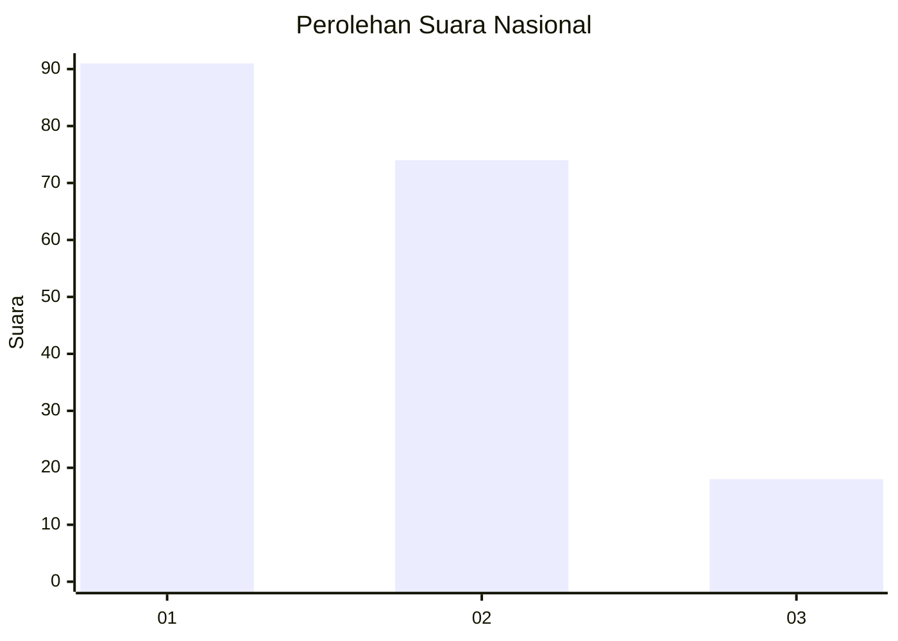
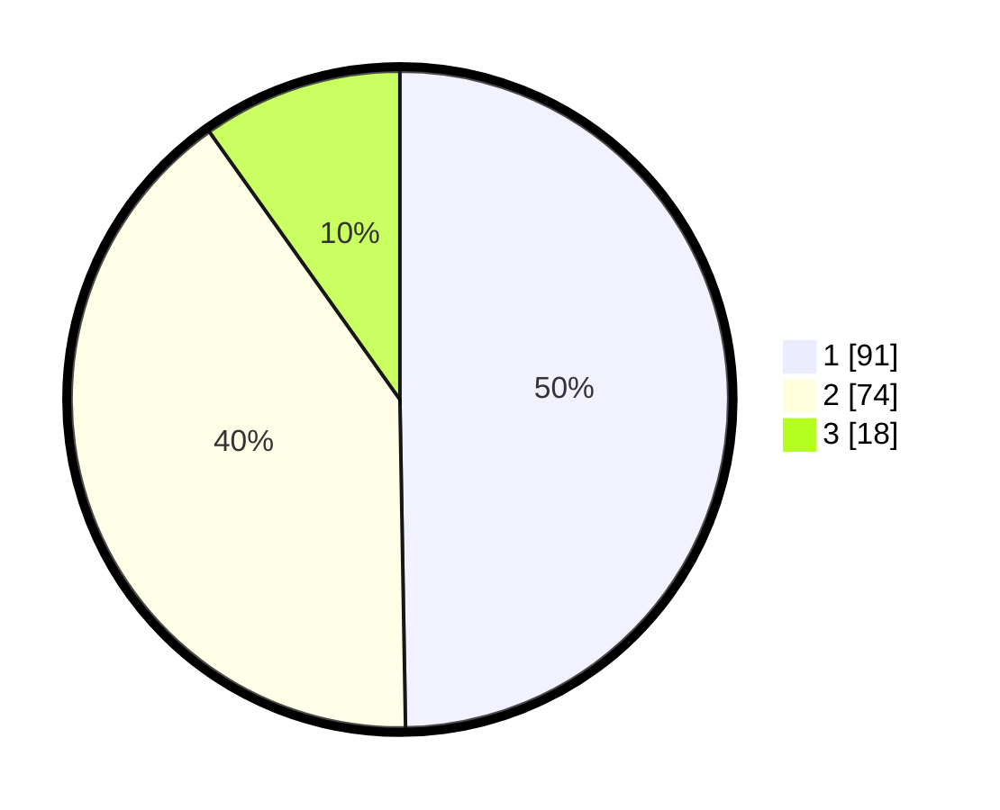

# Hasil

## Grafik

## Tabel

| No.    | Nama Paslon    | Suara | Suara (raw) | Persentase |
|:------ |:-------------- | -----:| -----------:| ----------:|
| 100025 | ANIES MUHAIMIN | 91    | [91][p-1]   | 49,73      |
| 100026 | PRABOWO GIBRAN | 74    | [74][p-2]   | 40,44      |
| 100027 | GANJAR MAHFUD  | 18    | [18][p-3]   | 9,84       |

[p-1]: https://github.com/gigit-pemilu/pemilu-2024/blob/main/pilpres/hitung-suara/sub/31-dki-jakarta/sub/73-jakarta-barat/sub/04-tambora/sub/1006-jembatan-besi/sub/089-tps/sub/paslon-1.txt
[p-2]: https://github.com/gigit-pemilu/pemilu-2024/blob/main/pilpres/hitung-suara/sub/31-dki-jakarta/sub/73-jakarta-barat/sub/04-tambora/sub/1006-jembatan-besi/sub/089-tps/sub/paslon-2.txt
[p-3]: https://github.com/gigit-pemilu/pemilu-2024/blob/main/pilpres/hitung-suara/sub/31-dki-jakarta/sub/73-jakarta-barat/sub/04-tambora/sub/1006-jembatan-besi/sub/089-tps/sub/paslon-3.txt

## Foto C Plano

https://sirekap-obj-formc.kpu.go.id/5160/pemilu/ppwp/31/73/04/10/06/3173041006089-20240214-220333--8ed08a98-840b-45bd-a93a-e0ba79810146.jpg

https://sirekap-obj-formc.kpu.go.id/5160/pemilu/ppwp/31/73/04/10/06/3173041006089-20240214-201453--bdd388f9-47fb-418b-b411-f1787cc38b42.jpg

https://sirekap-obj-formc.kpu.go.id/5160/pemilu/ppwp/31/73/04/10/06/3173041006089-20240214-220506--3ec388c8-46b9-4c70-a01f-26b181c87cc7.jpg

## Metadata

| Key        | Value               |
| ---------- | ------------------- |
| Time Stamp | 2024-02-19 16:00:00 |

