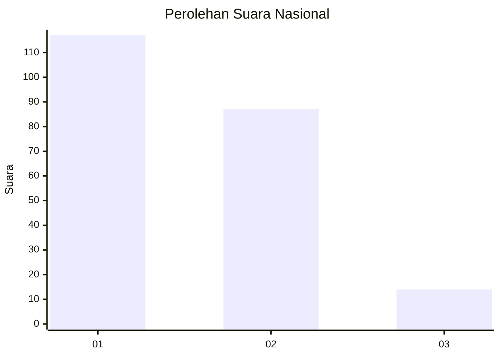
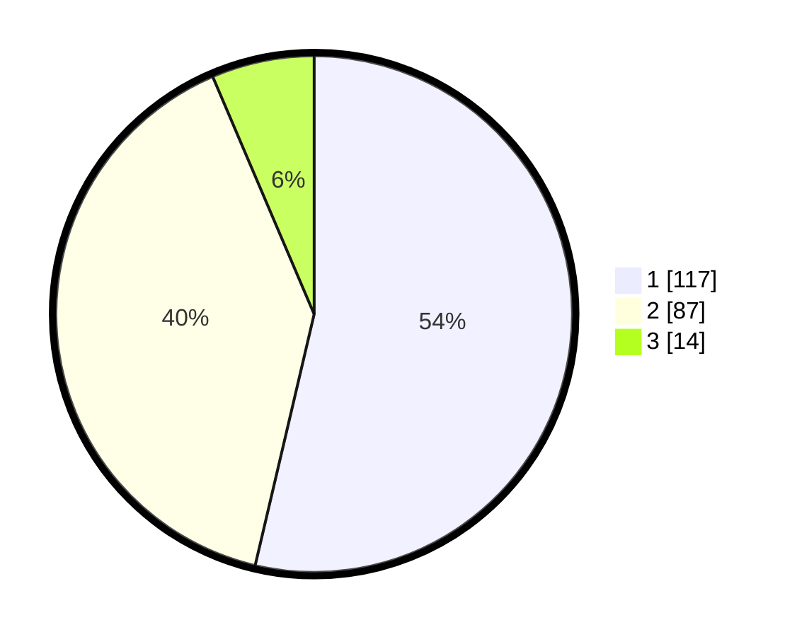

# Hasil

## Grafik

## Tabel

| No.    | Nama Paslon    | Suara | Suara (raw) | Persentase |
|:------ |:-------------- | -----:| -----------:| ----------:|
| 100025 | ANIES MUHAIMIN | 117   | [117][p-1]  | 53,67      |
| 100026 | PRABOWO GIBRAN | 87    | [87][p-2]   | 39,91      |
| 100027 | GANJAR MAHFUD  | 14    | [14][p-3]   | 6,42       |

[p-1]: https://github.com/gigit-pemilu/pemilu-2024/blob/main/pilpres/hitung-suara/sub/31-dki-jakarta/sub/73-jakarta-barat/sub/04-tambora/sub/1006-jembatan-besi/sub/096-tps/sub/paslon-1.txt
[p-2]: https://github.com/gigit-pemilu/pemilu-2024/blob/main/pilpres/hitung-suara/sub/31-dki-jakarta/sub/73-jakarta-barat/sub/04-tambora/sub/1006-jembatan-besi/sub/096-tps/sub/paslon-2.txt
[p-3]: https://github.com/gigit-pemilu/pemilu-2024/blob/main/pilpres/hitung-suara/sub/31-dki-jakarta/sub/73-jakarta-barat/sub/04-tambora/sub/1006-jembatan-besi/sub/096-tps/sub/paslon-3.txt

## Foto C Plano

https://sirekap-obj-formc.kpu.go.id/369a/pemilu/ppwp/31/73/04/10/06/3173041006096-20240214-212401--9750391a-5de3-4db7-b224-4758208fb333.jpg

https://sirekap-obj-formc.kpu.go.id/369a/pemilu/ppwp/31/73/04/10/06/3173041006096-20240214-212811--e2ac5878-fa67-4022-b247-feda0faf19b1.jpg

https://sirekap-obj-formc.kpu.go.id/369a/pemilu/ppwp/31/73/04/10/06/3173041006096-20240214-212901--1fc10cb5-f74d-4cec-8725-6d85486f9642.jpg

## Metadata

| Key        | Value               |
| ---------- | ------------------- |
| Time Stamp | 2024-02-19 16:00:00 |

