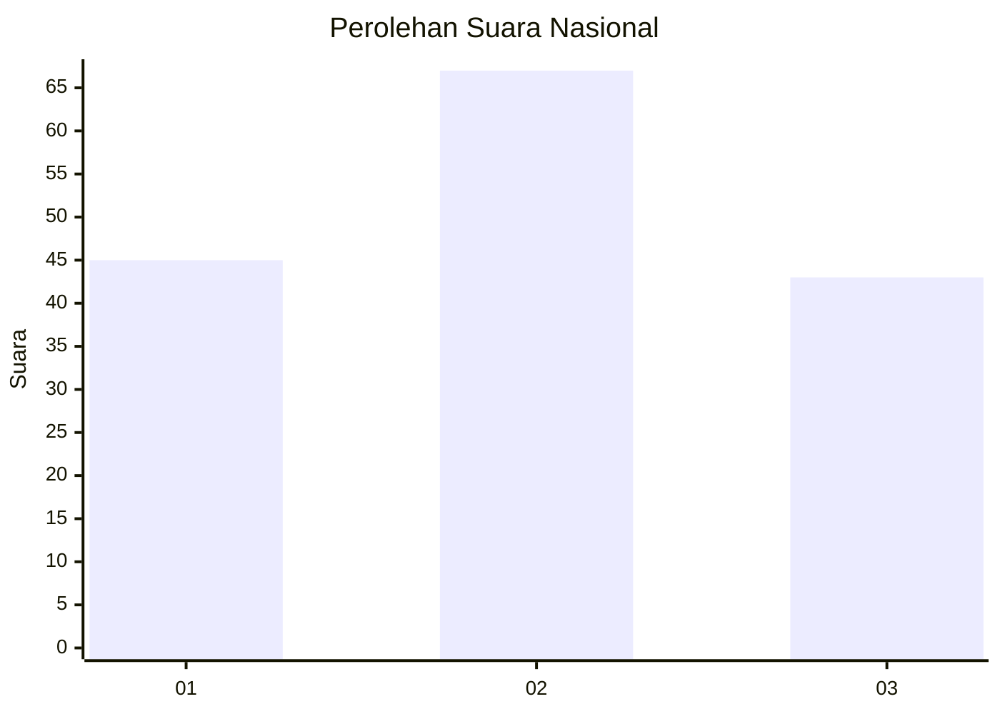
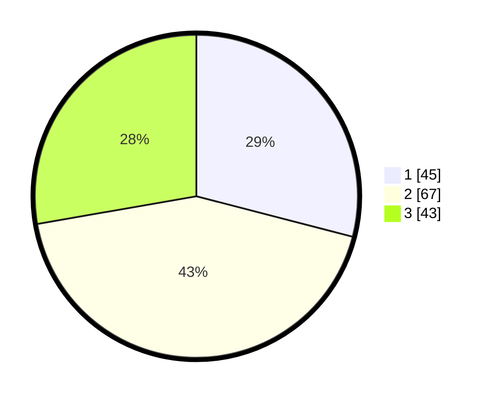

# Hasil

## Grafik

## Tabel

| No.    | Nama Paslon    | Suara | Suara (raw) | Persentase |
|:------ |:-------------- | -----:| -----------:| ----------:|
| 100025 | ANIES MUHAIMIN | 45    | [45][p-1]   | 29,03      |
| 100026 | PRABOWO GIBRAN | 67    | [67][p-2]   | 43,23      |
| 100027 | GANJAR MAHFUD  | 43    | [43][p-3]   | 27,74      |

[p-1]: https://github.com/gigit-pemilu/pemilu-2024/blob/main/pilpres/hitung-suara/sub/31-dki-jakarta/sub/73-jakarta-barat/sub/04-tambora/sub/1007-angke/sub/011-tps/sub/paslon-1.txt
[p-2]: https://github.com/gigit-pemilu/pemilu-2024/blob/main/pilpres/hitung-suara/sub/31-dki-jakarta/sub/73-jakarta-barat/sub/04-tambora/sub/1007-angke/sub/011-tps/sub/paslon-2.txt
[p-3]: https://github.com/gigit-pemilu/pemilu-2024/blob/main/pilpres/hitung-suara/sub/31-dki-jakarta/sub/73-jakarta-barat/sub/04-tambora/sub/1007-angke/sub/011-tps/sub/paslon-3.txt

## Foto C Plano

https://sirekap-obj-formc.kpu.go.id/9295/pemilu/ppwp/31/73/04/10/07/3173041007011-20240214-155050--861c00ab-c402-4d34-979f-41f7666998cb.jpg

https://sirekap-obj-formc.kpu.go.id/9295/pemilu/ppwp/31/73/04/10/07/3173041007011-20240215-000838--2692a735-a623-43e7-9f10-9d05844c8b5b.jpg

https://sirekap-obj-formc.kpu.go.id/9295/pemilu/ppwp/31/73/04/10/07/3173041007011-20240214-224111--cbbee10e-5d12-4fbd-ac3d-7ded2d4bc281.jpg

## Metadata

| Key        | Value               |
| ---------- | ------------------- |
| Time Stamp | 2024-02-15 02:10:27 |

