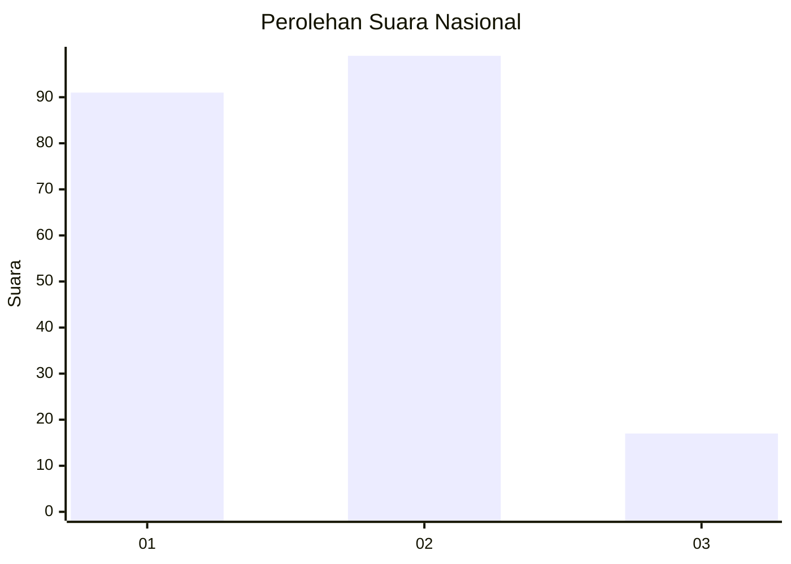
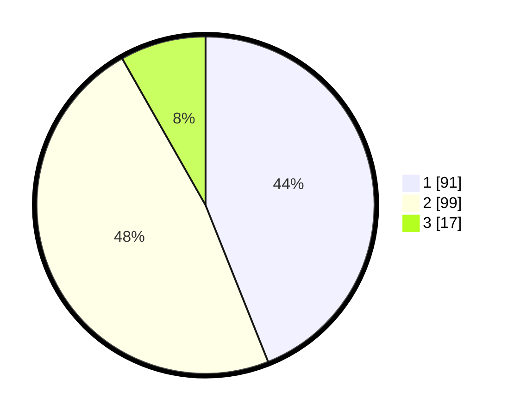

# Hasil

## Grafik

## Tabel

| No.    | Nama Paslon    | Suara | Suara (raw) | Persentase |
|:------ |:-------------- | -----:| -----------:| ----------:|
| 100025 | ANIES MUHAIMIN | 91    | [91][p-1]   | 43,96      |
| 100026 | PRABOWO GIBRAN | 99    | [99][p-2]   | 47,83      |
| 100027 | GANJAR MAHFUD  | 17    | [17][p-3]   | 8,21       |

[p-1]: https://github.com/gigit-pemilu/pemilu-2024/blob/main/pilpres/hitung-suara/sub/31-dki-jakarta/sub/73-jakarta-barat/sub/04-tambora/sub/1007-angke/sub/014-tps/sub/paslon-1.txt
[p-2]: https://github.com/gigit-pemilu/pemilu-2024/blob/main/pilpres/hitung-suara/sub/31-dki-jakarta/sub/73-jakarta-barat/sub/04-tambora/sub/1007-angke/sub/014-tps/sub/paslon-2.txt
[p-3]: https://github.com/gigit-pemilu/pemilu-2024/blob/main/pilpres/hitung-suara/sub/31-dki-jakarta/sub/73-jakarta-barat/sub/04-tambora/sub/1007-angke/sub/014-tps/sub/paslon-3.txt

## Foto C Plano

https://sirekap-obj-formc.kpu.go.id/af3f/pemilu/ppwp/31/73/04/10/07/3173041007014-20240214-214924--67d6dcef-1b18-4ae3-8224-71db7f34955b.jpg

https://sirekap-obj-formc.kpu.go.id/af3f/pemilu/ppwp/31/73/04/10/07/3173041007014-20240214-215421--5c7c2dc6-2226-4c76-bf91-4065123a04db.jpg

https://sirekap-obj-formc.kpu.go.id/af3f/pemilu/ppwp/31/73/04/10/07/3173041007014-20240214-215320--dc1f012c-ebf4-4a5a-b1a4-6fc99913f772.jpg

## Metadata

| Key        | Value               |
| ---------- | ------------------- |
| Time Stamp | 2024-02-17 16:36:25 |

