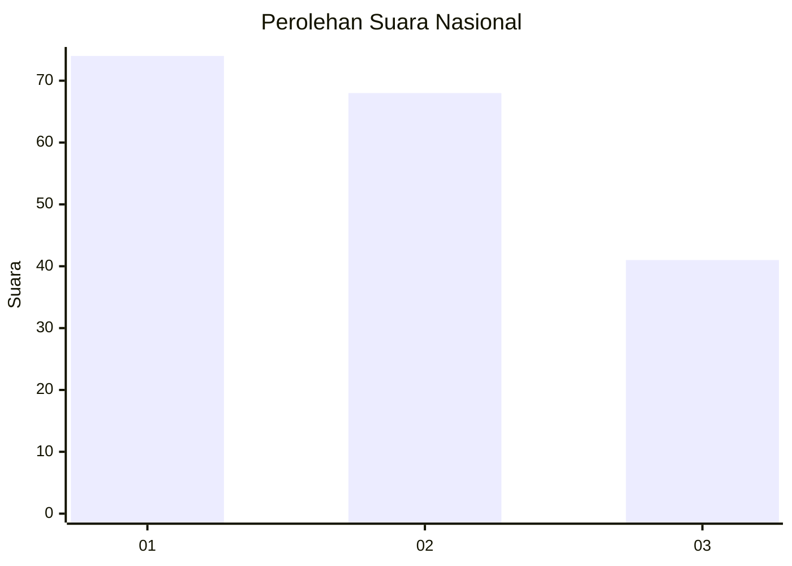
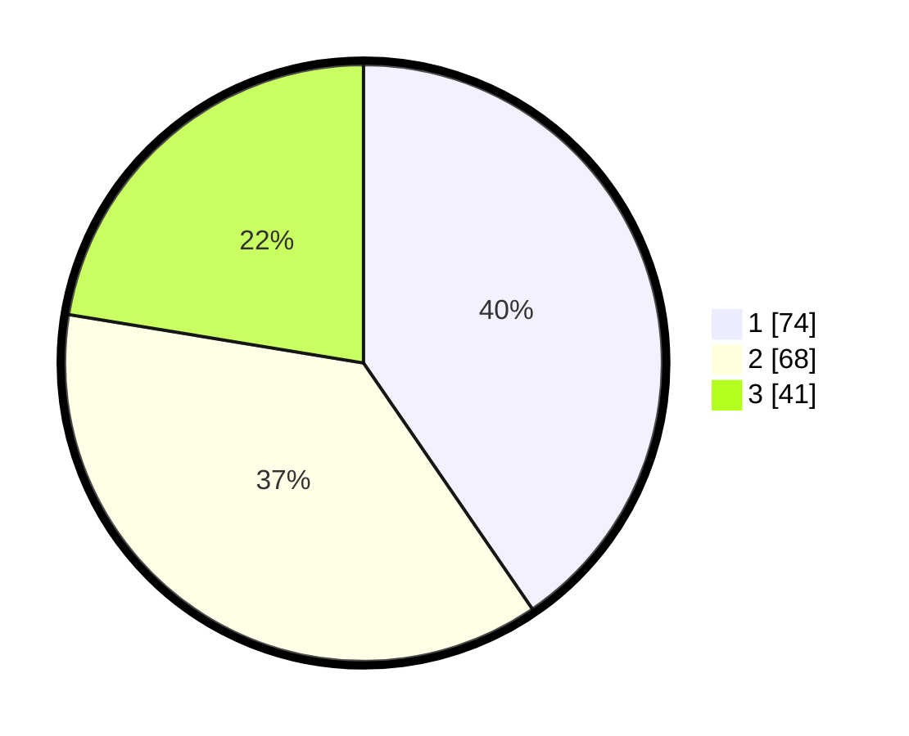

# Hasil

## Grafik

## Tabel

| No.    | Nama Paslon    | Suara | Suara (raw) | Persentase |
|:------ |:-------------- | -----:| -----------:| ----------:|
| 100025 | ANIES MUHAIMIN | 74    | [74][p-1]   | 40,44      |
| 100026 | PRABOWO GIBRAN | 68    | [68][p-2]   | 37,16      |
| 100027 | GANJAR MAHFUD  | 41    | [41][p-3]   | 22,40      |

[p-1]: https://github.com/gigit-pemilu/pemilu-2024/blob/main/pilpres/hitung-suara/sub/31-dki-jakarta/sub/73-jakarta-barat/sub/04-tambora/sub/1007-angke/sub/015-tps/sub/paslon-1.txt
[p-2]: https://github.com/gigit-pemilu/pemilu-2024/blob/main/pilpres/hitung-suara/sub/31-dki-jakarta/sub/73-jakarta-barat/sub/04-tambora/sub/1007-angke/sub/015-tps/sub/paslon-2.txt
[p-3]: https://github.com/gigit-pemilu/pemilu-2024/blob/main/pilpres/hitung-suara/sub/31-dki-jakarta/sub/73-jakarta-barat/sub/04-tambora/sub/1007-angke/sub/015-tps/sub/paslon-3.txt

## Foto C Plano

https://sirekap-obj-formc.kpu.go.id/dd06/pemilu/ppwp/31/73/04/10/07/3173041007015-20240214-221359--3ff88abe-598a-4a99-a910-6896426f5d73.jpg

https://sirekap-obj-formc.kpu.go.id/dd06/pemilu/ppwp/31/73/04/10/07/3173041007015-20240214-213329--20613585-e395-4203-a445-7adf83fc7d87.jpg

https://sirekap-obj-formc.kpu.go.id/dd06/pemilu/ppwp/31/73/04/10/07/3173041007015-20240214-214204--39b1c9a5-8a3b-4afd-b089-57e52392b43a.jpg

## Metadata

| Key        | Value               |
| ---------- | ------------------- |
| Time Stamp | 2024-02-19 19:00:00 |

