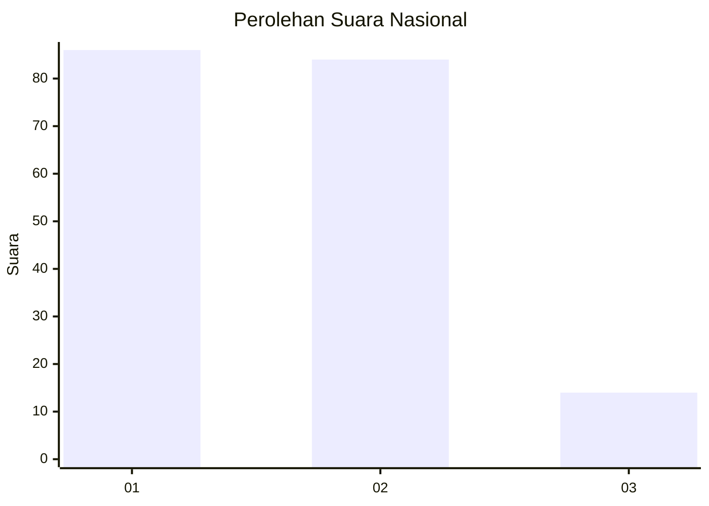
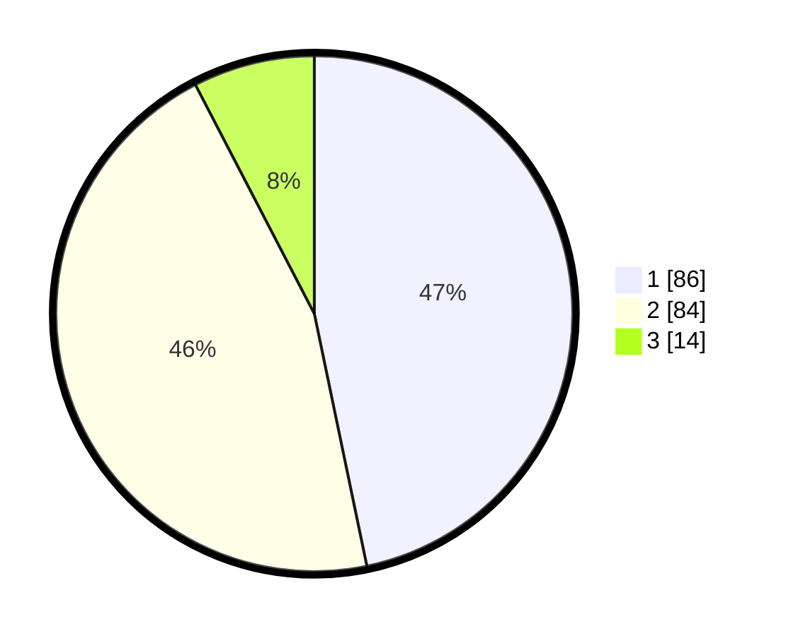

# Hasil

## Grafik

## Tabel

| No.    | Nama Paslon    | Suara | Suara (raw) | Persentase |
|:------ |:-------------- | -----:| -----------:| ----------:|
| 100025 | ANIES MUHAIMIN | 86    | [86][p-1]   | 46,74      |
| 100026 | PRABOWO GIBRAN | 84    | [84][p-2]   | 45,65      |
| 100027 | GANJAR MAHFUD  | 14    | [14][p-3]   | 7,61       |

[p-1]: https://github.com/gigit-pemilu/pemilu-2024/blob/main/pilpres/hitung-suara/sub/31-dki-jakarta/sub/73-jakarta-barat/sub/04-tambora/sub/1007-angke/sub/023-tps/sub/paslon-1.txt
[p-2]: https://github.com/gigit-pemilu/pemilu-2024/blob/main/pilpres/hitung-suara/sub/31-dki-jakarta/sub/73-jakarta-barat/sub/04-tambora/sub/1007-angke/sub/023-tps/sub/paslon-2.txt
[p-3]: https://github.com/gigit-pemilu/pemilu-2024/blob/main/pilpres/hitung-suara/sub/31-dki-jakarta/sub/73-jakarta-barat/sub/04-tambora/sub/1007-angke/sub/023-tps/sub/paslon-3.txt

## Foto C Plano

https://sirekap-obj-formc.kpu.go.id/b442/pemilu/ppwp/31/73/04/10/07/3173041007023-20240214-222638--7449aedc-c0af-4deb-b2fb-7d4924880af1.jpg

https://sirekap-obj-formc.kpu.go.id/b442/pemilu/ppwp/31/73/04/10/07/3173041007023-20240214-222751--b0aaec12-8cd5-4608-9a04-1f7b1e2663f2.jpg

https://sirekap-obj-formc.kpu.go.id/b442/pemilu/ppwp/31/73/04/10/07/3173041007023-20240214-223031--b74cf3da-9faa-4299-babe-ec46fbb0b227.jpg

## Metadata

| Key        | Value               |
| ---------- | ------------------- |
| Time Stamp | 2024-02-17 16:36:25 |

