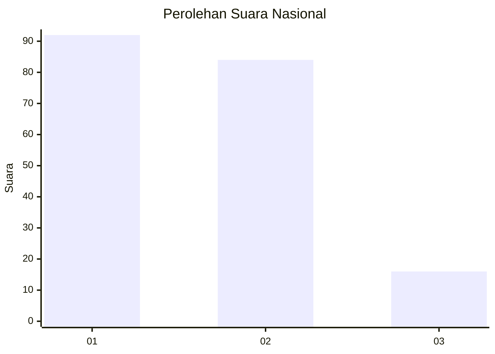
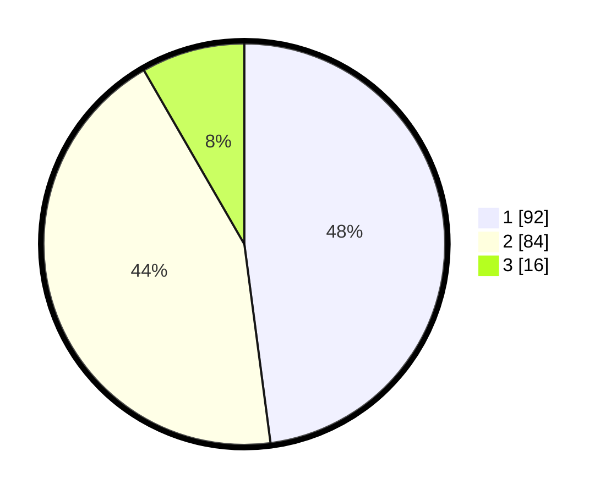

# Hasil

## Grafik

## Tabel

| No.    | Nama Paslon    | Suara | Suara (raw) | Persentase |
|:------ |:-------------- | -----:| -----------:| ----------:|
| 100025 | ANIES MUHAIMIN | 92    | [92][p-1]   | 47,92      |
| 100026 | PRABOWO GIBRAN | 84    | [84][p-2]   | 43,75      |
| 100027 | GANJAR MAHFUD  | 16    | [16][p-3]   | 8,33       |

[p-1]: https://github.com/gigit-pemilu/pemilu-2024/blob/main/pilpres/hitung-suara/sub/31-dki-jakarta/sub/73-jakarta-barat/sub/04-tambora/sub/1007-angke/sub/024-tps/sub/paslon-1.txt
[p-2]: https://github.com/gigit-pemilu/pemilu-2024/blob/main/pilpres/hitung-suara/sub/31-dki-jakarta/sub/73-jakarta-barat/sub/04-tambora/sub/1007-angke/sub/024-tps/sub/paslon-2.txt
[p-3]: https://github.com/gigit-pemilu/pemilu-2024/blob/main/pilpres/hitung-suara/sub/31-dki-jakarta/sub/73-jakarta-barat/sub/04-tambora/sub/1007-angke/sub/024-tps/sub/paslon-3.txt

## Foto C Plano

https://sirekap-obj-formc.kpu.go.id/4b1a/pemilu/ppwp/31/73/04/10/07/3173041007024-20240215-022404--82cd5f85-2212-42c9-8518-f31a282acf4a.jpg

https://sirekap-obj-formc.kpu.go.id/4b1a/pemilu/ppwp/31/73/04/10/07/3173041007024-20240214-232211--ade24002-5f85-4212-8290-9b55609cb879.jpg

https://sirekap-obj-formc.kpu.go.id/4b1a/pemilu/ppwp/31/73/04/10/07/3173041007024-20240214-232318--08bc222d-a44a-4041-b1f3-4adecf4cbc3c.jpg

## Metadata

| Key        | Value               |
| ---------- | ------------------- |
| Time Stamp | 2024-02-16 16:25:10 |

