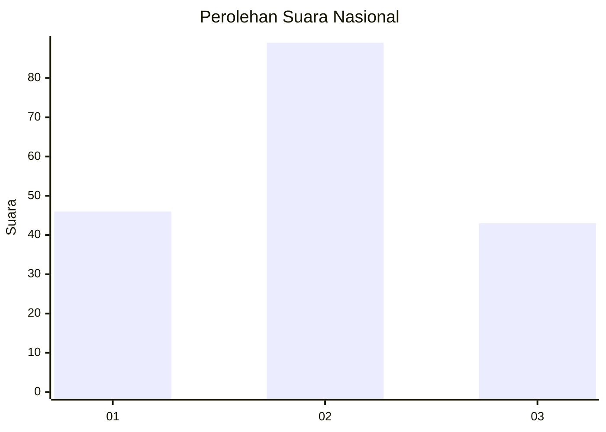
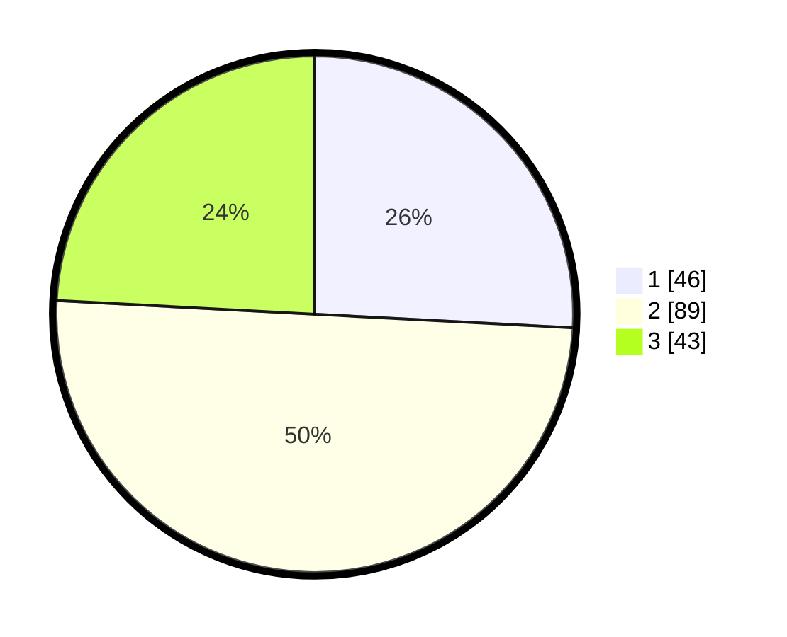

# Hasil

## Grafik

## Tabel

| No.    | Nama Paslon    | Suara | Suara (raw) | Persentase |
|:------ |:-------------- | -----:| -----------:| ----------:|
| 100025 | ANIES MUHAIMIN | 46    | [46][p-1]   | 25,84      |
| 100026 | PRABOWO GIBRAN | 89    | [89][p-2]   | 50,00      |
| 100027 | GANJAR MAHFUD  | 43    | [43][p-3]   | 24,16      |

[p-1]: https://github.com/gigit-pemilu/pemilu-2024/blob/main/pilpres/hitung-suara/sub/31-dki-jakarta/sub/73-jakarta-barat/sub/04-tambora/sub/1007-angke/sub/041-tps/sub/paslon-1.txt
[p-2]: https://github.com/gigit-pemilu/pemilu-2024/blob/main/pilpres/hitung-suara/sub/31-dki-jakarta/sub/73-jakarta-barat/sub/04-tambora/sub/1007-angke/sub/041-tps/sub/paslon-2.txt
[p-3]: https://github.com/gigit-pemilu/pemilu-2024/blob/main/pilpres/hitung-suara/sub/31-dki-jakarta/sub/73-jakarta-barat/sub/04-tambora/sub/1007-angke/sub/041-tps/sub/paslon-3.txt

## Foto C Plano

https://sirekap-obj-formc.kpu.go.id/8ad3/pemilu/ppwp/31/73/04/10/07/3173041007041-20240215-013720--4aab34a3-5939-40e6-a2c7-f6517066418f.jpg

https://sirekap-obj-formc.kpu.go.id/8ad3/pemilu/ppwp/31/73/04/10/07/3173041007041-20240215-013815--0561a7f9-a8fb-4b6b-9614-45f18f04bc43.jpg

https://sirekap-obj-formc.kpu.go.id/8ad3/pemilu/ppwp/31/73/04/10/07/3173041007041-20240214-155333--f22d8923-f226-4022-abf2-cf52297bf2db.jpg

## Metadata

| Key        | Value               |
| ---------- | ------------------- |
| Time Stamp | 2024-02-19 20:00:00 |

