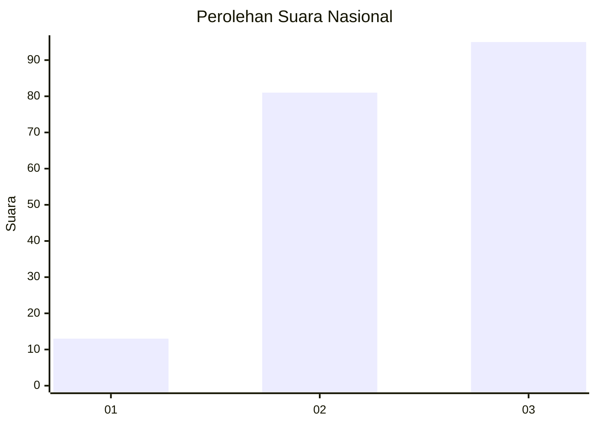
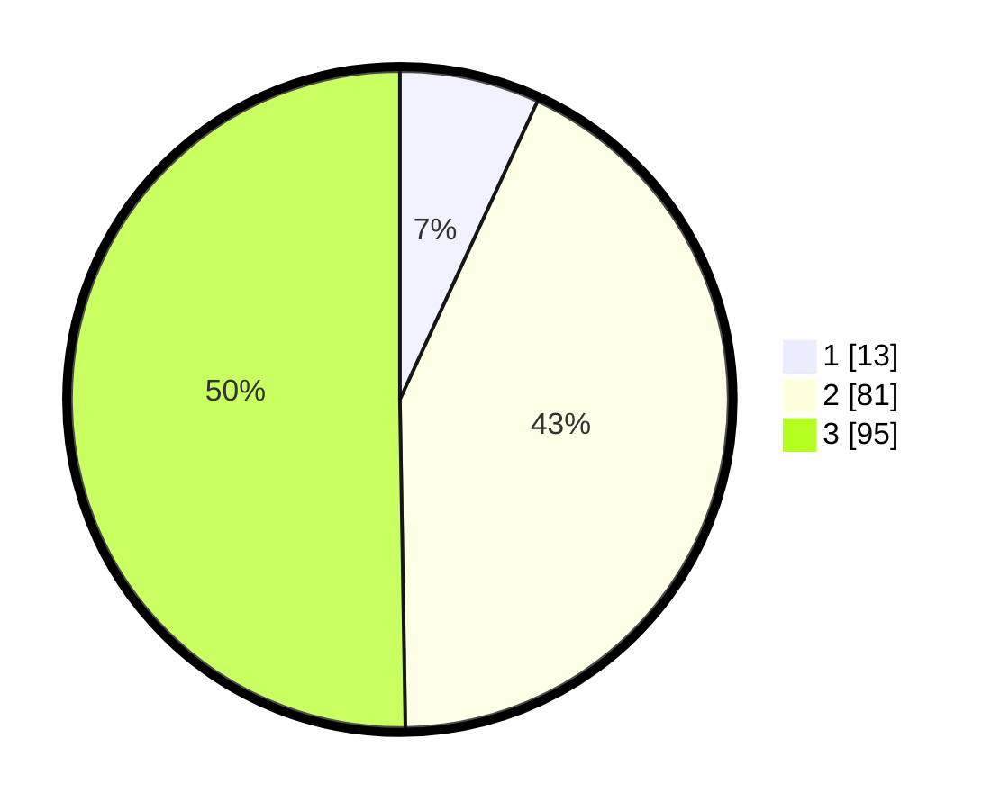

# Hasil

## Grafik

## Tabel

| No.    | Nama Paslon    | Suara | Suara (raw) | Persentase |
|:------ |:-------------- | -----:| -----------:| ----------:|
| 100025 | ANIES MUHAIMIN | 13    | [13][p-1]   | 6,88       |
| 100026 | PRABOWO GIBRAN | 81    | [81][p-2]   | 42,86      |
| 100027 | GANJAR MAHFUD  | 95    | [95][p-3]   | 50,26      |

[p-1]: https://github.com/gigit-pemilu/pemilu-2024/blob/main/pilpres/hitung-suara/sub/31-dki-jakarta/sub/73-jakarta-barat/sub/04-tambora/sub/1007-angke/sub/054-tps/sub/paslon-1.txt
[p-2]: https://github.com/gigit-pemilu/pemilu-2024/blob/main/pilpres/hitung-suara/sub/31-dki-jakarta/sub/73-jakarta-barat/sub/04-tambora/sub/1007-angke/sub/054-tps/sub/paslon-2.txt
[p-3]: https://github.com/gigit-pemilu/pemilu-2024/blob/main/pilpres/hitung-suara/sub/31-dki-jakarta/sub/73-jakarta-barat/sub/04-tambora/sub/1007-angke/sub/054-tps/sub/paslon-3.txt

## Foto C Plano

https://sirekap-obj-formc.kpu.go.id/e203/pemilu/ppwp/31/73/04/10/07/3173041007054-20240215-030848--47ccbd30-5606-4956-a7c1-6e948c024f9d.jpg

https://sirekap-obj-formc.kpu.go.id/e203/pemilu/ppwp/31/73/04/10/07/3173041007054-20240215-030931--9ee6e24b-76fc-4703-8959-f370aea709b2.jpg

https://sirekap-obj-formc.kpu.go.id/e203/pemilu/ppwp/31/73/04/10/07/3173041007054-20240215-031115--9fbfc61a-96aa-40c5-8740-8a7490e4e956.jpg

## Metadata

| Key        | Value               |
| ---------- | ------------------- |
| Time Stamp | 2024-02-15 16:30:25 |

