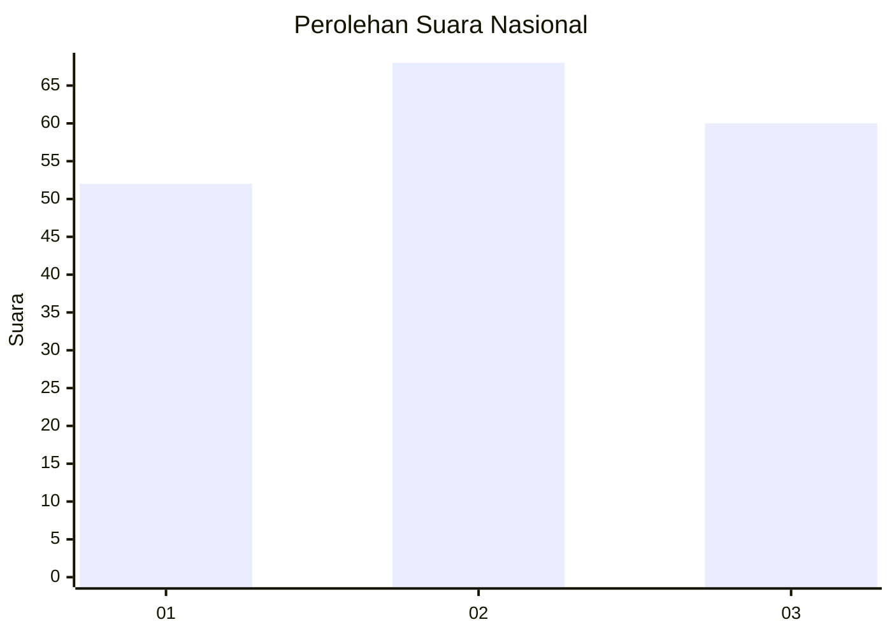
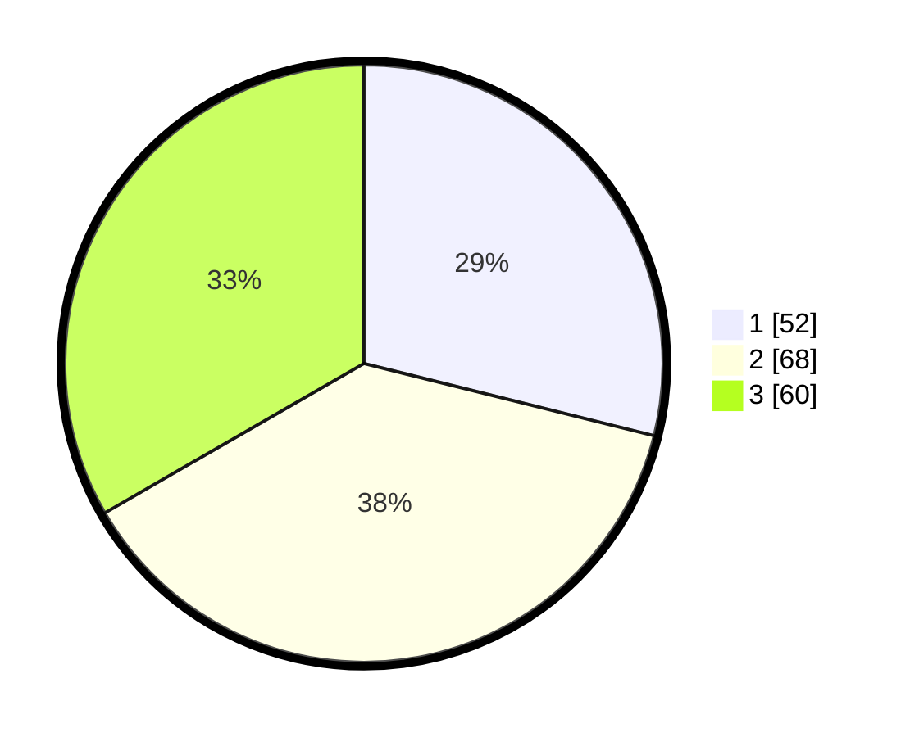

# Hasil

## Grafik

## Tabel

| No.    | Nama Paslon    | Suara | Suara (raw) | Persentase |
|:------ |:-------------- | -----:| -----------:| ----------:|
| 100025 | ANIES MUHAIMIN | 52    | [52][p-1]   | 28,89      |
| 100026 | PRABOWO GIBRAN | 68    | [68][p-2]   | 37,78      |
| 100027 | GANJAR MAHFUD  | 60    | [60][p-3]   | 33,33      |

[p-1]: https://github.com/gigit-pemilu/pemilu-2024/blob/main/pilpres/hitung-suara/sub/31-dki-jakarta/sub/73-jakarta-barat/sub/04-tambora/sub/1007-angke/sub/065-tps/sub/paslon-1.txt
[p-2]: https://github.com/gigit-pemilu/pemilu-2024/blob/main/pilpres/hitung-suara/sub/31-dki-jakarta/sub/73-jakarta-barat/sub/04-tambora/sub/1007-angke/sub/065-tps/sub/paslon-2.txt
[p-3]: https://github.com/gigit-pemilu/pemilu-2024/blob/main/pilpres/hitung-suara/sub/31-dki-jakarta/sub/73-jakarta-barat/sub/04-tambora/sub/1007-angke/sub/065-tps/sub/paslon-3.txt

## Foto C Plano

https://sirekap-obj-formc.kpu.go.id/8192/pemilu/ppwp/31/73/04/10/07/3173041007065-20240214-224942--400772e7-1b28-40e7-ad7c-d38da16e3c4b.jpg

https://sirekap-obj-formc.kpu.go.id/8192/pemilu/ppwp/31/73/04/10/07/3173041007065-20240214-225106--fd9dc32e-7071-400b-b0b0-6a2fcb55ae58.jpg

https://sirekap-obj-formc.kpu.go.id/8192/pemilu/ppwp/31/73/04/10/07/3173041007065-20240214-225255--4faf9d8b-357d-4bc7-af62-c16c0b3f7c97.jpg

## Metadata

| Key        | Value               |
| ---------- | ------------------- |
| Time Stamp | 2024-02-19 20:00:00 |

