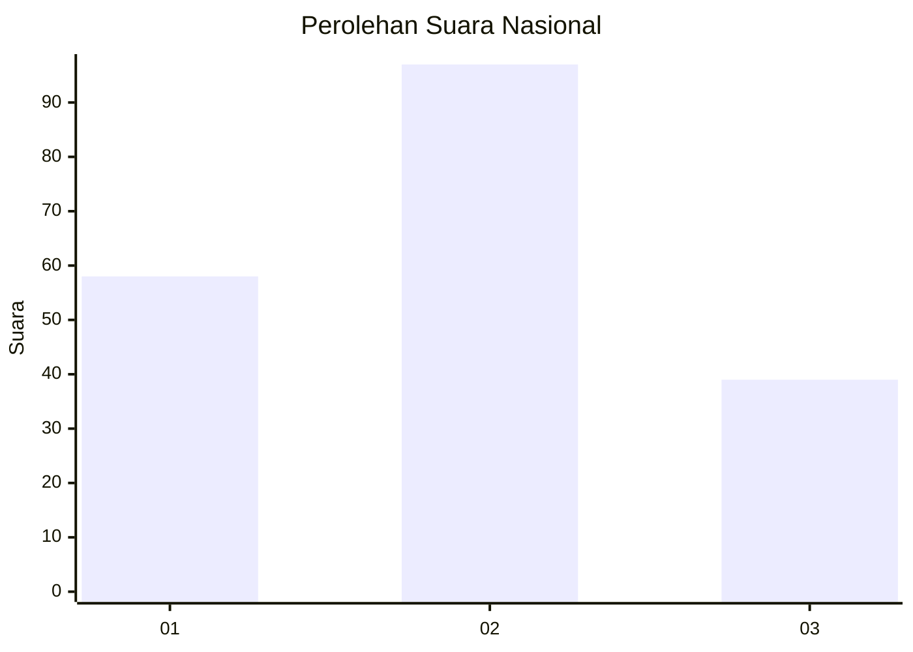
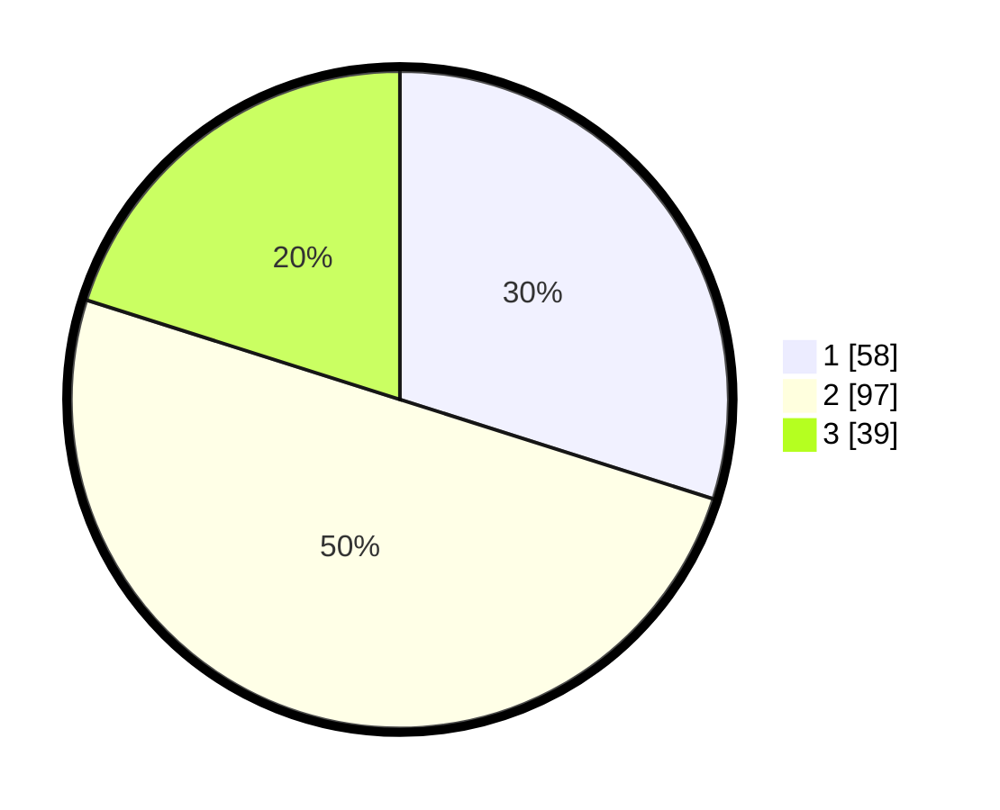

# Hasil

## Grafik

## Tabel

| No.    | Nama Paslon    | Suara | Suara (raw) | Persentase |
|:------ |:-------------- | -----:| -----------:| ----------:|
| 100025 | ANIES MUHAIMIN | 58    | [58][p-1]   | 29,90      |
| 100026 | PRABOWO GIBRAN | 97    | [97][p-2]   | 50,00      |
| 100027 | GANJAR MAHFUD  | 39    | [39][p-3]   | 20,10      |

[p-1]: https://github.com/gigit-pemilu/pemilu-2024/blob/main/pilpres/hitung-suara/sub/31-dki-jakarta/sub/73-jakarta-barat/sub/04-tambora/sub/1007-angke/sub/068-tps/sub/paslon-1.txt
[p-2]: https://github.com/gigit-pemilu/pemilu-2024/blob/main/pilpres/hitung-suara/sub/31-dki-jakarta/sub/73-jakarta-barat/sub/04-tambora/sub/1007-angke/sub/068-tps/sub/paslon-2.txt
[p-3]: https://github.com/gigit-pemilu/pemilu-2024/blob/main/pilpres/hitung-suara/sub/31-dki-jakarta/sub/73-jakarta-barat/sub/04-tambora/sub/1007-angke/sub/068-tps/sub/paslon-3.txt

## Foto C Plano

https://sirekap-obj-formc.kpu.go.id/dd45/pemilu/ppwp/31/73/04/10/07/3173041007068-20240225-235139--cb332a7b-b73b-4c96-92a9-f12e03a61f4e.jpg

https://sirekap-obj-formc.kpu.go.id/dd45/pemilu/ppwp/31/73/04/10/07/3173041007068-20240225-235231--726e7e29-0b64-451a-8c49-85dbe4ca5a80.jpg

https://sirekap-obj-formc.kpu.go.id/dd45/pemilu/ppwp/31/73/04/10/07/3173041007068-20240225-235339--04af5eaa-63f2-492e-9ffa-55cf40cd6d50.jpg

## Metadata

| Key        | Value               |
| ---------- | ------------------- |
| Time Stamp | 2024-02-26 11:00:00 |

